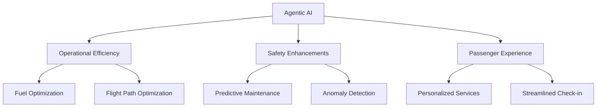

# Chapter 1: Introduction

## Transforming Aviation with Agentic AI

The aviation industry has always been at the forefront of technological innovation. From the advent of jet engines to the implementation of advanced navigation systems, the sector has continuously evolved to meet the demands of safety, efficiency, and passenger experience. Today, a new frontier is emerging: the integration of Agentic AI technology.

Agentic AI refers to artificial intelligence systems that possess a degree of autonomy, enabling them to make decisions, learn from data, and adapt to changing environments. This chapter introduces the concept of Agentic AI and its transformative potential in the aviation industry.

## Why Agentic AI?

The aviation industry faces numerous challenges, including:

- **Operational Efficiency**: Reducing fuel consumption, optimizing flight paths, and minimizing delays.
- **Safety**: Enhancing predictive maintenance, monitoring pilot performance, and detecting anomalies in real-time.
- **Passenger Experience**: Personalizing services, streamlining check-in processes, and improving in-flight entertainment.

Agentic AI offers solutions to these challenges by leveraging advanced machine learning algorithms, real-time data processing, and autonomous decision-making capabilities.

## Structure of the Book

This book is structured to guide you through the journey of understanding and implementing Agentic AI in the aviation industry. The chapters are as follows:

1. **Introduction**: Overview of Agentic AI and its relevance to aviation.
2. **Technological Foundations**: Key technologies enabling Agentic AI.
3. **Applications in Aviation**: Real-world use cases and benefits.
4. **Implementation Strategies**: Steps to integrate Agentic AI into aviation operations.
5. **Challenges and Ethical Considerations**: Addressing potential risks and ethical dilemmas.
6. **Future Trends**: The evolving role of AI in aviation.

## Diagram: The Role of Agentic AI in Aviation

This diagram illustrates the key areas where Agentic AI can make a significant impact in aviation.