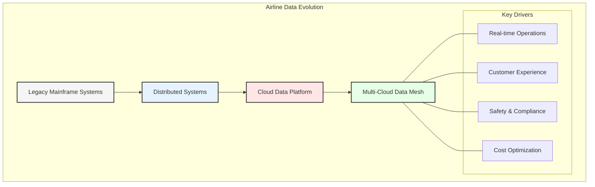
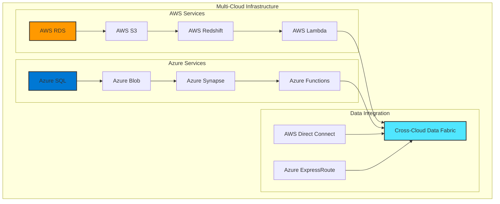
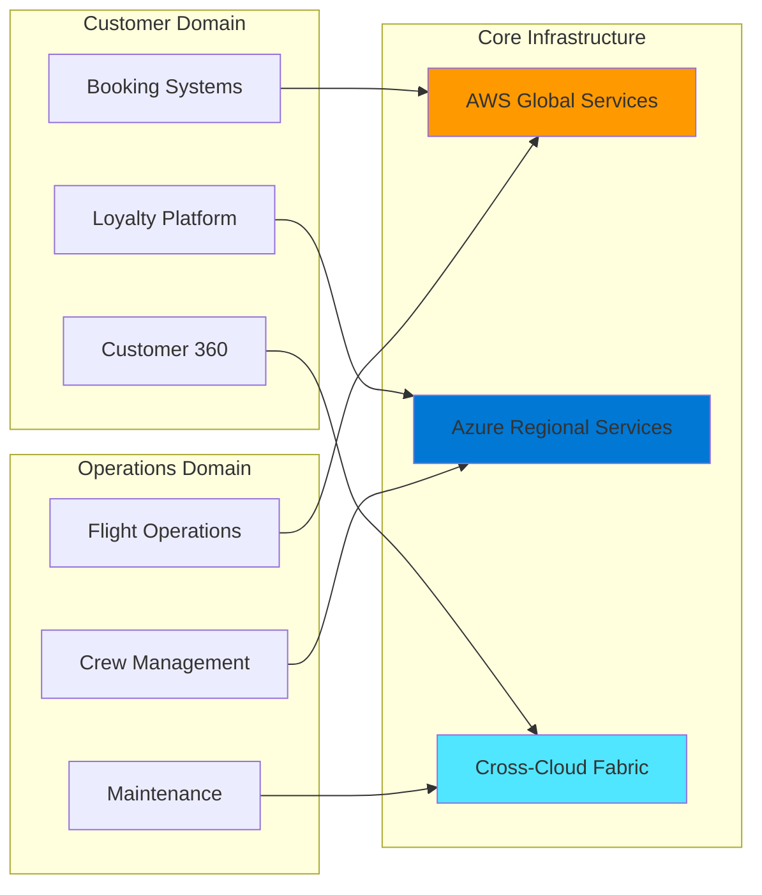

# Chapter 1: The Evolution of Enterprise Data Architecture

## Historical Context and Evolution in the Airline Industry

The journey of enterprise data architecture has been marked by continuous evolution, particularly in the airline industry where data complexity, real-time requirements, and global operations demand sophisticated solutions. This chapter explores this transformation through the lens of GlobalAir, a major international airline operating across 150+ destinations.

## Modern Airline Data Challenges

### 1. Operational Complexity
- Real-time flight tracking
- Crew management
- Maintenance scheduling
- Ground operations
- Weather integration

### 2. Customer Experience Demands
- Personalized booking experience
- Real-time updates
- Loyalty program integration
- Multi-channel engagement
- Baggage tracking

### 3. Regulatory Requirements
- Safety compliance
- Data privacy (GDPR, CCPA)
- Cross-border regulations
- Financial reporting
- Security standards

## Multi-Cloud Architecture Overview

## Technology Stack Evolution

### 1. Legacy Systems (Pre-2000s)
- Mainframe-based reservation systems
- Monolithic applications
- Proprietary databases
- Limited integration capabilities

### 2. Distributed Era (2000s-2010s)
- Service-oriented architecture
- Multiple data centers
- Enterprise service bus
- Regional data stores

### 3. Cloud Adoption (2010s-2020s)
- AWS and Azure adoption
- Hybrid cloud solutions
- Containerized applications
- Global data replication

### 4. Data Mesh Era (2020s-Present)
- Domain-oriented architecture
- Multi-cloud orchestration
- Real-time data products
- AI/ML integration

## Current Technology Architecture

## Key Business Drivers

### 1. Operational Excellence
- Real-time decision making
- Predictive maintenance
- Route optimization
- Resource allocation
- Cost management

### 2. Customer Experience
- Seamless booking
- Personalized services
- Digital transformation
- Self-service capabilities
- Connected journey

### 3. Revenue Optimization
- Dynamic pricing
- Ancillary services
- Network planning
- Partner integration
- Market analysis

## Cloud Provider Selection Strategy

### AWS Primary Use Cases
- Global route management
- Reservation systems
- Analytics platform
- Customer data platform
- Machine learning

### Azure Primary Use Cases
- Regional operations
- Crew management
- Maintenance systems
- Enterprise integration
- Business intelligence

## Looking Ahead

As we progress through this book, we'll explore how GlobalAir's transformation from traditional architecture to a modern data mesh enables:

1. Improved operational efficiency
2. Enhanced customer experience
3. Better regulatory compliance
4. Increased innovation speed
5. Optimized cost structure

The subsequent chapters will dive deeper into each architectural paradigm, their implementation considerations, and their impact on airline operations.

## Key Takeaways

1. Airline industry demands sophisticated data architecture
2. Multi-cloud strategy provides global scale and resilience
3. Data mesh enables domain-oriented solutions
4. Technology evolution supports business transformation
5. Real-time capabilities are crucial for success