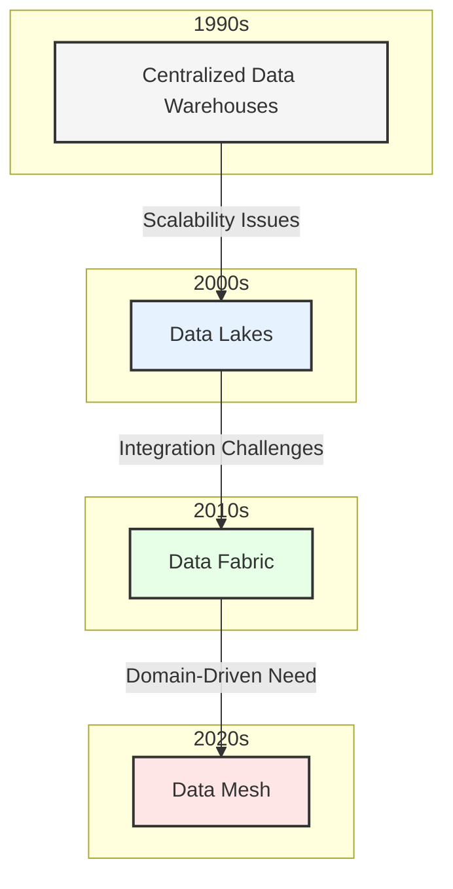
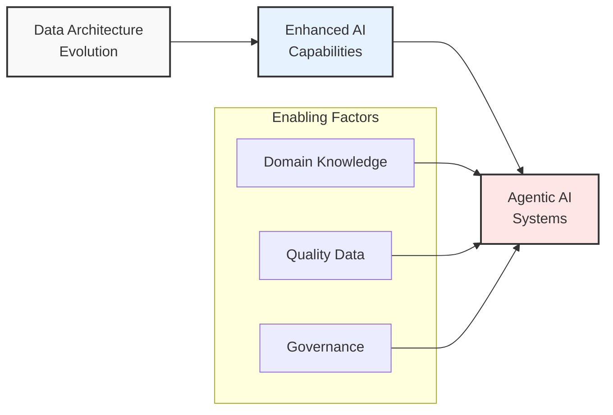

# Chapter 1: The Evolution of Enterprise Data Architecture

## Historical Context and Evolution

The journey of enterprise data architecture has been marked by continuous evolution, driven by increasing data complexity, business demands, and technological advancement. This chapter explores this transformation and sets the foundation for understanding the shift from data fabric to data mesh architectures.

## Key Drivers of Change

### 1. Business Agility Requirements
- Faster time-to-market demands
- Need for real-time insights
- Dynamic business environment adaptation

### 2. Technological Advancement
- Cloud computing maturity
- Emergence of sophisticated AI/ML capabilities
- Improved data processing technologies

### 3. Organizational Evolution
- Shift to product-oriented teams
- Domain-driven design adoption
- Decentralized decision-making

## The Data Architecture Timeline

### Traditional Centralized Architecture (Pre-2000s)
- Monolithic data warehouses
- Rigid schema definitions
- Limited scalability
- Centralized control

### Data Lakes Evolution (2000s-2010s)
- Schema-on-read approach
- Improved storage capabilities
- Challenges with data governance
- Data swamps emergence

### Data Fabric Emergence (2010s-2020s)
- Unified data management
- Automated data integration
- Metadata-driven approach
- Global data governance

### Data Mesh Paradigm (2020s-Present)
- Domain-oriented decentralization
- Product thinking
- Self-serve infrastructure
- Federated governance

## The Rise of Agentic AI

## Looking Ahead

As we progress through this book, we'll explore how the transformation from data fabric to data mesh architectures enables:

1. Better domain alignment
2. Improved data quality and governance
3. Enhanced AI capabilities
4. Faster business value delivery

The subsequent chapters will dive deeper into each architectural paradigm, their implementation considerations, and their impact on agentic AI systems.

## Key Takeaways

- Enterprise data architecture has evolved from centralized to distributed models
- Each evolution addressed specific challenges of its predecessor
- Data mesh represents a paradigm shift in how we think about data
- The future of data architecture is closely tied to AI capabilities
- Successful transformation requires both technical and organizational changes