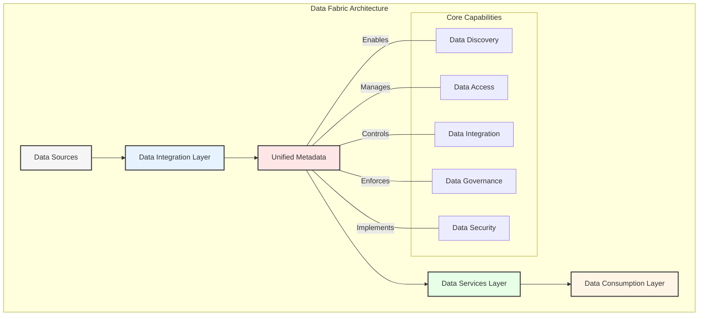
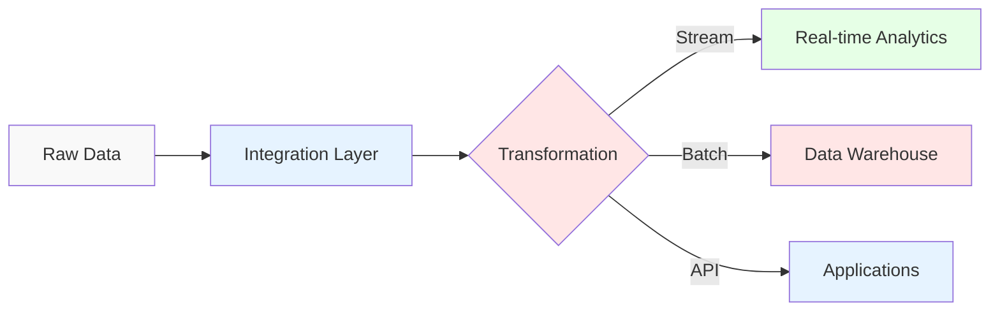
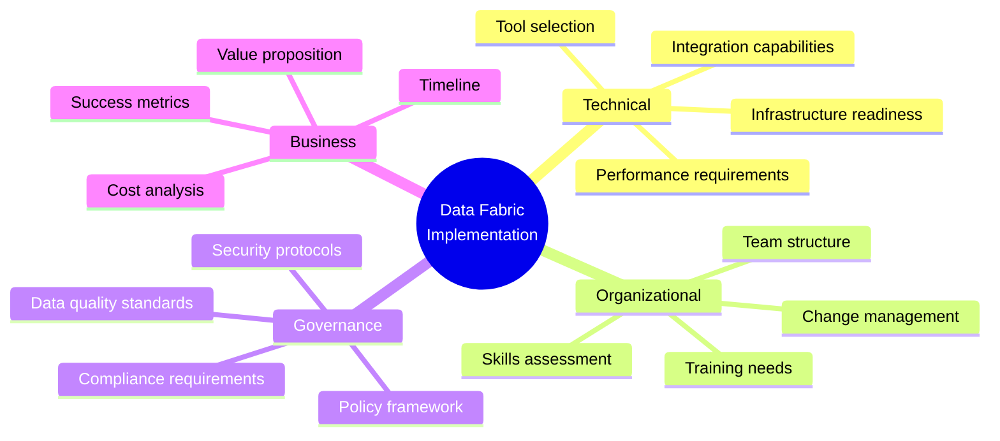

# Chapter 2: Understanding Data Fabric: The Foundation

## What is Data Fabric?

Data Fabric represents an architectural approach that simplifies and integrates data management across cloud and on-premises environments. It provides a unified, consistent data management framework while automating data discovery, governance, and consumption.

## Key Components of Data Fabric

### 1. Metadata Management
- Active metadata collection
- Automated metadata analysis
- Knowledge graph creation
- Pattern recognition

### 2. Data Integration Services
- ETL/ELT processes
- Real-time data streaming
- API management
- Event-driven integration

## Data Fabric Patterns

### 1. Global Data Access Pattern
- Unified data access layer
- Consistent security model
- Cross-platform compatibility
- Location-agnostic access

### 2. Data Governance Pattern
- Centralized policy management
- Automated compliance monitoring
- Data quality frameworks
- Audit trail maintenance

### 3. Data Services Pattern
- Reusable data services
- Self-service capabilities
- API-first approach
- Service mesh integration

## Implementation Considerations

## Advantages of Data Fabric

1. **Unified Data Management**
   - Consistent data access
   - Simplified architecture
   - Reduced complexity

2. **Enhanced Data Governance**
   - Automated compliance
   - Centralized control
   - Better data quality

3. **Improved Efficiency**
   - Reduced integration time
   - Automated processes
   - Lower maintenance costs

## Challenges and Limitations

1. **Implementation Complexity**
   - Initial setup overhead
   - Integration challenges
   - Skill requirements

2. **Cost Considerations**
   - Infrastructure investments
   - Training expenses
   - Maintenance costs

3. **Technical Constraints**
   - Legacy system integration
   - Performance overhead
   - Scalability concerns

## Best Practices

### Design Principles
- Start with metadata strategy
- Implement incrementally
- Focus on automation
- Ensure scalability

### Implementation Guidelines
- Begin with pilot projects
- Establish governance early
- Automate where possible
- Monitor and optimize

## Looking Forward

As we move towards data mesh architectures, understanding data fabric is crucial because:
- It provides the foundational concepts
- Many principles carry forward
- Integration patterns remain relevant
- Governance models evolve rather than replace

## Key Takeaways

1. Data fabric provides a unified approach to data management
2. Metadata management is central to success
3. Automation is key to scalability
4. Implementation requires careful planning
5. Foundation for modern data architectures

## Next Steps

The next chapter will explore how data mesh architectures build upon and diverge from data fabric principles, introducing domain-oriented thinking and decentralized governance models.