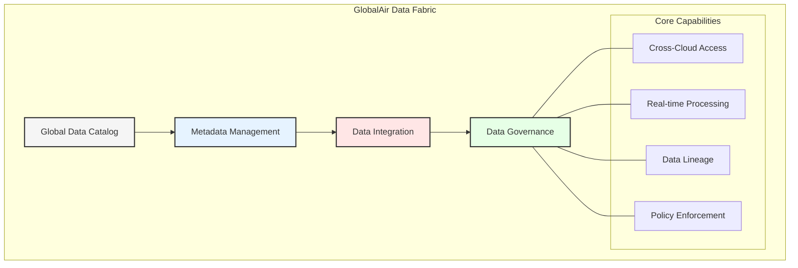
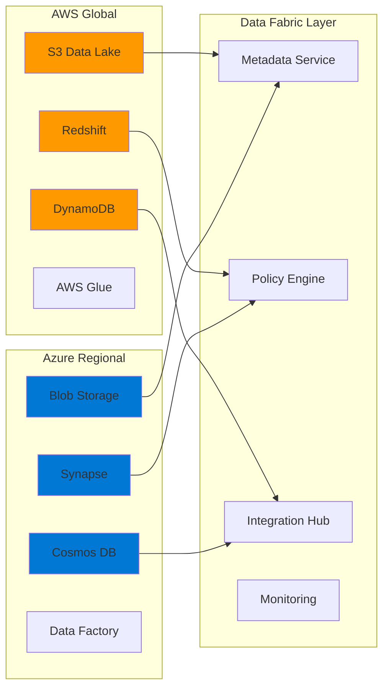
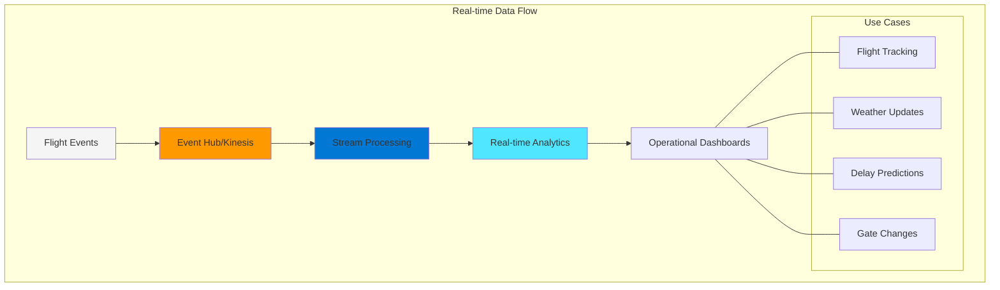
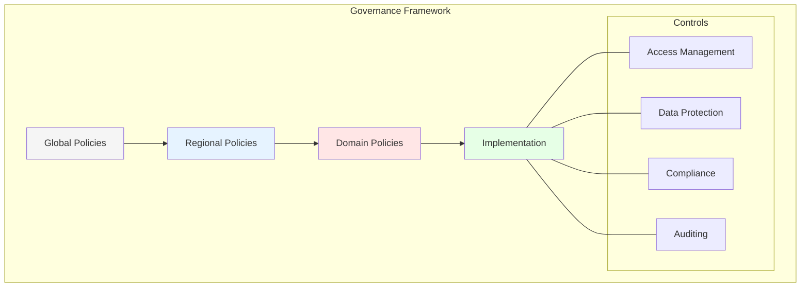
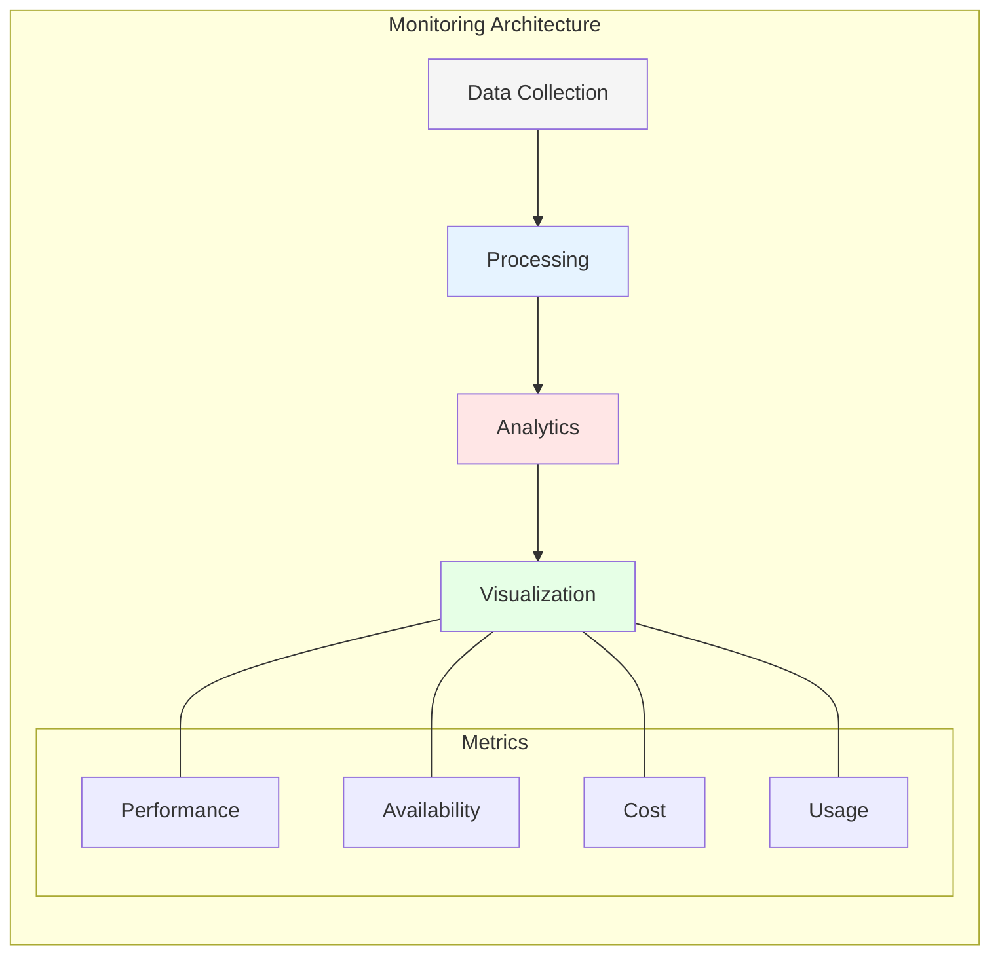

# Chapter 2: Data Fabric: The Foundation

## Understanding Data Fabric in Aviation

Data Fabric serves as the foundational architecture for GlobalAir's digital transformation, enabling seamless data integration across multiple clouds, regions, and operational domains. This chapter explores how Data Fabric addresses the unique challenges of airline operations.

## Multi-Cloud Data Fabric Architecture

### AWS Components
1. **Global Data Store**
   - Amazon S3 for raw data lakes
   - Amazon RDS for operational databases
   - Amazon Redshift for analytics
   - DynamoDB for real-time data

2. **Integration Services**
   - AWS Glue for ETL
   - Amazon MSK for event streaming
   - AWS Direct Connect for hybrid connectivity
   - AWS Lake Formation for data lake management

### Azure Components
1. **Regional Data Store**
   - Azure Blob Storage for regional data
   - Azure SQL Database for operations
   - Azure Synapse Analytics for BI
   - Cosmos DB for document storage

2. **Integration Platform**
   - Azure Data Factory for data integration
   - Azure Event Hubs for real-time events
   - Azure ExpressRoute for connectivity
   - Azure Purview for data governance

## Airline-Specific Data Domains

### 1. Flight Operations Data
- Real-time flight tracking
- Weather data integration
- Navigation databases
- Airport information
- Fuel management

### 2. Customer Experience Data
- Booking history
- Loyalty programs
- Travel preferences
- Feedback data
- Service interactions

### 3. Aircraft Maintenance Data
- Maintenance records
- Part inventories
- Service schedules
- Technical documentation
- Compliance records

## Data Integration Patterns

### 1. Real-time Integration

### 2. Batch Integration
- Daily passenger manifests
- Revenue accounting
- Crew scheduling
- Inventory updates
- Performance analytics

### 3. Hybrid Integration
- Booking systems
- Loyalty programs
- Partner networks
- Ground operations
- Maintenance systems

## Data Governance Framework

### 1. Global Policies
- Data sovereignty
- Privacy compliance
- Security standards
- Retention policies
- Access controls

### 2. Regional Requirements
- Local regulations
- Data residency
- Privacy laws
- Security measures
- Compliance reporting

## Security Implementation

### 1. Data Protection
- Encryption at rest
- Encryption in transit
- Key management
- Access controls
- Data masking

### 2. Identity Management
- Single sign-on
- Role-based access
- Multi-factor auth
- Directory services
- Access monitoring

### 3. Network Security
- VPC peering
- Private endpoints
- WAF implementation
- DDoS protection
- Network monitoring

## Performance Optimization

### 1. Global Data Access
- Content delivery networks
- Regional caching
- Data replication
- Load balancing
- Query optimization

### 2. Resource Management
- Auto-scaling
- Cost optimization
- Resource monitoring
- Capacity planning
- Performance tuning

## Monitoring and Analytics

## Implementation Challenges

### 1. Technical Challenges
- Multi-cloud complexity
- Data consistency
- Performance optimization
- Integration patterns
- Tool selection

### 2. Organizational Challenges
- Skill requirements
- Change management
- Process adaptation
- Team collaboration
- Knowledge transfer

## Key Takeaways

1. Data Fabric enables seamless multi-cloud operations
2. Real-time capabilities are essential for airlines
3. Strong governance ensures compliance
4. Security must be comprehensive
5. Performance optimization is crucial

## Next Steps

The next chapter will explore how Data Mesh architecture builds upon this foundation to create a more distributed and domain-oriented approach to data management.