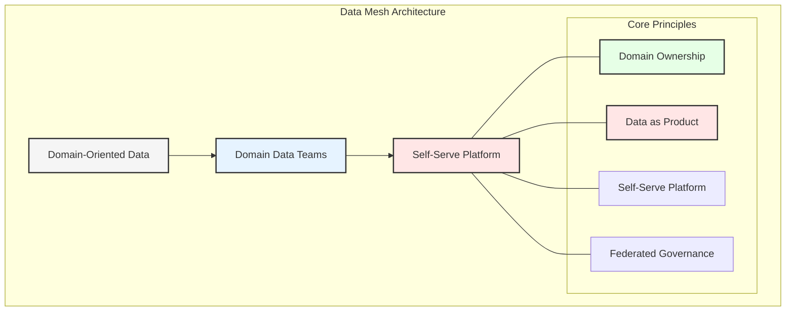
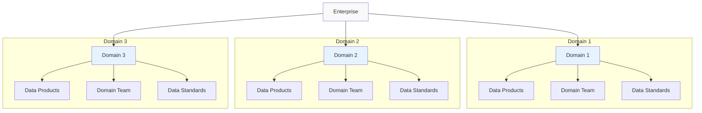
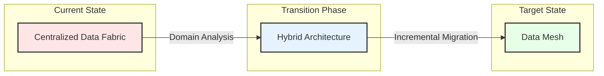
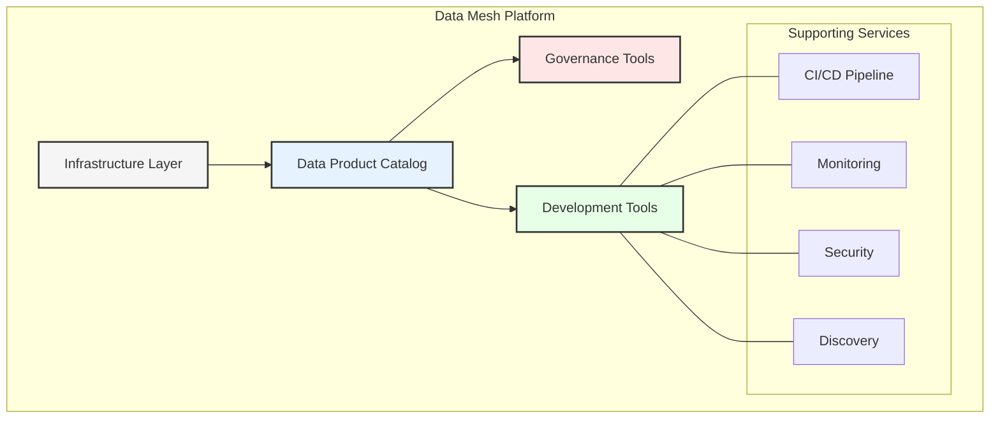
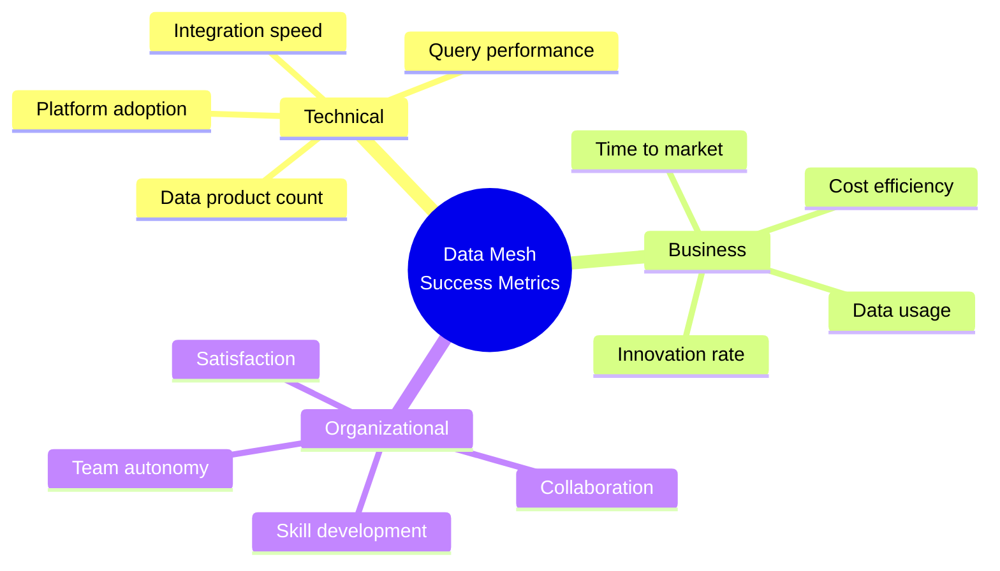

# Chapter 3: Data Mesh: A Paradigm Shift

## The Data Mesh Revolution

Data Mesh represents a fundamental shift in how organizations think about and manage their data infrastructure. Unlike traditional centralized approaches, including Data Fabric, Data Mesh embraces decentralization and domain-oriented ownership.

## Core Principles of Data Mesh

### 1. Domain-Oriented Decentralization
- Aligned with business domains
- Autonomous domain teams
- Local decision making
- Domain-specific data models

### 2. Data as a Product
- Product thinking applied to data
- Clear ownership and responsibility
- Quality and SLA guarantees
- Consumer-centric design

### 3. Self-Serve Data Infrastructure
- Standardized tooling
- Automated provisioning
- Platform thinking
- Developer experience focus

### 4. Federated Computational Governance
- Distributed responsibility
- Global standards
- Local enforcement
- Automated compliance

## Transitioning from Data Fabric to Data Mesh

## Implementation Strategy

### 1. Domain Identification
- Business capability mapping
- Data ownership analysis
- Team structure alignment
- Domain boundaries definition

### 2. Platform Development
- Infrastructure as code
- Self-service capabilities
- Standardized templates
- Monitoring and observability

### 3. Organizational Change
- Team restructuring
- Skills development
- Culture transformation
- New operating model

## Data Mesh Platform Components

## Challenges and Solutions

### 1. Organizational Challenges
- Resistance to change
- Skill gaps
- Cultural transformation
- New ways of working

### 2. Technical Challenges
- Platform development
- Interoperability
- Data consistency
- Performance optimization

### 3. Governance Challenges
- Balancing autonomy
- Maintaining standards
- Quality assurance
- Compliance management

## Best Practices for Success

1. **Start Small**
   - Choose pilot domains
   - Prove value early
   - Learn and adapt
   - Scale gradually

2. **Invest in Platform**
   - Automation first
   - Developer experience
   - Self-service focus
   - Continuous improvement

3. **Enable Teams**
   - Training programs
   - Clear documentation
   - Support structures
   - Community building

## Measuring Success

## Key Takeaways

1. Data Mesh is a sociotechnical approach
2. Success requires both technical and organizational change
3. Platform investment is crucial
4. Federated governance balances autonomy and control
5. Incremental adoption reduces risk

## Next Steps

The next chapter will explore Domain-Driven Data Architecture in detail, showing how to align data products with business domains while maintaining enterprise-wide consistency.