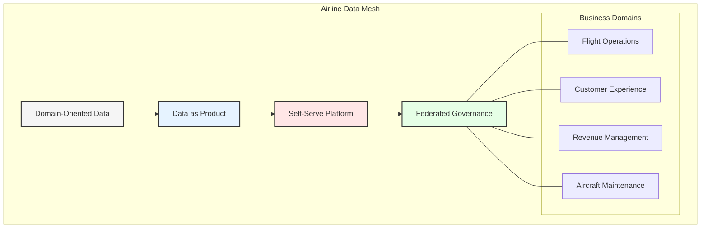
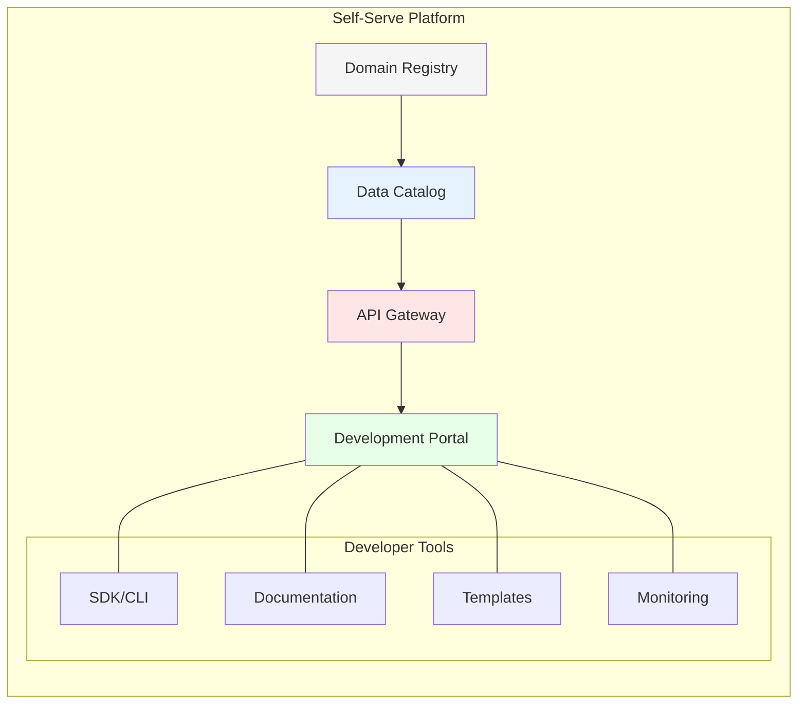
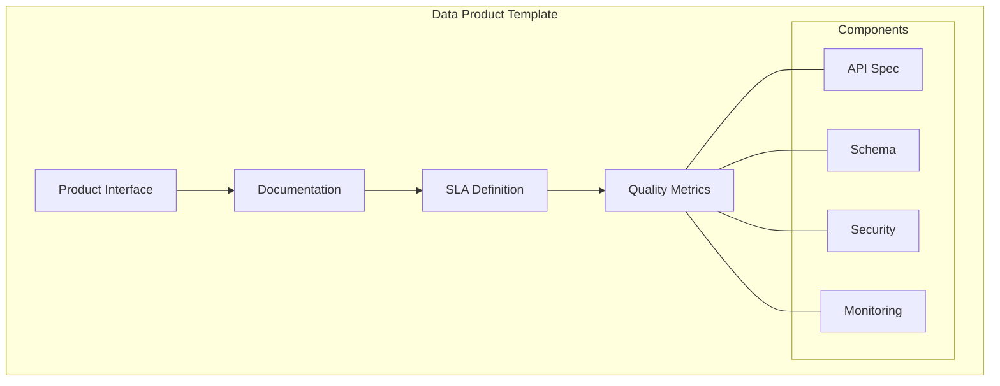
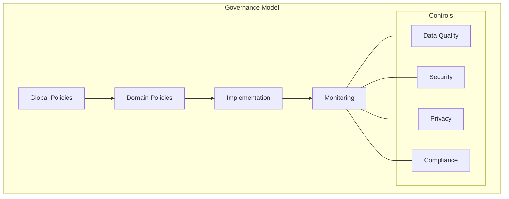

# Chapter 3: Data Mesh - A Modern Paradigm for Airlines

## Data Mesh in Aviation Context

GlobalAir's transformation to Data Mesh architecture represents a fundamental shift in how airline data is managed, owned, and utilized. This chapter explores how Data Mesh principles are implemented across various airline domains while leveraging multi-cloud capabilities.



## Domain-Oriented Architecture

### 1. Flight Operations Domain
- **Data Products:**
  - Real-time flight status
  - Crew assignments
  - Route optimization
  - Weather integration
  - Ground operations

- **Technology Stack:**
  ```mermaid
  graph TB
      subgraph "Flight Ops Domain"
          A[Event Sources] --> B[AWS Kinesis]
          B --> C[Lambda Processing]
          C --> D[DynamoDB]
          D --> E[API Gateway]
          
          subgraph "Data Products"
              F[Flight Tracker]
              G[Crew Portal]
              H[Weather Service]
          end
          
          E --- F
          E --- G
          E --- H
      end
      
      style A fill:#f5f5f5
      style B fill:#ff9900
      style C fill:#ff9900
      style D fill:#ff9900
      style E fill:#ff9900
  ```

### 2. Customer Experience Domain
- **Data Products:**
  - Booking platform
  - Loyalty management
  - Personalization engine
  - Customer 360
  - Journey tracking

- **Technology Stack:**
  ```mermaid
  graph TB
      subgraph "Customer Domain"
          A[Customer Events] --> B[Event Hubs]
          B --> C[Azure Functions]
          C --> D[Cosmos DB]
          D --> E[API Management]
          
          subgraph "Data Products"
              F[Booking Engine]
              G[Loyalty Platform]
              H[Customer Profile]
          end
          
          E --- F
          E --- G
          E --- H
      end
      
      style A fill:#f5f5f5
      style B fill:#0078d4
      style C fill:#0078d4
      style D fill:#0078d4
      style E fill:#0078d4
  ```

### 3. Revenue Management Domain
- **Data Products:**
  - Dynamic pricing
  - Inventory management
  - Revenue forecasting
  - Competitive analysis
  - Ancillary services

### 4. Aircraft Maintenance Domain
- **Data Products:**
  - Maintenance scheduling
  - Parts inventory
  - Predictive maintenance
  - Compliance reporting
  - Technical documentation

## Self-Serve Data Platform

### 1. Technical Infrastructure


### 2. Development Experience
- Domain templates
- CI/CD pipelines
- Testing frameworks
- Documentation tools
- Monitoring solutions

### 3. Cloud Services Integration
- **AWS Services:**
  - API Gateway
  - CloudFormation
  - CodePipeline
  - CloudWatch
  - Service Catalog

- **Azure Services:**
  - API Management
  - ARM Templates
  - DevOps
  - Monitor
  - Service Catalog

## Data Product Standards

### 1. Product Structure


### 2. Quality Requirements
- Data freshness
- Accuracy metrics
- Availability SLA
- Performance KPIs
- Security compliance

### 3. Implementation Standards
- API design
- Schema definition
- Security controls
- Monitoring setup
- Documentation requirements

## Federated Governance Model

### 1. Global Standards
- Data classification
- Security policies
- Privacy requirements
- Compliance rules
- Quality standards

### 2. Domain Autonomy
- Implementation freedom
- Technology choice
- Release management
- Resource allocation
- Team organization

### 3. Compliance Framework


## Cross-Domain Integration

### 1. Event-Driven Architecture
- Flight events
- Booking events
- Maintenance alerts
- Weather updates
- System notifications

### 2. API Management
- API gateway
- Rate limiting
- Authentication
- Authorization
- Monitoring

### 3. Data Sharing
- Data contracts
- Schema registry
- Change management
- Version control
- Access control

## Implementation Strategy

### 1. Domain Migration
- Domain identification
- Team formation
- Product definition
- Implementation
- Validation

### 2. Platform Development
- Infrastructure setup
- Tool selection
- Template creation
- Pipeline setup
- Documentation

### 3. Governance Evolution
- Policy development
- Standard creation
- Monitoring setup
- Audit process
- Feedback loop

## Key Success Metrics

### 1. Technical Metrics
- API response times
- Data freshness
- System availability
- Error rates
- Resource utilization

### 2. Business Metrics
- Time to market
- Development velocity
- Data usage
- Cost efficiency
- Customer satisfaction

## Challenges and Solutions

### 1. Technical Challenges
- Multi-cloud complexity
- Data consistency
- Performance optimization
- Tool integration
- Security implementation

### 2. Organizational Challenges
- Culture change
- Skill development
- Team restructuring
- Process adaptation
- Knowledge sharing

## Key Takeaways

1. Domain orientation enables business agility
2. Self-serve platform accelerates development
3. Standardization ensures quality
4. Federated governance balances control
5. Cross-domain integration drives value

## Next Steps

The next chapter will explore how Domain-Driven Design principles guide the creation and evolution of data domains in the airline industry.