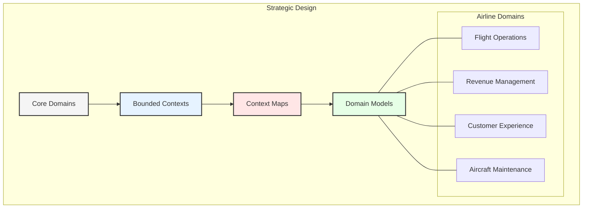
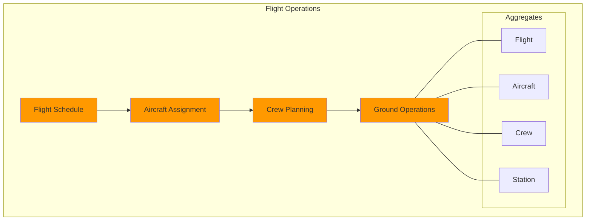
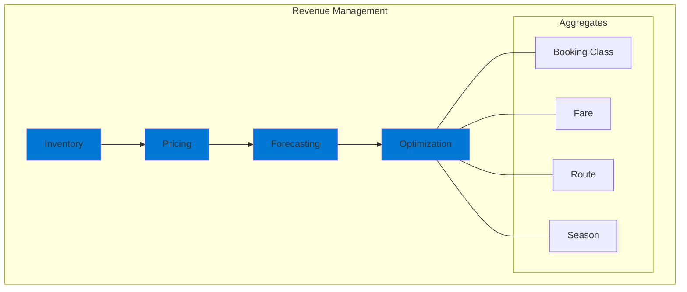
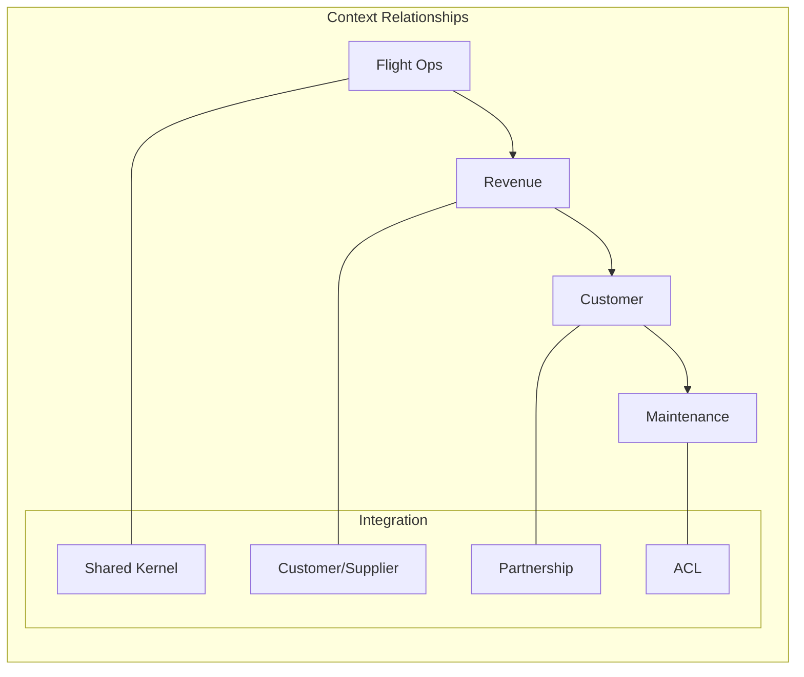
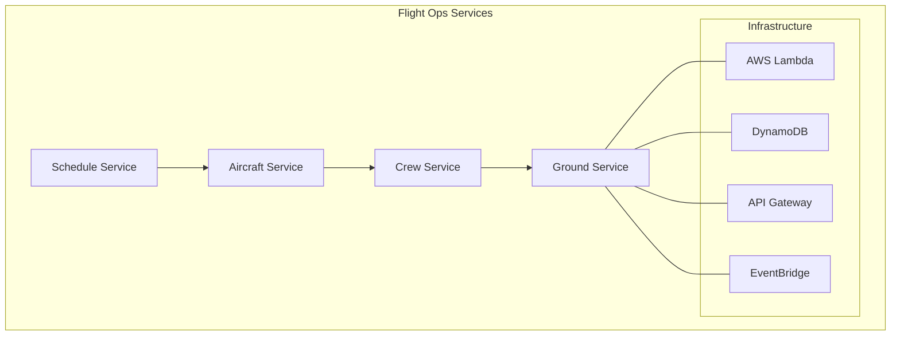
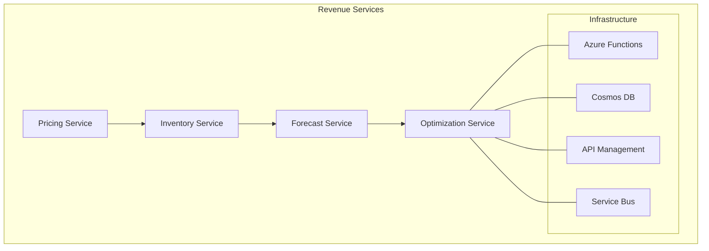
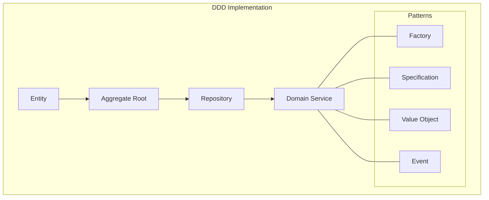

# Chapter 4: Domain-Driven Data Architecture

## Domain-Driven Design in Aviation

GlobalAir's implementation of Domain-Driven Design (DDD) provides a strategic framework for organizing data architecture around core business domains. This chapter explores how DDD principles shape the airline's data landscape across its multi-cloud environment.

## Core Domain Analysis

### 1. Flight Operations Domain

#### Domain Model
- **Entities:**
  - Flight
  - Aircraft
  - Crew
  - Route
  - Station

- **Value Objects:**
  - FlightNumber
  - ScheduleTime
  - AircraftType
  - CrewPosition
  - RouteSegment

- **Aggregates:**
  - FlightOperation
  - CrewAssignment
  - AircraftSchedule
  - StationOperation

### 2. Revenue Management Domain

#### Domain Model
- **Entities:**
  - Inventory
  - Price
  - BookingClass
  - Market
  - Season

- **Value Objects:**
  - FareAmount
  - LoadFactor
  - YieldMetric
  - MarketDemand
  - SeasonalPattern

- **Aggregates:**
  - PricingStrategy
  - InventoryControl
  - MarketAnalysis
  - RevenueOptimization

## Bounded Contexts

### 1. Context Mapping

### 2. Integration Patterns

#### AWS Implementation
- **Event Bridge:**
  - Domain event publishing
  - Cross-context communication
  - Event routing
  - Pattern matching

- **Step Functions:**
  - Process orchestration
  - Saga pattern
  - Compensation handling
  - Error management

#### Azure Implementation
- **Service Bus:**
  - Message queuing
  - Topic subscription
  - Order handling
  - Dead letter queuing

- **Logic Apps:**
  - Workflow automation
  - Integration patterns
  - Connector framework
  - Message transformation

## Domain Services

### 1. Flight Operations Services

### 2. Revenue Management Services

## Event Storming Analysis

### 1. Flight Operations Events
- FlightScheduled
- AircraftAssigned
- CrewAssigned
- FlightDeparted
- FlightArrived
- DelayRecorded
- WeatherImpact

### 2. Revenue Management Events
- InventoryUpdated
- PriceChanged
- BookingCreated
- ForecastUpdated
- OptimizationRun
- MarketAnalyzed
- SeasonDefined

## Implementation Patterns

### 1. Domain Model Pattern

### 2. Technical Implementation

#### AWS Stack
- Lambda for domain services
- DynamoDB for aggregates
- EventBridge for events
- API Gateway for interfaces

#### Azure Stack
- Functions for domain services
- Cosmos DB for aggregates
- Service Bus for events
- API Management for interfaces

## Data Consistency Patterns

### 1. Eventual Consistency
- Event sourcing
- CQRS pattern
- Saga pattern
- Compensation logic

### 2. Strong Consistency
- Transactional boundaries
- Aggregate roots
- Optimistic locking
- Version control

## Testing Strategy

### 1. Domain Model Testing
- Unit tests
- Aggregate tests
- Event tests
- Service tests

### 2. Integration Testing
- Context integration
- Event flow
- Saga execution
- Compensation handling

## Deployment Strategy

### 1. AWS Deployment
- CloudFormation templates
- CodePipeline automation
- Multi-region deployment
- Blue-green updates

### 2. Azure Deployment
- ARM templates
- Azure DevOps
- Geo-replication
- Staged rollout

## Monitoring and Observability

### 1. Domain Metrics
- Bounded context health
- Event processing
- Service performance
- Data consistency

### 2. Business Metrics
- Domain KPIs
- Process efficiency
- System reliability
- Business impact

## Key Takeaways

1. DDD aligns technology with business
2. Bounded contexts ensure clean separation
3. Event-driven integration enables flexibility
4. Multi-cloud implementation provides resilience
5. Domain-specific deployment ensures control

## Next Steps

The next chapter will explore how Agentic AI capabilities can be integrated into this domain-driven architecture to enhance decision-making and automation across airline operations.