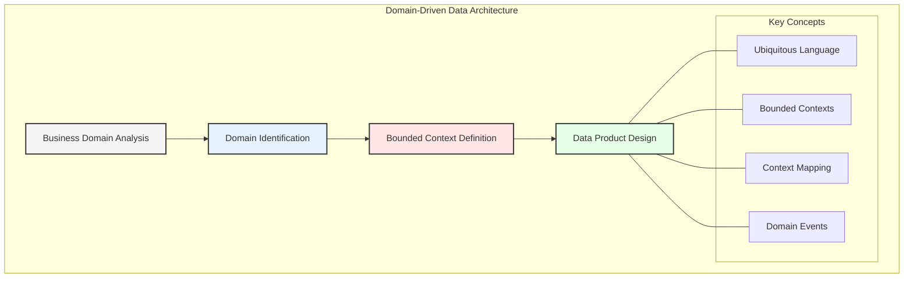
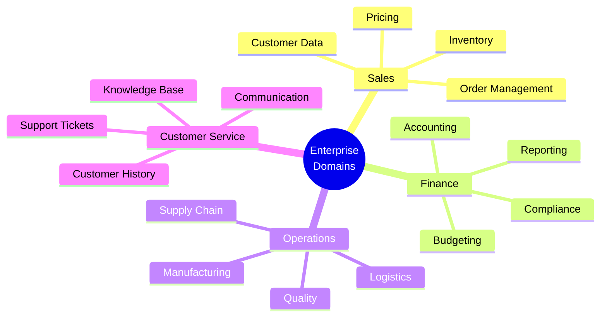
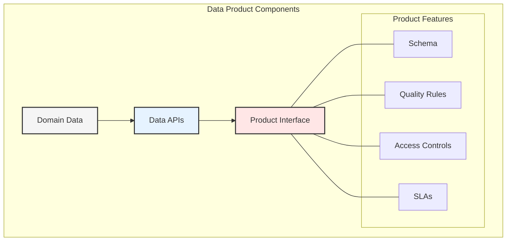
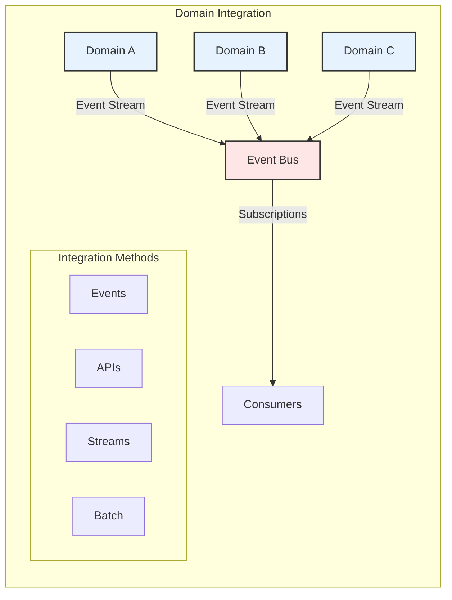
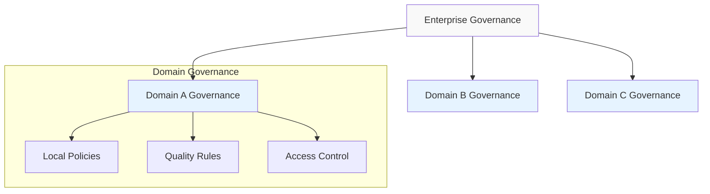
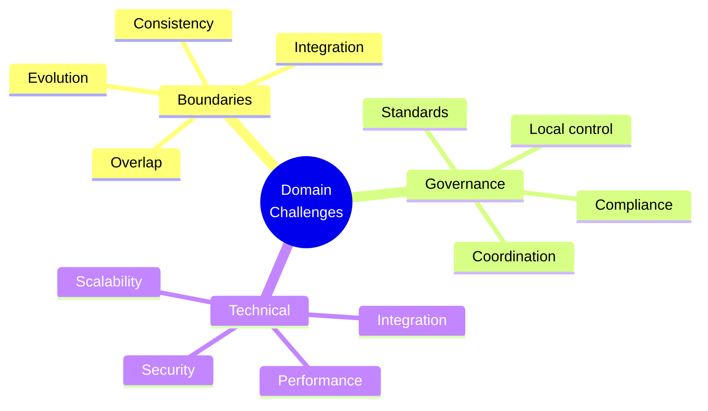

# Chapter 4: Domain-Driven Data Architecture

## Understanding Domain-Driven Design in Data

Domain-Driven Design (DDD) principles, when applied to data architecture, create a powerful framework for organizing and managing enterprise data assets. This chapter explores how to apply DDD concepts to create effective data domains and products.

## Domain Discovery Process

### 1. Business Capability Mapping
- Identify core business functions
- Map data flows
- Document dependencies
- Define domain boundaries

### 2. Bounded Context Definition
- Context boundaries
- Shared kernels
- Anti-corruption layers
- Interface contracts

## Data Product Architecture

### 1. Data Product Design Principles
- Domain alignment
- Consumer-first approach
- Self-contained units
- Clear interfaces

### 2. Product Interface Design
- API specifications
- Query patterns
- Access methods
- Documentation standards

## Domain Integration Patterns

### 1. Event-Driven Integration
- Domain events
- Event schemas
- Publishing patterns
- Subscription models

### 2. API-Based Integration
- REST/GraphQL APIs
- Service contracts
- Version management
- Documentation

## Data Governance in Domain-Driven Architecture

### 1. Domain-Level Governance
- Local policies
- Quality standards
- Access controls
- Compliance checks

### 2. Cross-Domain Governance
- Global standards
- Shared policies
- Integration rules
- Master data management

## Implementation Strategy

### 1. Domain Analysis Phase
- Business process mapping
- Data flow analysis
- Stakeholder interviews
- Domain modeling

### 2. Design Phase
- Context mapping
- Interface design
- Schema development
- Integration planning

### 3. Development Phase
- Infrastructure setup
- API development
- Testing strategy
- Documentation

## Best Practices

1. **Start with Business Domains**
   - Focus on value streams
   - Involve domain experts
   - Map data relationships
   - Define clear boundaries

2. **Design for Evolution**
   - Flexible schemas
   - Versioned interfaces
   - Extensible models
   - Change management

3. **Ensure Data Quality**
   - Validation rules
   - Quality metrics
   - Monitoring
   - Feedback loops

## Common Challenges and Solutions

## Key Takeaways

1. Domain-driven design enhances data architecture
2. Clear boundaries improve maintainability
3. Event-driven integration enables scalability
4. Local governance supports autonomy
5. Evolution must be planned for

## Next Steps

The next chapter will explore Agentic AI and how domain-driven data architecture provides the foundation for advanced AI capabilities within the enterprise.