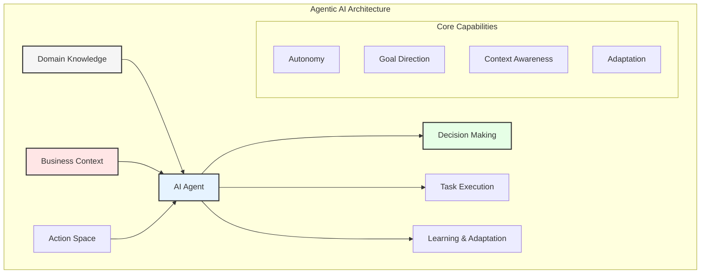
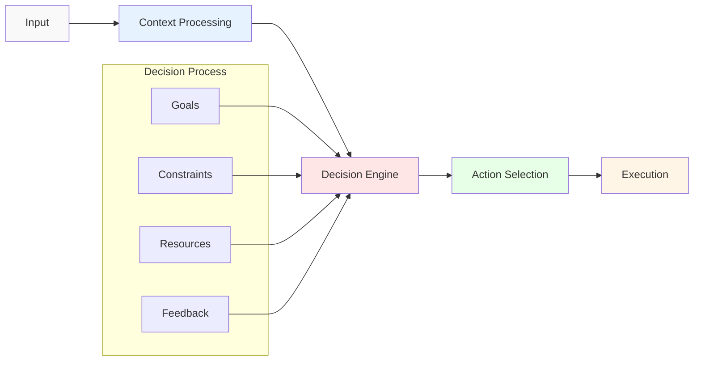
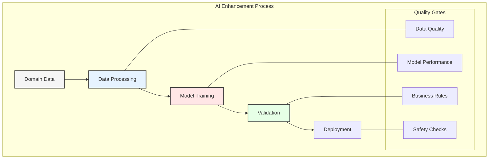
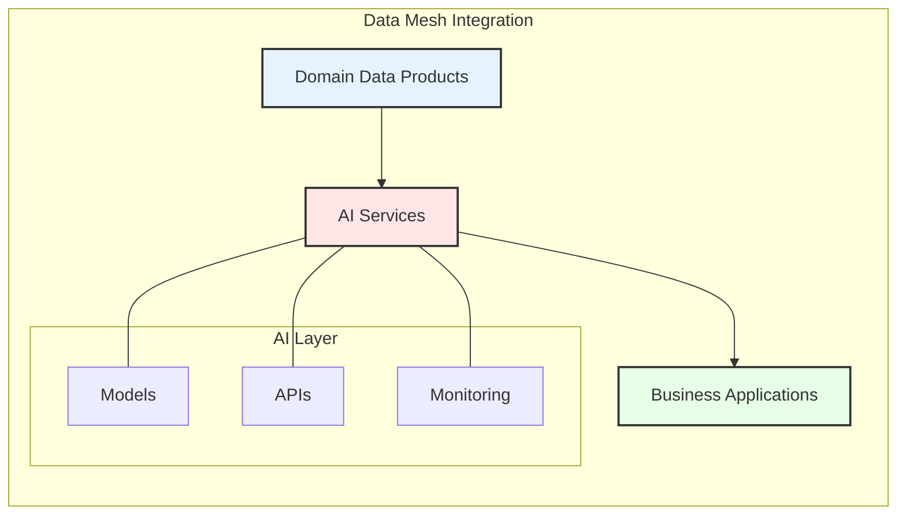
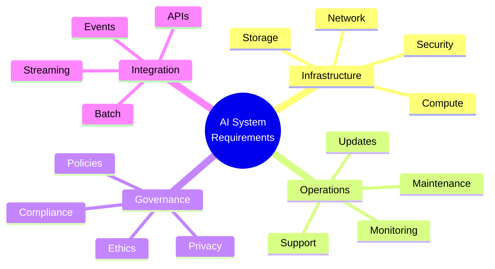
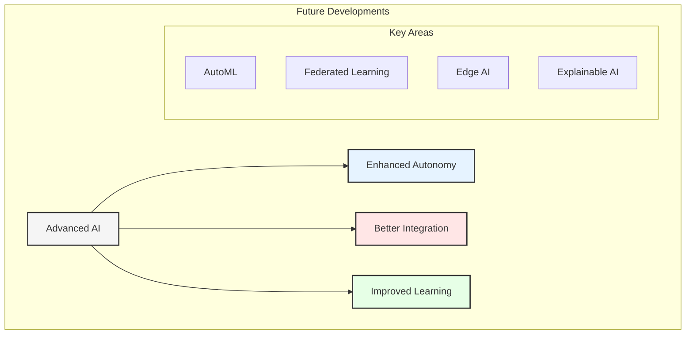

# Chapter 5: Agentic AI: Core Concepts and Capabilities

## Understanding Agentic AI

Agentic AI represents a new paradigm in artificial intelligence where systems exhibit autonomous, goal-directed behavior while maintaining awareness of business domain contexts. This chapter explores how these systems operate and how they can be enhanced through domain-specific data architecture.

## Core Components of Agentic AI

### 1. Domain Knowledge Integration
- Business rules encoding
- Domain-specific constraints
- Expert knowledge representation
- Contextual understanding

### 2. Decision-Making Framework
- Goal-oriented reasoning
- Multi-objective optimization
- Risk assessment
- Action planning

## Enhancing AI with Domain Data

### 1. Data Quality Requirements
- Accuracy metrics
- Completeness checks
- Consistency validation
- Timeliness measures

### 2. Domain-Specific Training
- Custom model development
- Transfer learning
- Fine-tuning strategies
- Validation frameworks

## AI Capabilities in Business Context

### 1. Autonomous Decision Making
- Rule-based decisions
- ML-based predictions
- Hybrid approaches
- Confidence scoring

### 2. Process Automation
- Workflow optimization
- Task prioritization
- Resource allocation
- Exception handling

### 3. Continuous Learning
- Feedback incorporation
- Performance monitoring
- Model updating
- Knowledge expansion

## Integration with Data Mesh

### 1. Data Product Consumption
- API-based access
- Event streaming
- Batch processing
- Real-time updates

### 2. Model Serving Infrastructure
- Scalable deployment
- Version management
- Performance monitoring
- Resource optimization

## Implementation Considerations

### 1. Technical Requirements
- Computing resources
- Storage capacity
- Network bandwidth
- Security measures

### 2. Operational Requirements
- Monitoring systems
- Alerting mechanisms
- Backup procedures
- Recovery plans

## Best Practices

1. **Start with Clear Goals**
   - Define objectives
   - Set metrics
   - Plan iterations
   - Monitor progress

2. **Ensure Data Quality**
   - Validation pipelines
   - Quality metrics
   - Cleaning procedures
   - Update mechanisms

3. **Maintain Control**
   - Human oversight
   - Safety measures
   - Rollback procedures
   - Audit trails

## Challenges and Solutions

### 1. Technical Challenges
- Model complexity
- Resource constraints
- Integration issues
- Performance bottlenecks

### 2. Operational Challenges
- Maintenance overhead
- Skill requirements
- Change management
- Cost control

### 3. Governance Challenges
- Ethical considerations
- Regulatory compliance
- Privacy protection
- Security measures

## Future Trends

## Key Takeaways

1. Agentic AI requires quality domain data
2. Integration with data mesh is crucial
3. Clear governance framework needed
4. Continuous monitoring essential
5. Evolution must be managed

## Next Steps

The next chapter will explore the practical integration of business domain data with agentic AI systems, including implementation patterns and best practices.