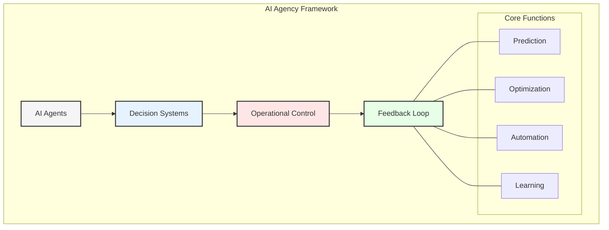
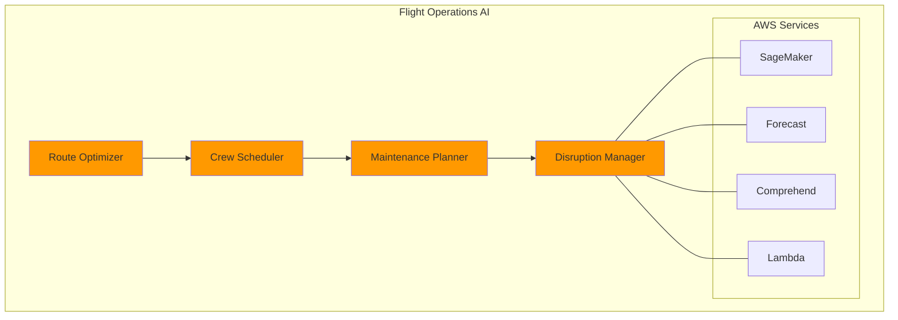
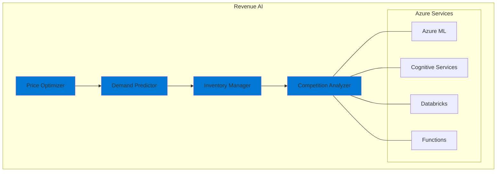
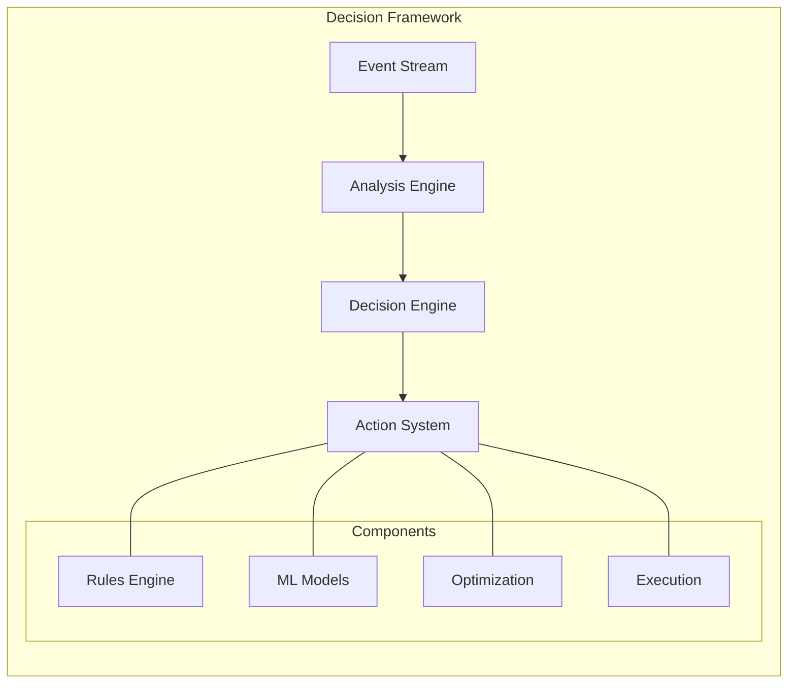
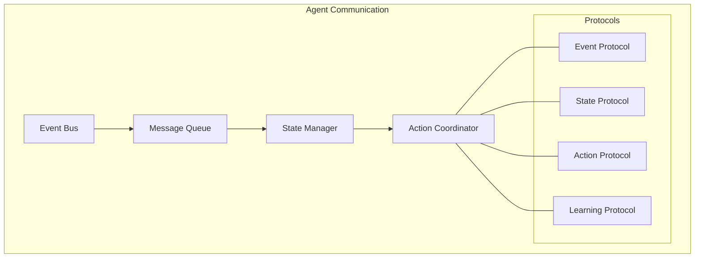
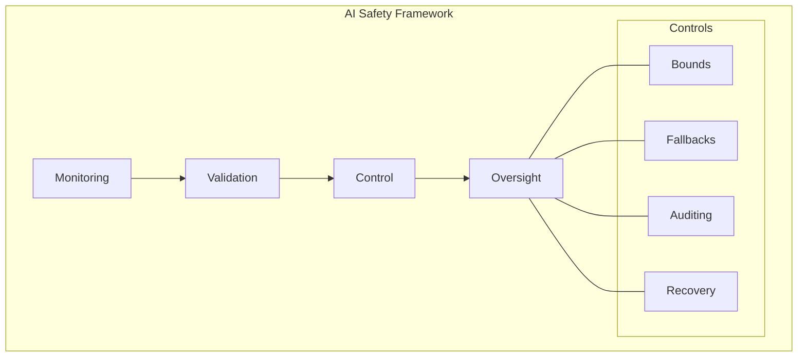
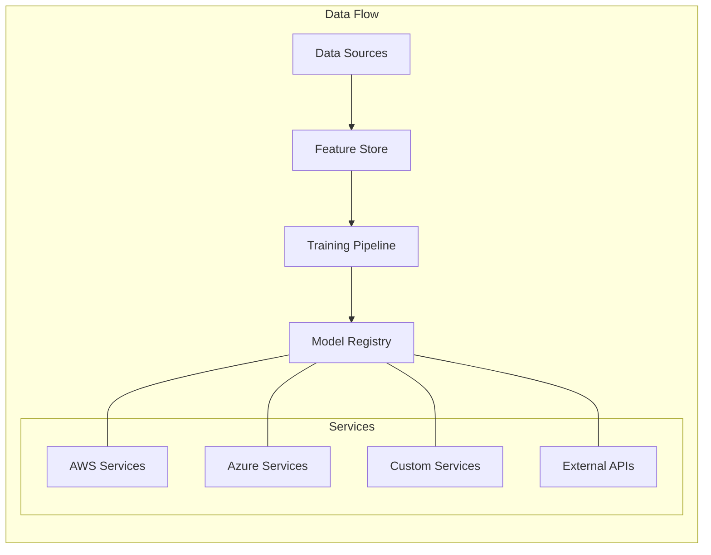

# Chapter 5: Agentic AI in Airline Operations

## Introduction to AI Agency in Aviation

GlobalAir's implementation of Agentic AI represents a paradigm shift in how airlines leverage artificial intelligence for autonomous decision-making and operational optimization. By deploying AI agents across various domains, GlobalAir has achieved significant improvements in efficiency, customer satisfaction, and operational resilience. This chapter explores the integration of AI agents using AWS and Azure's machine learning capabilities, highlighting their transformative impact.

## AI Agent Architecture

### 1. Flight Operations Agents

#### Implementation Details
- **Route Optimization:**
  - AWS SageMaker enables the development of machine learning models that predict optimal flight paths based on historical data, weather conditions, and air traffic.
  - Custom algorithms integrate real-time data to dynamically adjust routes, ensuring fuel efficiency and minimizing delays.
  - Real-time weather integration provides up-to-date meteorological insights, enhancing safety and operational planning.
  - Fuel efficiency calculations leverage predictive analytics to identify cost-saving opportunities, supporting sustainability goals.

- **Crew Scheduling:**
  - Azure ML facilitates pattern recognition to optimize crew assignments, balancing workload and preferences.
  - Fatigue risk management ensures compliance with safety regulations, reducing the likelihood of errors.
  - Regulatory compliance checks automate the validation of crew schedules against industry standards, ensuring adherence.
  - Preference matching enhances employee satisfaction by considering individual preferences in scheduling decisions.

### 2. Revenue Management Agents

- **Price Optimization:**
  - AI-driven pricing engines analyze market trends, competitor actions, and customer behavior to dynamically adjust fares.
  - Demand prediction models forecast booking patterns, enabling proactive inventory management.
  - Inventory management systems ensure optimal seat allocation, balancing load factors and profitability.
  - Competition analysis provides insights into market positioning, guiding strategic pricing decisions.

## Multi-Cloud ML Infrastructure

### 1. AWS ML Services
- **SageMaker Implementation:**
  - Custom model development supports diverse use cases, from route optimization to customer segmentation.
  - Automated training pipelines streamline the model development lifecycle, reducing time-to-market.
  - Model deployment automation ensures seamless integration into operational systems, minimizing disruptions.
  - A/B testing frameworks evaluate model performance, enabling continuous improvement.

- **AWS AI Services:**
  - Forecast predicts demand patterns, supporting inventory and pricing strategies.
  - Personalize delivers tailored recommendations, enhancing customer engagement.
  - Comprehend analyzes sentiment in customer feedback, guiding service improvements.
  - Rekognition enhances security through facial recognition and anomaly detection.

### 2. Azure ML Services
- **Azure ML Implementation:**
  - AutoML capabilities simplify the creation of high-performing models, democratizing AI adoption.
  - MLOps pipelines automate the deployment and monitoring of models, ensuring reliability.
  - Model registry centralizes model management, improving governance and traceability.
  - Deployment strategies enable flexible scaling, supporting diverse operational needs.

- **Azure AI Services:**
  - Cognitive Services provide pre-built AI capabilities, such as language understanding and vision analysis.
  - Bot Service powers conversational interfaces, enhancing customer interactions.
  - OpenAI integration enables advanced natural language processing, supporting innovative use cases.
  - Custom Vision facilitates the development of tailored image recognition solutions, addressing specific challenges.

## Real-time Decision Systems

### 1. Operational Decisions

- **Event Stream Analysis:**
  - Real-time data streams from IoT devices, operational systems, and customer interactions feed into analysis engines.
  - Decision engines apply business rules and machine learning models to generate actionable insights.
  - Action systems execute decisions, such as rerouting flights or adjusting prices, ensuring timely responses.

### 2. Customer Experience Decisions
- **Personalization Engines:**
  - AI-driven systems tailor recommendations, such as seat upgrades or in-flight purchases, to individual preferences.
  - Dynamic pricing adjusts fares in real-time based on demand and customer behavior, maximizing revenue.
  - Upgrade offers incentivize customers to enhance their travel experience, increasing satisfaction.
  - Service recovery systems proactively address issues, turning negative experiences into positive outcomes.
  - Loyalty rewards programs leverage AI to identify and reward high-value customers, fostering long-term relationships.

## AI Agent Interaction Patterns

### 1. Inter-Agent Communication

### 2. Cross-Domain Coordination
- Event-driven communication
- State synchronization
- Action arbitration
- Learning sharing

## Machine Learning Pipelines

### 1. Training Pipeline
- Data preparation
- Feature engineering
- Model training
- Validation
- Deployment

### 2. Inference Pipeline
- Real-time inference
- Batch prediction
- Model monitoring
- Performance tracking
- Feedback collection

## AI Safety and Governance

### 1. Safety Measures

- **Monitoring and Validation:**
  - Continuous monitoring ensures that AI systems operate within defined parameters, preventing unintended outcomes.
  - Validation processes rigorously test models against real-world scenarios, ensuring reliability and fairness.
  - Control mechanisms, such as fallback systems, provide safeguards against failures, maintaining operational continuity.
  - Oversight frameworks establish accountability, ensuring that AI systems align with organizational values and goals.

### 2. Governance Framework
- **Ethics Guidelines:**
  - Clear principles guide the development and deployment of AI systems, ensuring ethical considerations are prioritized.
  - Bias detection tools identify and mitigate potential biases in data and models, promoting fairness.
  - Fairness metrics evaluate the impact of AI decisions on different stakeholder groups, ensuring equity.
  - Transparency initiatives provide visibility into AI processes, building trust with stakeholders.
  - Accountability measures assign responsibility for AI outcomes, ensuring compliance with regulations and standards.

## Performance Optimization

### 1. Model Optimization
- Hyperparameter tuning
- Architecture search
- Feature selection
- Ensemble methods
- Pruning techniques

### 2. Infrastructure Optimization
- Auto-scaling
- Cost management
- Resource allocation
- Caching strategies
- Load balancing

## Integration Patterns

### 1. Data Integration

### 2. Service Integration
- API management
- Event handling
- State management
- Error handling
- Recovery patterns

## Monitoring and Analytics

### 1. Model Monitoring
- Performance metrics
- Drift detection
- Error analysis
- Resource usage
- Cost tracking

### 2. Business Impact
- ROI measurement
- Efficiency gains
- Cost savings
- Revenue impact
- Customer satisfaction

## Future Developments

### 1. Technology Evolution
- Advanced AI models
- Quantum computing
- Edge deployment
- Federated learning
- AutoML advances

### 2. Business Evolution
- New use cases
- Enhanced automation
- Deeper integration
- Greater autonomy
- Expanded scope

## Key Takeaways

1. AI agents enhance operational efficiency by automating complex decision-making processes.
2. Multi-cloud ML infrastructure provides flexibility and scalability, supporting diverse use cases.
3. Safety and governance frameworks ensure that AI systems operate responsibly and ethically.
4. Integration patterns enable seamless communication between AI agents, fostering collaboration.
5. Continuous monitoring and optimization ensure that AI systems deliver sustained value.

## Next Steps

The next chapter will explore the integration patterns that enable seamless communication between different components of the airline's data architecture.