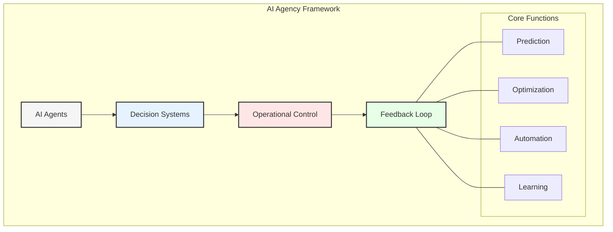
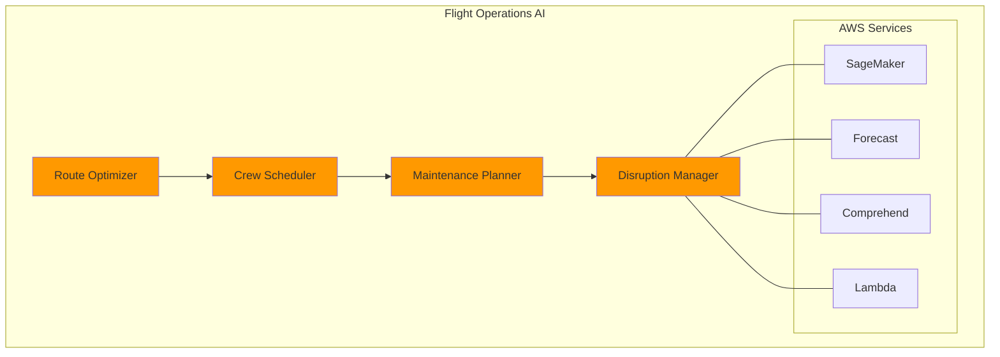
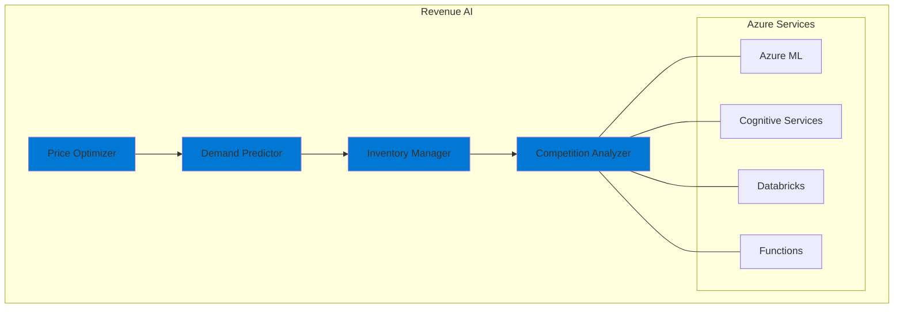
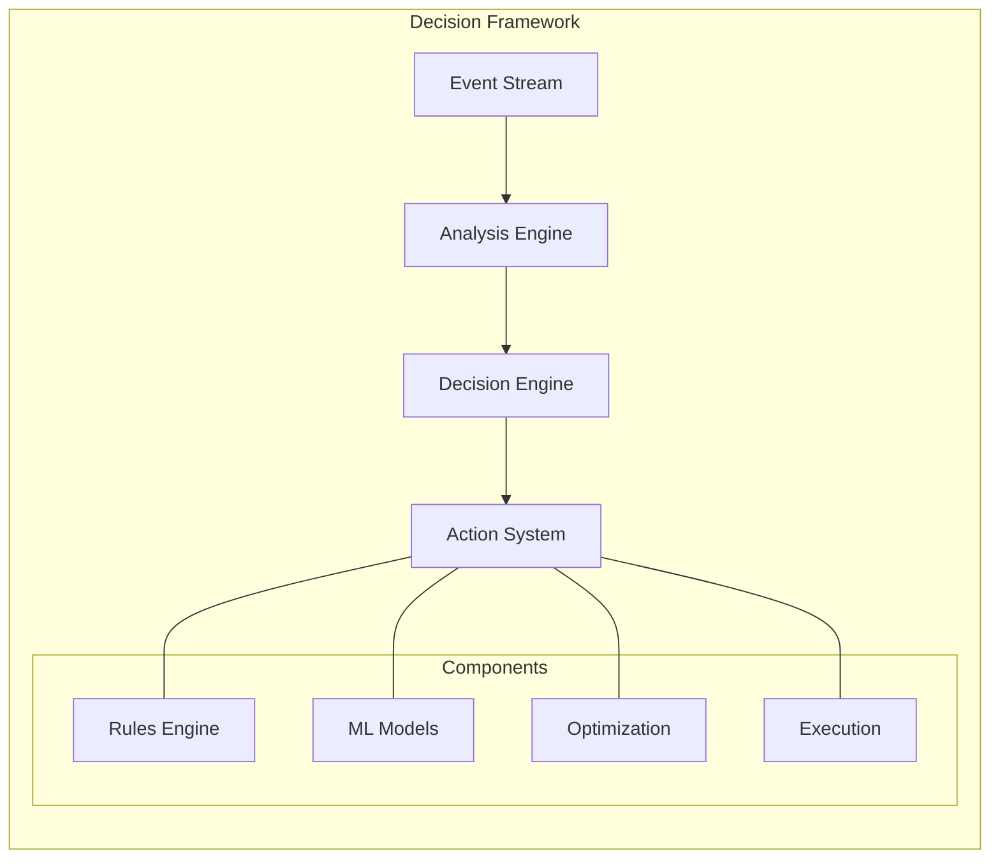
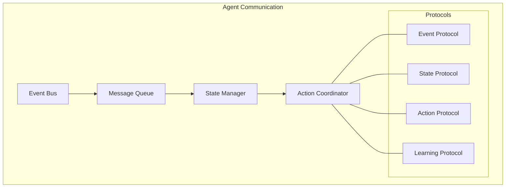
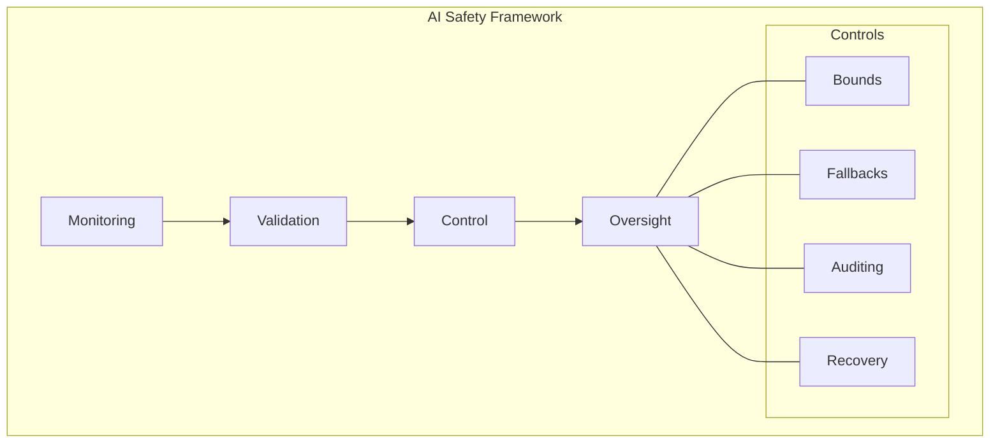
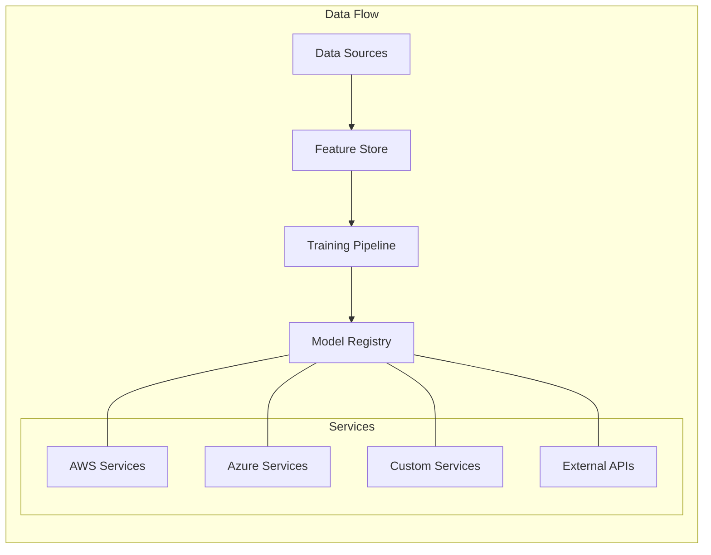

# Chapter 5: Agentic AI in Airline Operations

## Introduction to AI Agency in Aviation

GlobalAir's implementation of Agentic AI represents a paradigm shift in how airlines leverage artificial intelligence for autonomous decision-making and operational optimization. This chapter explores the integration of AI agents across different domains using AWS and Azure's machine learning capabilities.

## AI Agent Architecture

### 1. Flight Operations Agents

#### Implementation Details
- **Route Optimization:**
  - AWS SageMaker for ML models
  - Custom algorithms for path optimization
  - Real-time weather integration
  - Fuel efficiency calculations

- **Crew Scheduling:**
  - Azure ML for pattern recognition
  - Fatigue risk management
  - Regulatory compliance checks
  - Preference matching

### 2. Revenue Management Agents

## Multi-Cloud ML Infrastructure

### 1. AWS ML Services
- **SageMaker Implementation:**
  - Custom model development
  - Automated training pipelines
  - Model deployment automation
  - A/B testing framework

- **AWS AI Services:**
  - Forecast for demand prediction
  - Personalize for recommendations
  - Comprehend for sentiment analysis
  - Rekognition for security

### 2. Azure ML Services
- **Azure ML Implementation:**
  - AutoML capabilities
  - MLOps pipelines
  - Model registry
  - Deployment strategies

- **Azure AI Services:**
  - Cognitive Services
  - Bot Service
  - OpenAI integration
  - Custom Vision

## Real-time Decision Systems

### 1. Operational Decisions

### 2. Customer Experience Decisions
- Personalization engines
- Dynamic pricing
- Upgrade offers
- Service recovery
- Loyalty rewards

## AI Agent Interaction Patterns

### 1. Inter-Agent Communication

### 2. Cross-Domain Coordination
- Event-driven communication
- State synchronization
- Action arbitration
- Learning sharing

## Machine Learning Pipelines

### 1. Training Pipeline
- Data preparation
- Feature engineering
- Model training
- Validation
- Deployment

### 2. Inference Pipeline
- Real-time inference
- Batch prediction
- Model monitoring
- Performance tracking
- Feedback collection

## AI Safety and Governance

### 1. Safety Measures

### 2. Governance Framework
- Ethics guidelines
- Bias detection
- Fairness metrics
- Transparency
- Accountability

## Performance Optimization

### 1. Model Optimization
- Hyperparameter tuning
- Architecture search
- Feature selection
- Ensemble methods
- Pruning techniques

### 2. Infrastructure Optimization
- Auto-scaling
- Cost management
- Resource allocation
- Caching strategies
- Load balancing

## Integration Patterns

### 1. Data Integration

### 2. Service Integration
- API management
- Event handling
- State management
- Error handling
- Recovery patterns

## Monitoring and Analytics

### 1. Model Monitoring
- Performance metrics
- Drift detection
- Error analysis
- Resource usage
- Cost tracking

### 2. Business Impact
- ROI measurement
- Efficiency gains
- Cost savings
- Revenue impact
- Customer satisfaction

## Future Developments

### 1. Technology Evolution
- Advanced AI models
- Quantum computing
- Edge deployment
- Federated learning
- AutoML advances

### 2. Business Evolution
- New use cases
- Enhanced automation
- Deeper integration
- Greater autonomy
- Expanded scope

## Key Takeaways

1. AI agents enhance operational efficiency
2. Multi-cloud ML provides flexibility
3. Safety and governance are critical
4. Integration patterns enable scalability
5. Continuous monitoring ensures success

## Next Steps

The next chapter will explore the integration patterns that enable seamless communication between different components of the airline's data architecture.