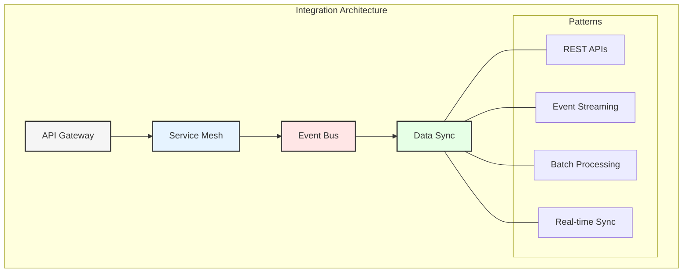
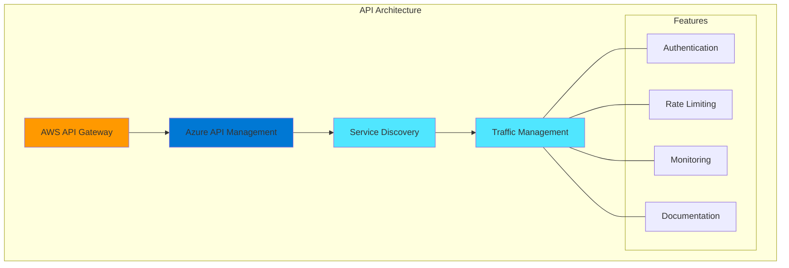
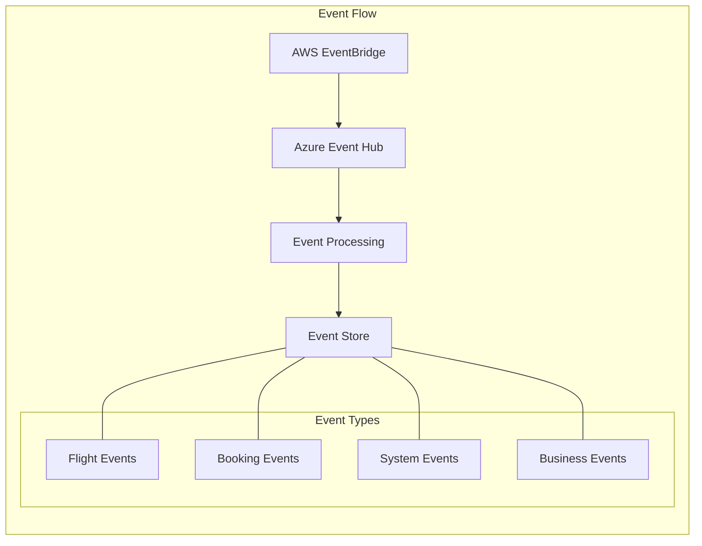
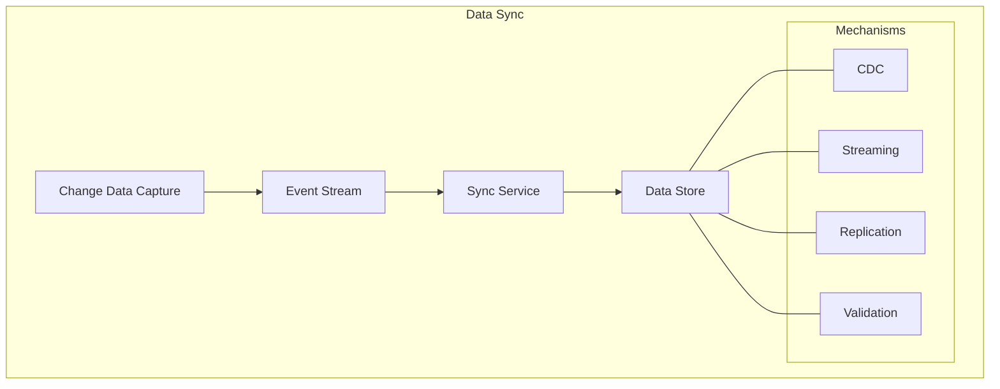
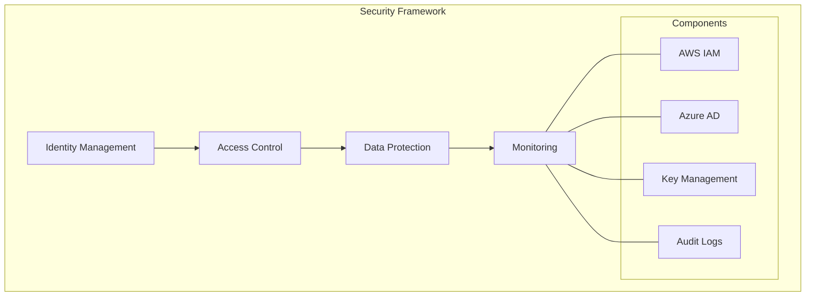
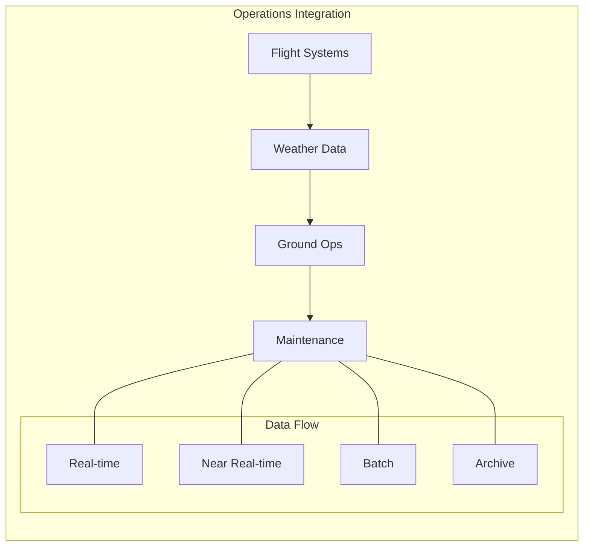
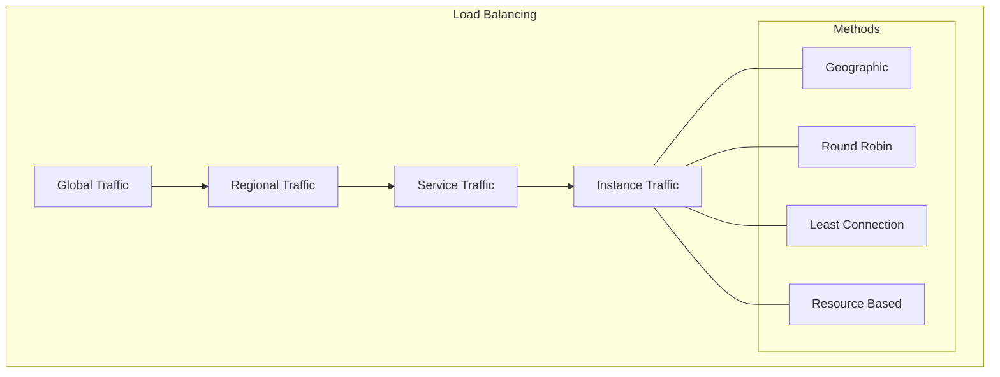
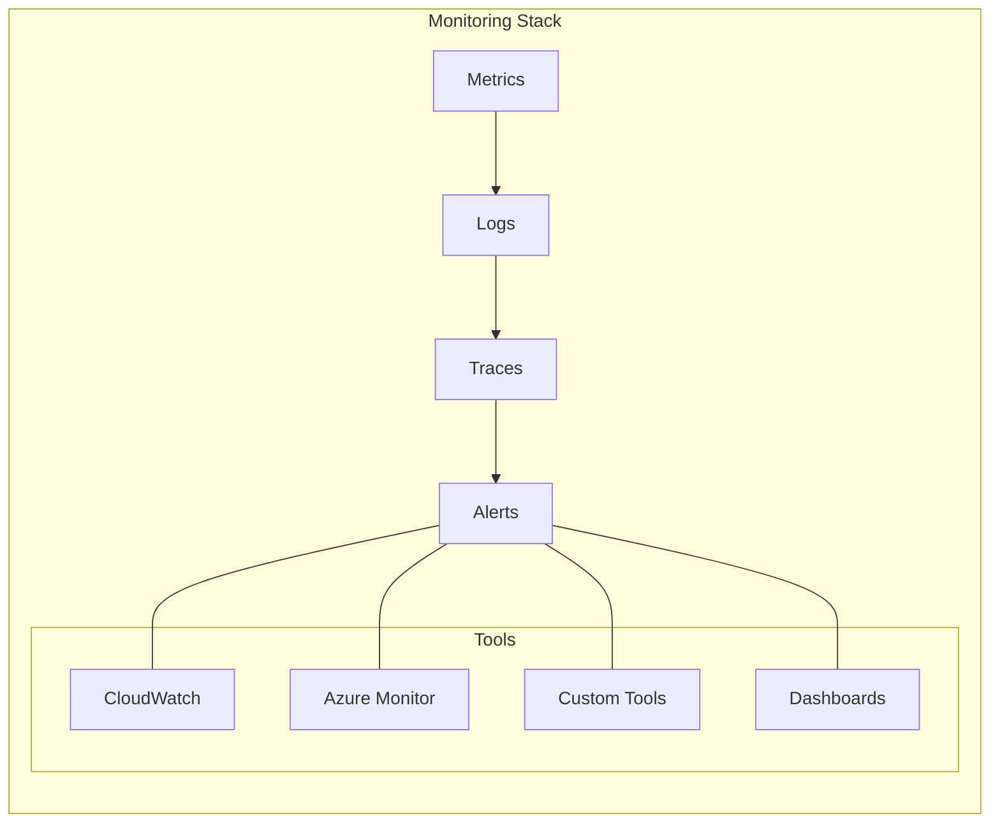
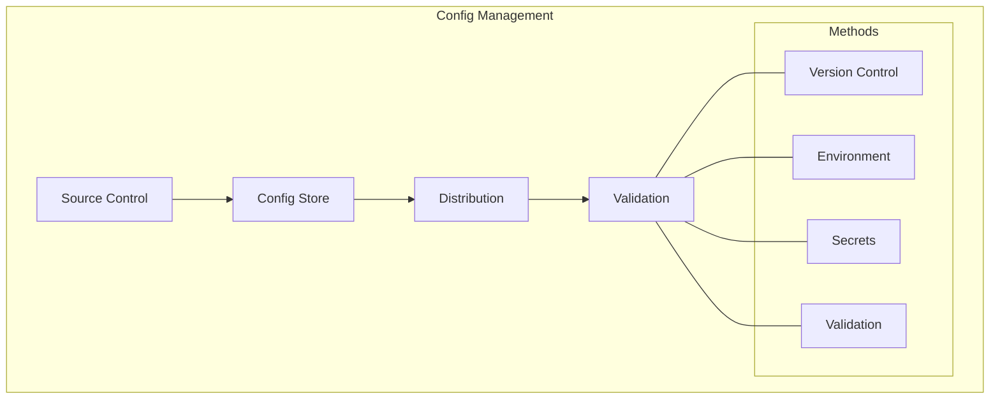

# Chapter 6: Integration Patterns for Airline Operations

## Multi-Cloud Integration Architecture

GlobalAir's integration architecture enables seamless operation across AWS and Azure clouds while maintaining high availability and real-time data synchronization. This chapter explores the patterns and practices that make this possible.

## Cross-Cloud Communication

### 1. API Management

### 2. Service Mesh Implementation
- **AWS App Mesh:**
  - Service discovery
  - Traffic routing
  - Circuit breaking
  - Retry logic

- **Azure Service Mesh:**
  - Service identity
  - Traffic splitting
  - Fault injection
  - Observability

## Event-Driven Integration

### 1. Event Architecture

### 2. Implementation Details

#### AWS Components
- EventBridge for routing
- SNS for pub/sub
- SQS for queuing
- Kinesis for streaming

#### Azure Components
- Event Hub for ingestion
- Service Bus for messaging
- Event Grid for routing
- Stream Analytics

## Data Synchronization

### 1. Real-time Sync

### 2. Batch Sync
- Daily reconciliation
- Historical data
- Analytics datasets
- Backup systems

## Integration Security

### 1. Cross-Cloud Security

### 2. Implementation
- **AWS Security:**
  - IAM roles
  - KMS encryption
  - VPC endpoints
  - WAF protection

- **Azure Security:**
  - Managed identities
  - Key Vault
  - Private endpoints
  - DDoS protection

## Domain-Specific Integration

### 1. Flight Operations

### 2. Customer Experience
- Booking integration
- Loyalty systems
- Mobile services
- Social media
- Payment systems

## Performance Optimization

### 1. Caching Strategy
- Multi-level caching
- Distributed cache
- Cache invalidation
- Performance metrics
- Cost optimization

### 2. Load Balancing

## Error Handling

### 1. Resilience Patterns
- Circuit breakers
- Retry policies
- Fallback mechanisms
- Dead letter queues
- Error logging

### 2. Recovery Procedures
- Automated recovery
- Manual intervention
- Data reconciliation
- System restore
- Incident management

## Monitoring and Observability

### 1. Operational Monitoring

### 2. Business Monitoring
- Transaction tracking
- Business metrics
- SLA compliance
- Cost analysis
- Usage patterns

## Deployment Strategies

### 1. Cross-Cloud Deployment
- Infrastructure as Code
- Blue-green deployment
- Canary releases
- Feature flags
- Rollback procedures

### 2. Configuration Management

## Key Takeaways

1. Multi-cloud integration requires careful planning
2. Event-driven architecture enables real-time operations
3. Security must be comprehensive
4. Performance optimization is critical
5. Monitoring ensures reliability

## Next Steps

The next chapter will explore the transformation journey from legacy systems to this modern integrated architecture.