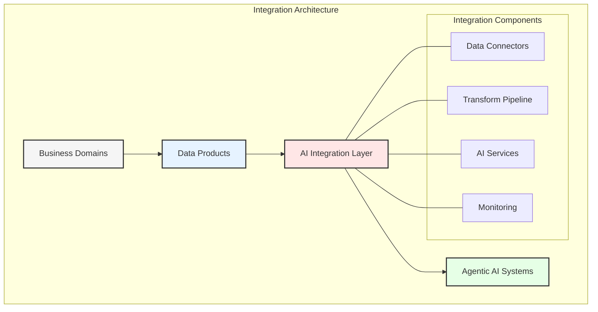
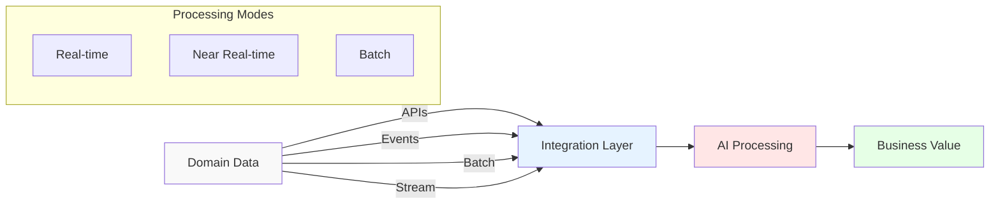
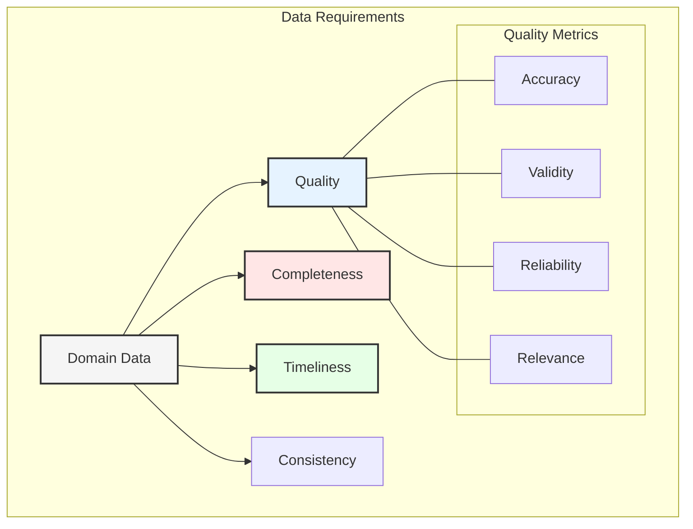
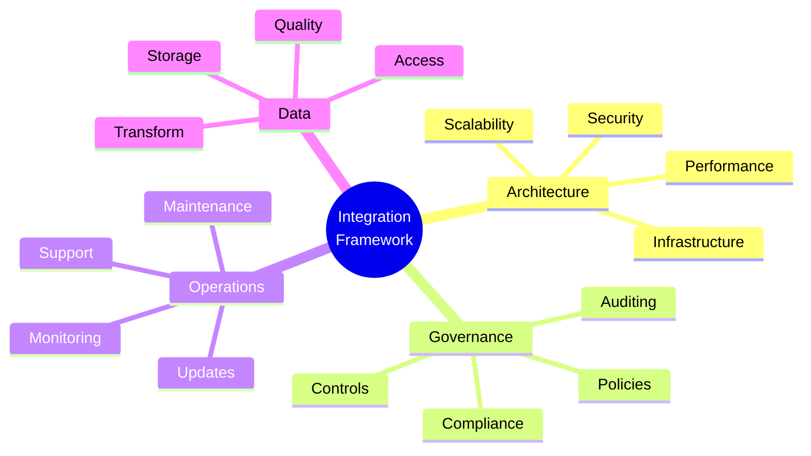
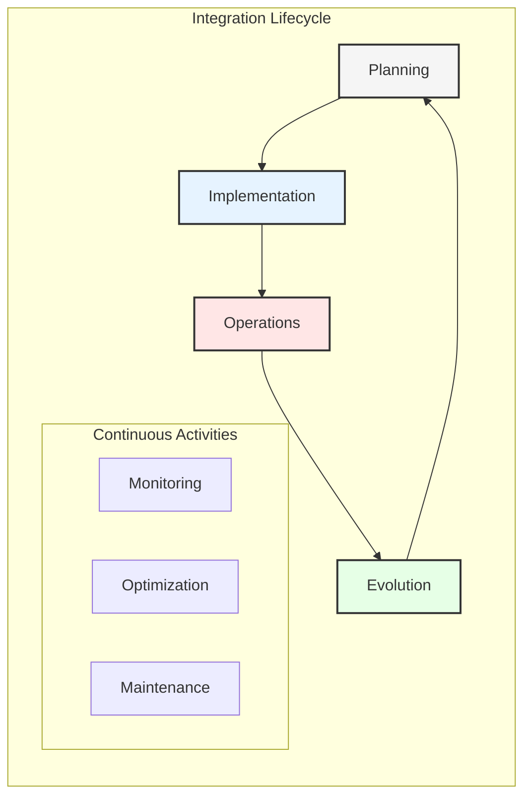
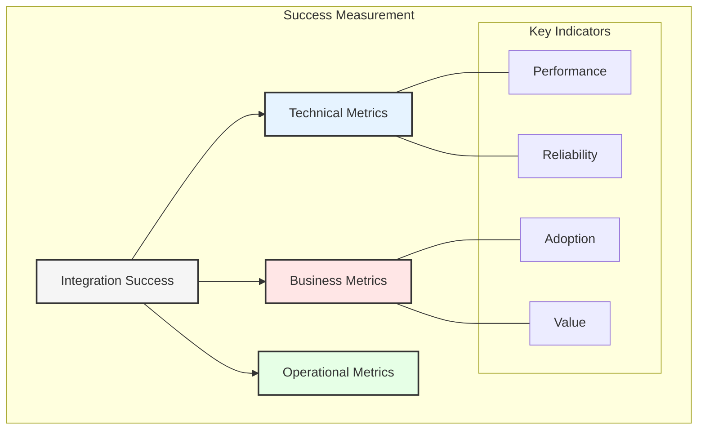

# Chapter 6: Integration of Business Domain Data with Agentic AI

## The Integration Challenge

Combining business domain data with agentic AI systems requires careful consideration of both technical and organizational factors. This chapter provides a comprehensive framework for successful integration while leveraging the data mesh architecture.

## Integration Patterns

### 1. Data Access Patterns
- API-First approach
- Event-driven integration
- Batch processing
- Real-time streaming

### 2. Data Transformation
- Schema alignment
- Format conversion
- Quality enrichment
- Context addition

### 3. AI Model Integration
- Model deployment
- Version control
- Performance monitoring
- Feedback loops

## Domain Data Requirements

### 1. Data Quality Standards
- Accuracy thresholds
- Completeness criteria
- Timeliness requirements
- Consistency checks

### 2. Metadata Requirements
- Business context
- Data lineage
- Usage patterns
- Quality metrics

## Implementation Framework

### 1. Technical Architecture
- Infrastructure setup
- Integration patterns
- Security measures
- Monitoring systems

### 2. Governance Framework
- Access controls
- Compliance checks
- Audit trails
- Policy enforcement

## Integration Lifecycle

### 1. Planning Phase
- Requirements gathering
- Architecture design
- Resource allocation
- Timeline definition

### 2. Implementation Phase
- Infrastructure setup
- Integration development
- Testing and validation
- Documentation

### 3. Operations Phase
- Monitoring and alerting
- Performance optimization
- Issue resolution
- Continuous improvement

## Best Practices

### 1. Design Principles
- Modularity
- Scalability
- Reliability
- Maintainability

### 2. Development Guidelines
- Code standards
- Testing requirements
- Documentation needs
- Review processes

### 3. Operational Standards
- SLA definitions
- Performance metrics
- Support procedures
- Incident management

## Common Challenges

### 1. Technical Challenges
- Integration complexity
- Performance issues
- Scalability concerns
- Security risks

### 2. Organizational Challenges
- Skill gaps
- Change resistance
- Communication issues
- Resource constraints

### 3. Data Challenges
- Quality problems
- Format inconsistencies
- Volume handling
- Access controls

## Success Metrics

### 1. Technical Metrics
- Integration performance
- System reliability
- Error rates
- Response times

### 2. Business Metrics
- Value delivery
- User adoption
- Cost efficiency
- Time savings

### 3. Operational Metrics
- System availability
- Issue resolution time
- Resource utilization
- Support efficiency

## Future Considerations

1. **Emerging Technologies**
   - New AI capabilities
   - Integration patterns
   - Data formats
   - Processing methods

2. **Evolving Requirements**
   - Business needs
   - Technical demands
   - Regulatory changes
   - Market trends

3. **Continuous Improvement**
   - Performance optimization
   - Feature enhancement
   - Process refinement
   - Capability expansion

## Key Takeaways

1. Integration requires careful planning
2. Quality standards are crucial
3. Monitoring is essential
4. Evolution must be managed
5. Success needs measurement

## Next Steps

The next chapter will explore organizational transformation and change management aspects of implementing these integrated systems.