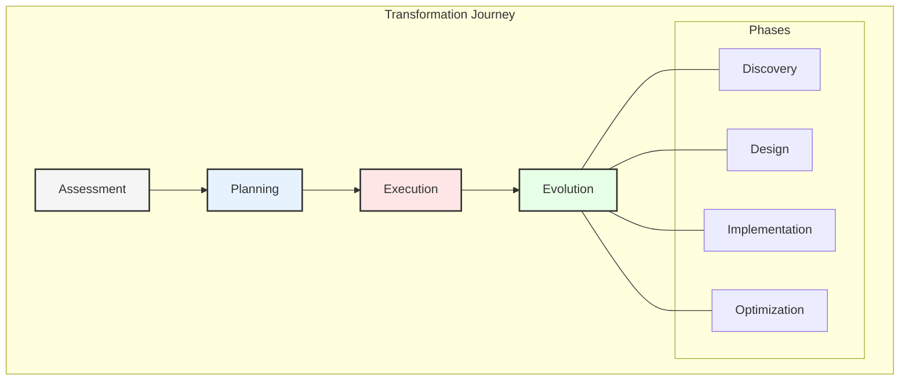
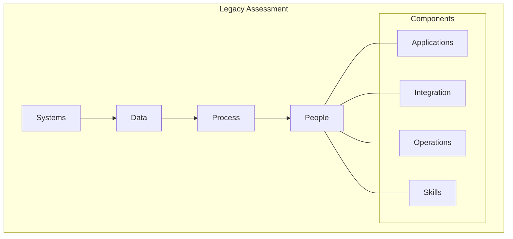
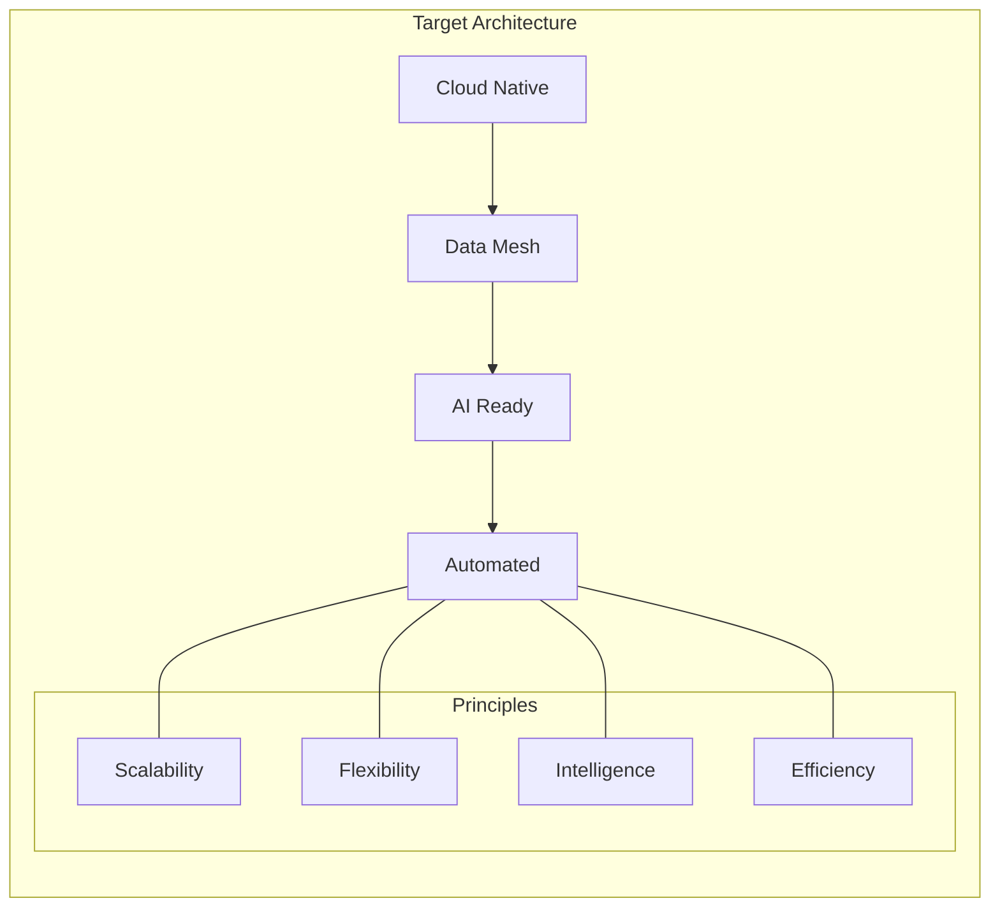
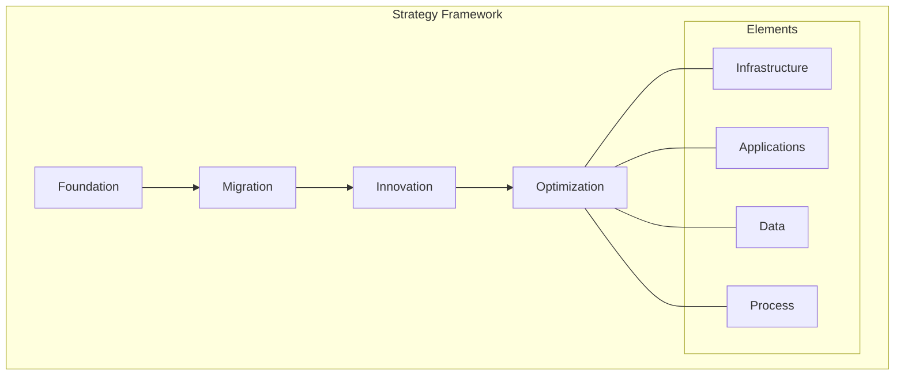
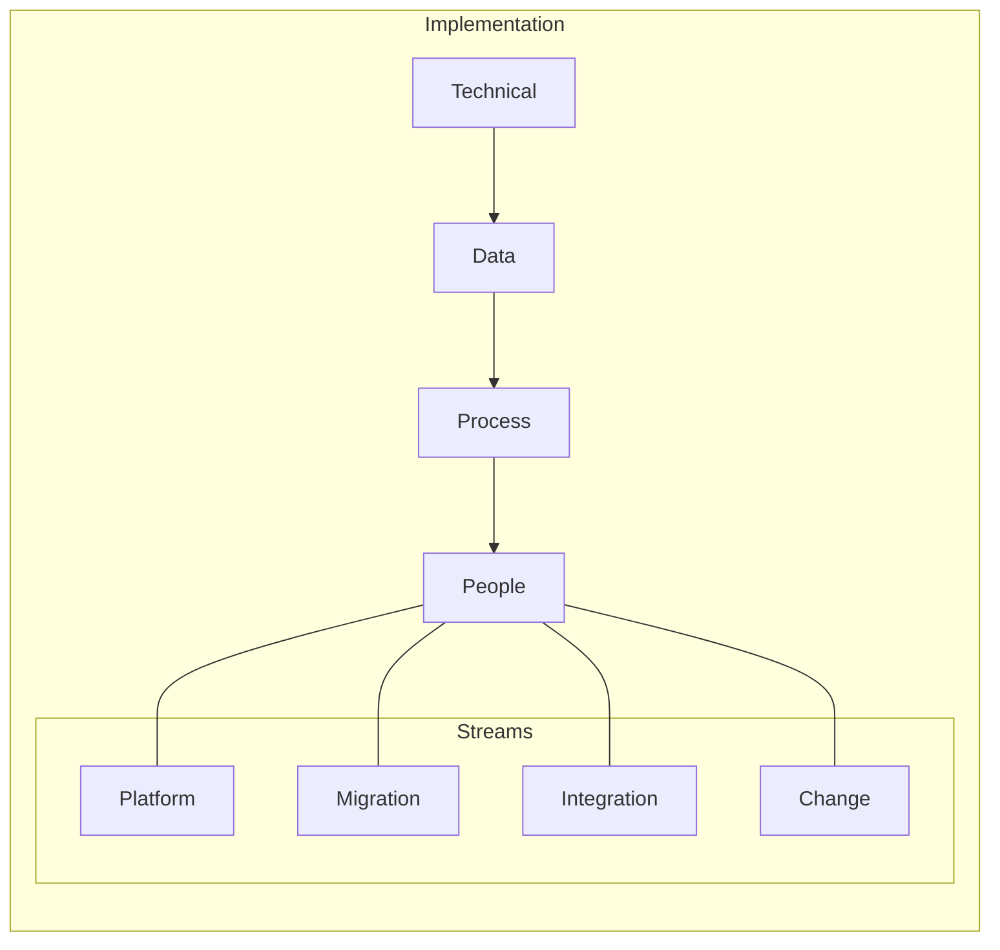
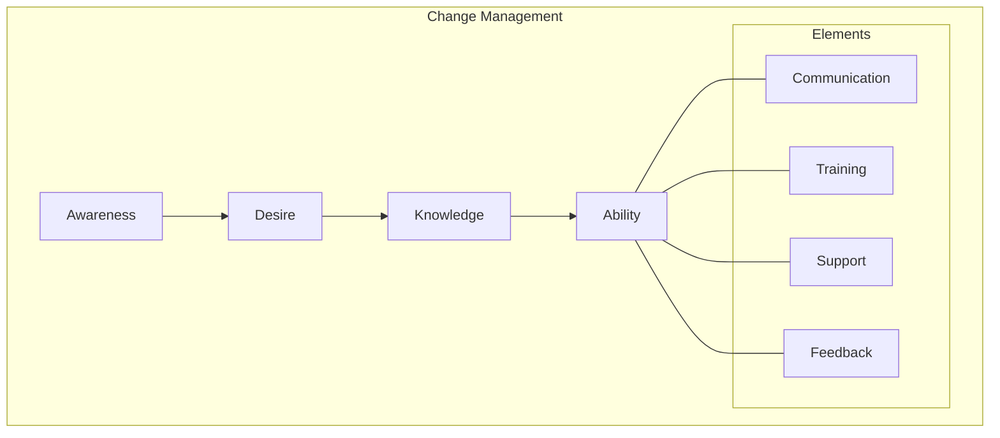
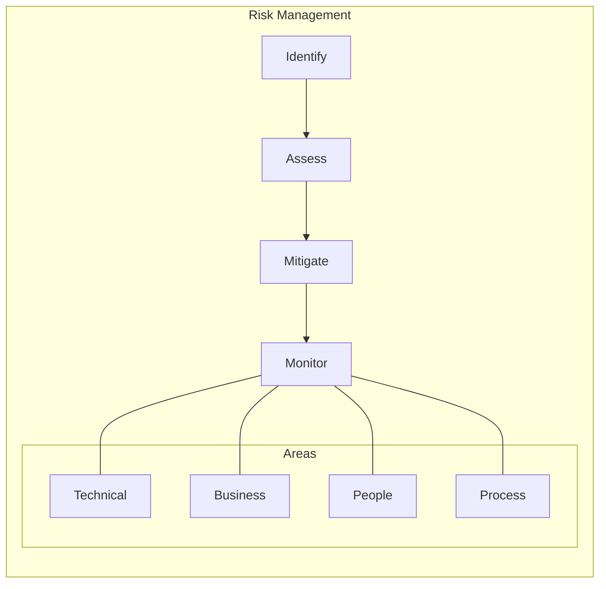
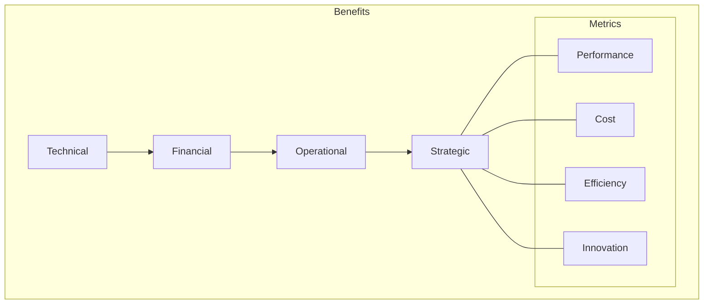

# Chapter 7: Digital Transformation Journey

## From Legacy to Modern Architecture

This chapter examines GlobalAir's transformation journey from legacy systems to a modern multi-cloud data architecture, providing a practical roadmap for airlines undertaking similar initiatives.



## Phase 1: Current State Assessment

### 1. Legacy System Analysis


### 2. Assessment Framework
```yaml
Analysis Areas:
  Technical:
    Systems:
      - Mainframe applications
      - Legacy databases
      - Integration points
      - Technical debt
      
    Data:
      - Data quality
      - Data governance
      - Data security
      - Data lifecycle
      
  Organizational:
    Process:
      - Business processes
      - Operations
      - Dependencies
      - Constraints
      
    People:
      - Skills inventory
      - Training needs
      - Change readiness
      - Cultural factors
```

## Phase 2: Future State Design

### 1. Architecture Vision


### 2. Design Principles
```yaml
Architecture Principles:
  Technical:
    - Cloud native design
    - Microservices based
    - Event driven
    - API first
    
  Data:
    - Domain oriented
    - Self-service
    - Automated governance
    - Real-time capable
    
  Integration:
    - Loose coupling
    - Standard interfaces
    - Async processing
    - Event streaming
```

## Phase 3: Transformation Strategy

### 1. Strategic Framework


### 2. Implementation Approach
```yaml
Strategy Components:
  Foundation:
    - Cloud infrastructure
    - Security framework
    - Integration platform
    - DevOps practices
    
  Migration:
    - Application modernization
    - Data migration
    - Process transformation
    - Skills development
    
  Innovation:
    - New capabilities
    - Advanced analytics
    - AI/ML integration
    - Process automation
```

## Phase 4: Implementation Plan

### 1. Workstream Organization


### 2. Execution Framework
```yaml
Implementation Framework:
  Technical Track:
    - Platform setup
    - Network design
    - Security implementation
    - Tool selection
    
  Data Track:
    - Data modeling
    - Migration planning
    - Quality framework
    - Governance setup
    
  Process Track:
    - Process redesign
    - Automation
    - Integration
    - Optimization
```

## Phase 5: Change Management

### 1. Change Framework


### 2. Implementation Plan
```yaml
Change Components:
  Communication:
    - Stakeholder engagement
    - Regular updates
    - Success stories
    - Issue management
    
  Training:
    - Technical skills
    - Process knowledge
    - Tool proficiency
    - Best practices
    
  Support:
    - Help desk
    - Documentation
    - Mentoring
    - Communities
```

## Phase 6: Risk Management

### 1. Risk Framework


### 2. Risk Plan
```yaml
Risk Management:
  Technical Risks:
    - System stability
    - Data integrity
    - Performance issues
    - Security breaches
    
  Business Risks:
    - Operation disruption
    - Cost overruns
    - Timeline delays
    - Scope creep
    
  Mitigation:
    - Contingency plans
    - Rollback procedures
    - Alternative approaches
    - Risk transfers
```

## Phase 7: Benefits Realization

### 1. Measurement Framework


### 2. Tracking Plan
```yaml
Benefits Framework:
  Technical Benefits:
    - System performance
    - Data quality
    - Integration efficiency
    - Innovation capability
    
  Business Benefits:
    - Cost reduction
    - Revenue growth
    - Customer satisfaction
    - Market position
    
  Measurement:
    - KPI tracking
    - ROI analysis
    - Value assessment
    - Impact evaluation
```

## Key Success Factors

1. Strong executive sponsorship
2. Clear vision and strategy
3. Effective change management
4. Robust risk management
5. Continuous communication
6. Skills development focus
7. Measurable outcomes

## Lessons Learned

### 1. Critical Insights
- Start with strong foundation
- Focus on quick wins
- Build momentum gradually
- Maintain flexibility
- Monitor progress continuously

### 2. Best Practices
```yaml
Practice Areas:
  Technical:
    - Modular approach
    - Standard patterns
    - Automated testing
    - Continuous delivery
    
  Organizational:
    - Clear ownership
    - Regular feedback
    - Skills development
    - Cultural change
    
  Management:
    - Active governance
    - Risk management
    - Change control
    - Value tracking
```

## Next Steps

The next chapter will provide detailed implementation guidelines and technical specifics for establishing the modern data architecture.