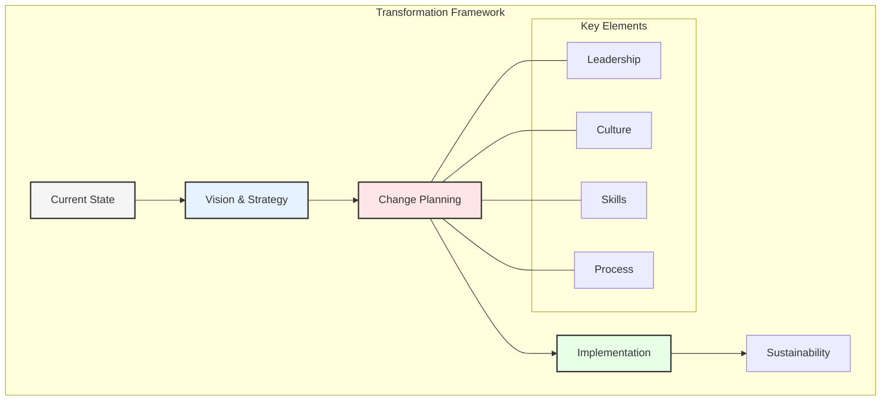
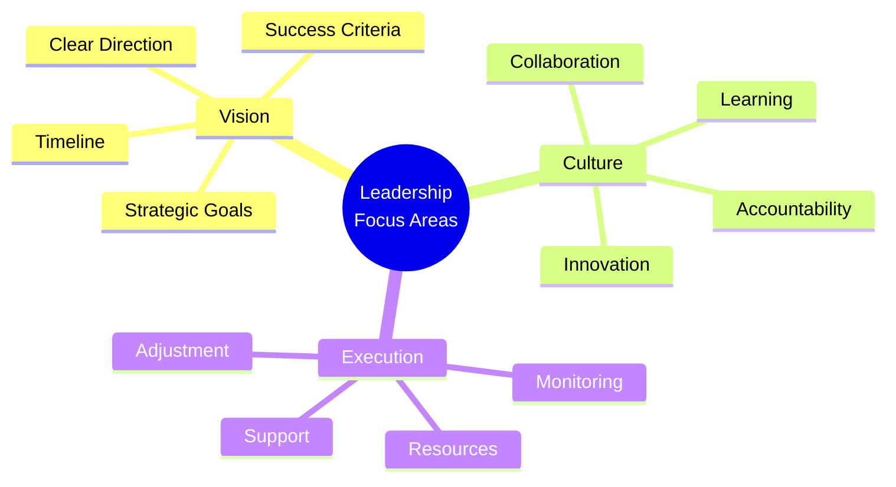
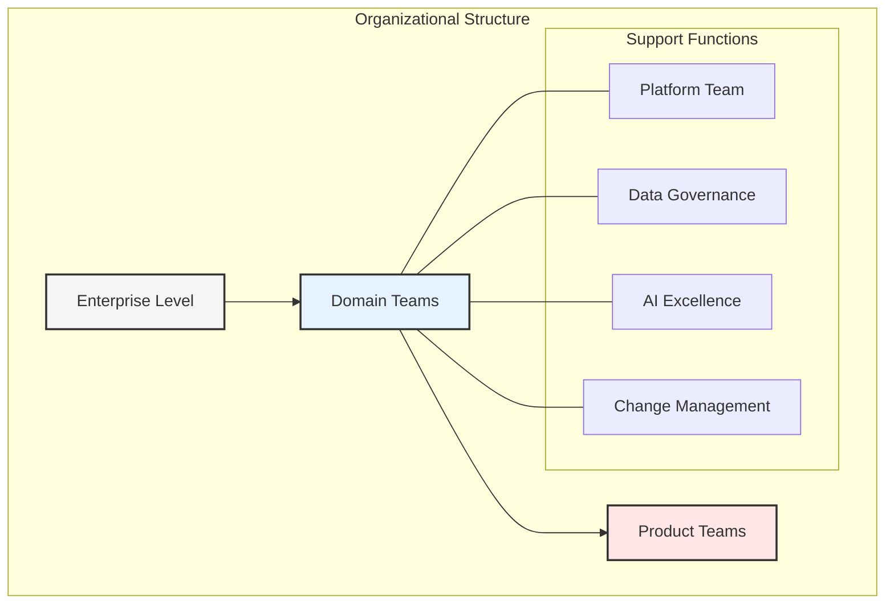
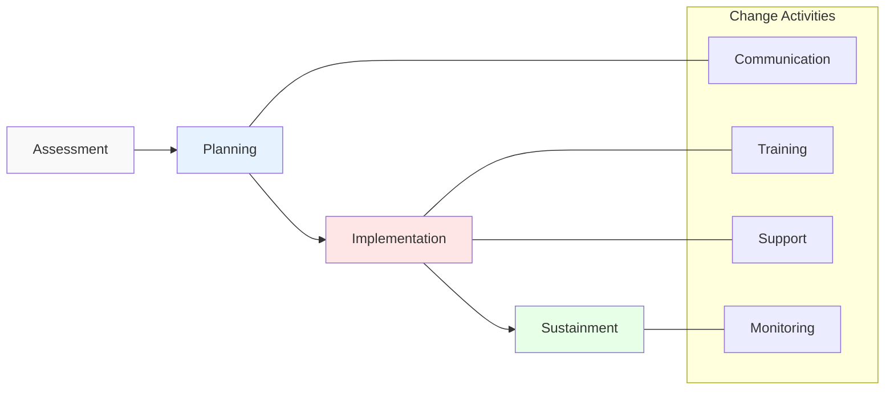
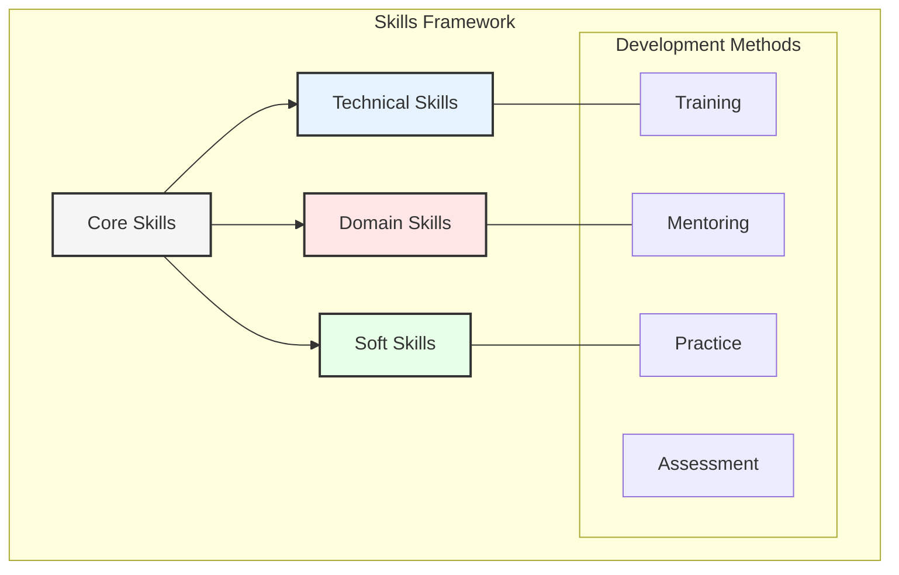
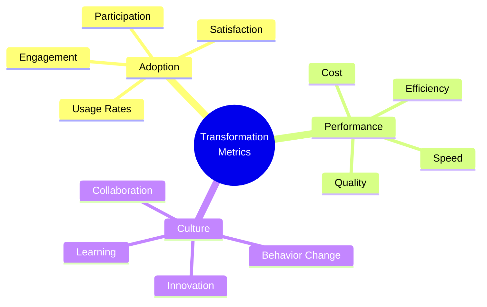

# Chapter 7: Organizational Transformation and Change Management

## The Transformation Journey

Successfully implementing data mesh architecture and agentic AI requires significant organizational changes. This chapter explores the human aspects of digital transformation and provides frameworks for managing change effectively.

## Leadership and Vision

### 1. Executive Sponsorship
- Clear vision communication
- Resource commitment
- Cultural leadership
- Change advocacy

### 2. Strategy Alignment
- Business objectives
- Technical roadmap
- Resource allocation
- Success metrics

## Organizational Design

### 1. Team Structure
- Domain-aligned teams
- Cross-functional capabilities
- Clear responsibilities
- Collaboration models

### 2. Roles and Skills
- New role definitions
- Skill requirements
- Training programs
- Career paths

## Change Management Framework

### 1. Assessment Phase
- Current state analysis
- Readiness evaluation
- Gap identification
- Impact assessment

### 2. Planning Phase
- Change strategy
- Communication plan
- Training roadmap
- Risk mitigation

### 3. Implementation Phase
- Phased rollout
- Feedback collection
- Adjustment process
- Success tracking

## Cultural Transformation

### 1. Cultural Elements
- Data-driven mindset
- Innovation culture
- Continuous learning
- Collaborative spirit

### 2. Behavior Changes
- Decision-making processes
- Work patterns
- Communication styles
- Performance metrics

### 3. Values Alignment
- Transparency
- Accountability
- Innovation
- Excellence

## Skills Development

### 1. Training Programs
- Technical skills
- Soft skills
- Domain knowledge
- Tools proficiency

### 2. Learning Paths
- Role-based learning
- Certification tracks
- Mentorship programs
- Knowledge sharing

## Communication Strategy

### 1. Stakeholder Communication
- Executive updates
- Team briefings
- Progress reports
- Success stories

### 2. Change Communication
- Vision sharing
- Impact explanation
- Progress updates
- Feedback channels

## Resistance Management

### 1. Identifying Resistance
- Common patterns
- Root causes
- Impact assessment
- Response planning

### 2. Managing Resistance
- Open dialogue
- Concern addressing
- Support provision
- Progress monitoring

## Success Metrics

### 1. Adoption Metrics
- User engagement
- Tool utilization
- Process adherence
- Feedback scores

### 2. Performance Metrics
- Efficiency gains
- Quality improvements
- Speed increases
- Cost reductions

### 3. Cultural Metrics
- Behavior changes
- Collaboration levels
- Innovation rates
- Learning progress

## Best Practices

1. **Clear Communication**
   - Regular updates
   - Multiple channels
   - Two-way dialogue
   - Success sharing

2. **Phased Implementation**
   - Pilot programs
   - Gradual rollout
   - Quick wins
   - Feedback loops

3. **Strong Support**
   - Leadership backing
   - Resource availability
   - Training access
   - Help systems

## Key Takeaways

1. Transformation requires strong leadership
2. Change management is crucial
3. Skills development is essential
4. Communication must be clear
5. Culture change takes time

## Next Steps

The next chapter will focus on implementation strategies and best practices for executing the transformation successfully.