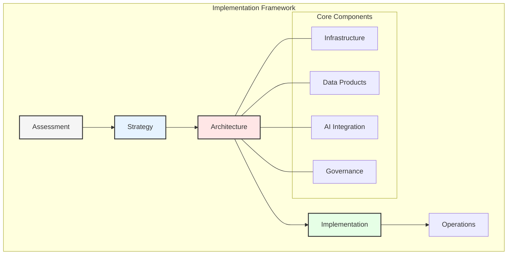
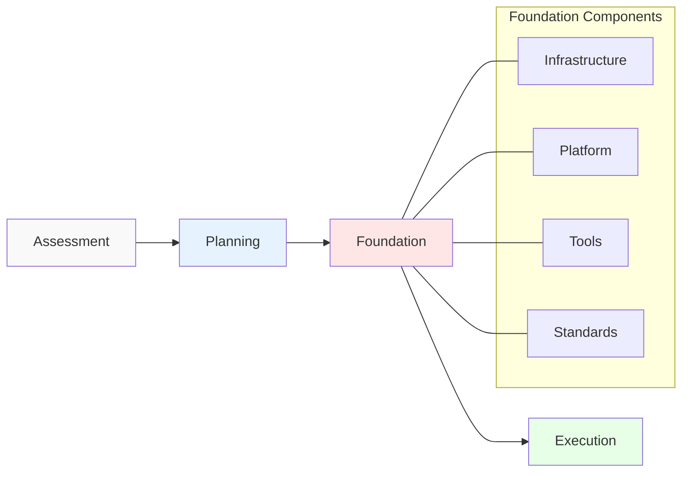
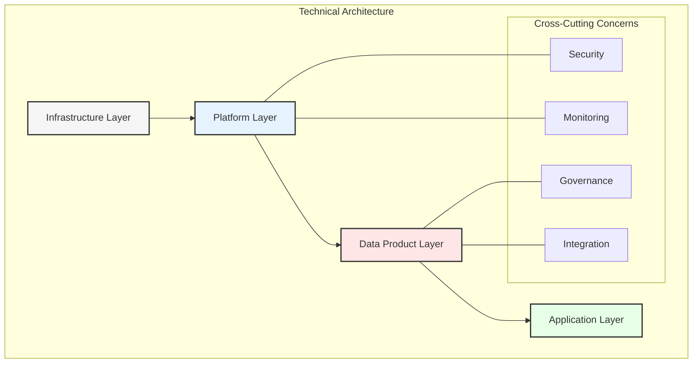
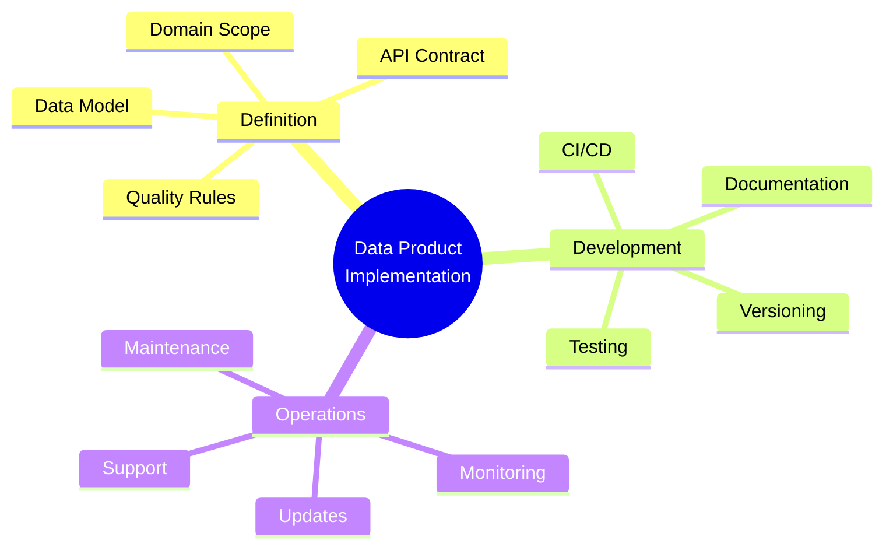
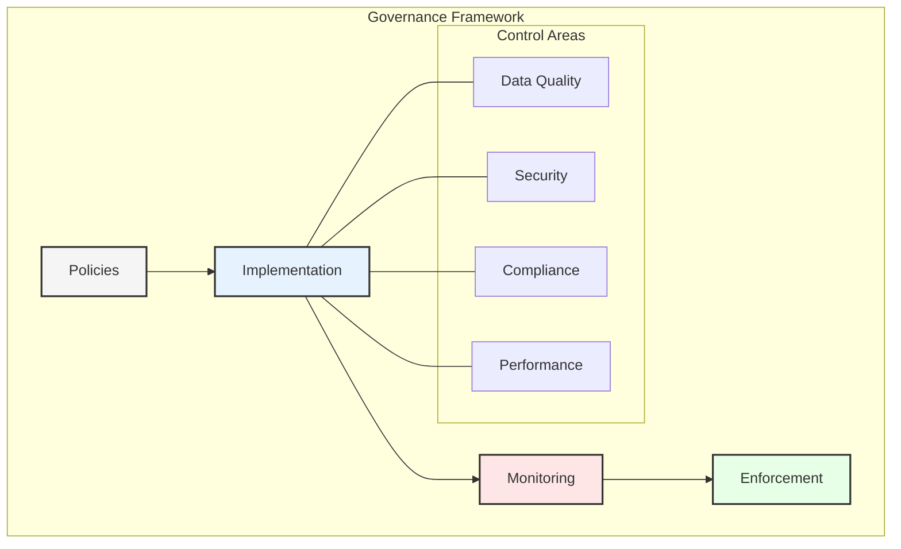
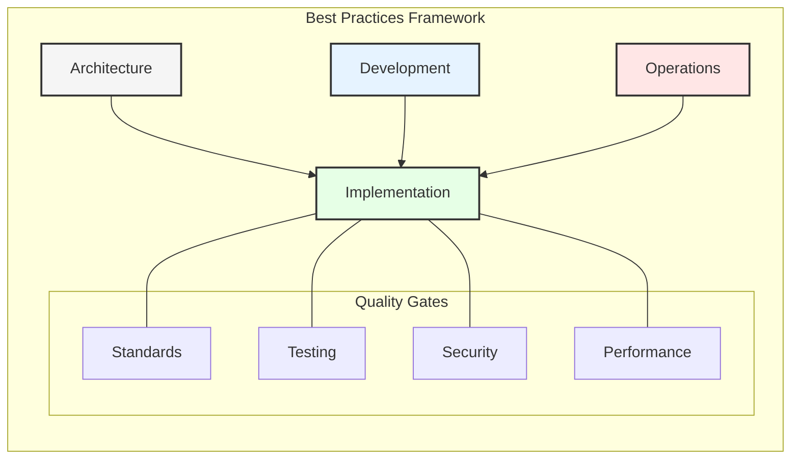
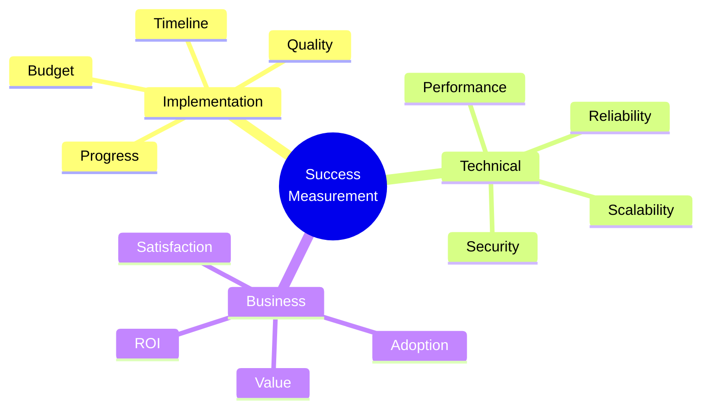

# Chapter 8: Implementation Strategy and Best Practices

## Strategic Implementation Framework

A successful transformation from data fabric to data mesh while incorporating agentic AI requires a well-structured implementation strategy. This chapter provides detailed guidance on implementation approaches and best practices.

## Implementation Phases

### 1. Assessment and Planning
- Current state evaluation
- Gap analysis
- Resource assessment
- Timeline planning

### 2. Foundation Building
- Infrastructure setup
- Tool selection
- Platform development
- Standards definition

## Technical Implementation

### 1. Infrastructure Setup
- Cloud platform configuration
- Network architecture
- Security implementation
- Monitoring systems

### 2. Data Platform Development
- Data product templates
- API standards
- Integration patterns
- Quality frameworks

## Data Product Implementation

### 1. Product Definition
- Domain boundaries
- Data models
- API contracts
- Quality metrics

### 2. Development Process
- CI/CD pipelines
- Testing frameworks
- Documentation standards
- Version control

## AI Integration Strategy

### 1. AI Platform Setup
- Model deployment
- Training infrastructure
- Inference services
- Monitoring systems

### 2. Domain Integration
- Data access patterns
- Model integration
- Feedback loops
- Performance metrics

## Governance Implementation

### 1. Policy Framework
- Data standards
- Security policies
- Access controls
- Compliance rules

### 2. Monitoring and Control
- Audit systems
- Quality checks
- Performance monitoring
- Compliance tracking

## Implementation Patterns

### 1. Domain Implementation
- Team structure
- Development process
- Quality assurance
- Deployment pipeline

### 2. Integration Patterns
- API gateway
- Event bus
- Data pipeline
- Service mesh

### 3. Security Patterns
- Authentication
- Authorization
- Encryption
- Audit trails

## Best Practices

### 1. Architecture Practices
- Modular design
- Scalable infrastructure
- Secure by design
- Observable systems

### 2. Development Practices
- Code standards
- Testing requirements
- Documentation
- Code review

### 3. Operational Practices
- Monitoring
- Incident response
- Change management
- Capacity planning

## Common Pitfalls

### 1. Technical Pitfalls
- Over-engineering
- Poor scalability
- Security gaps
- Performance issues

### 2. Organizational Pitfalls
- Inadequate training
- Resistance to change
- Poor communication
- Resource constraints

### 3. Process Pitfalls
- Incomplete planning
- Weak governance
- Poor documentation
- Inadequate testing

## Success Factors

### 1. Critical Success Factors
- Executive support
- Clear objectives
- Adequate resources
- Strong governance

### 2. Performance Indicators
- Implementation progress
- Quality metrics
- Adoption rates
- Business value

## Risk Management

### 1. Risk Identification
- Technical risks
- Organizational risks
- Process risks
- External risks

### 2. Risk Mitigation
- Prevention strategies
- Contingency plans
- Monitoring systems
- Response procedures

## Next Steps

### 1. Continuous Improvement
- Regular reviews
- Performance optimization
- Feature enhancement
- Process refinement

### 2. Future Planning
- Technology evolution
- Business needs
- Market trends
- Innovation opportunities

## Key Takeaways

1. Structured implementation approach is crucial
2. Best practices ensure quality and consistency
3. Risk management is essential
4. Continuous improvement drives success
5. Measurement enables optimization

## Next Steps

The next chapter will explore real-world case studies and success stories of organizations that have successfully implemented these transformations.