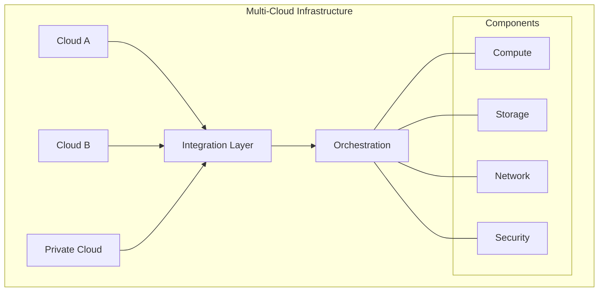
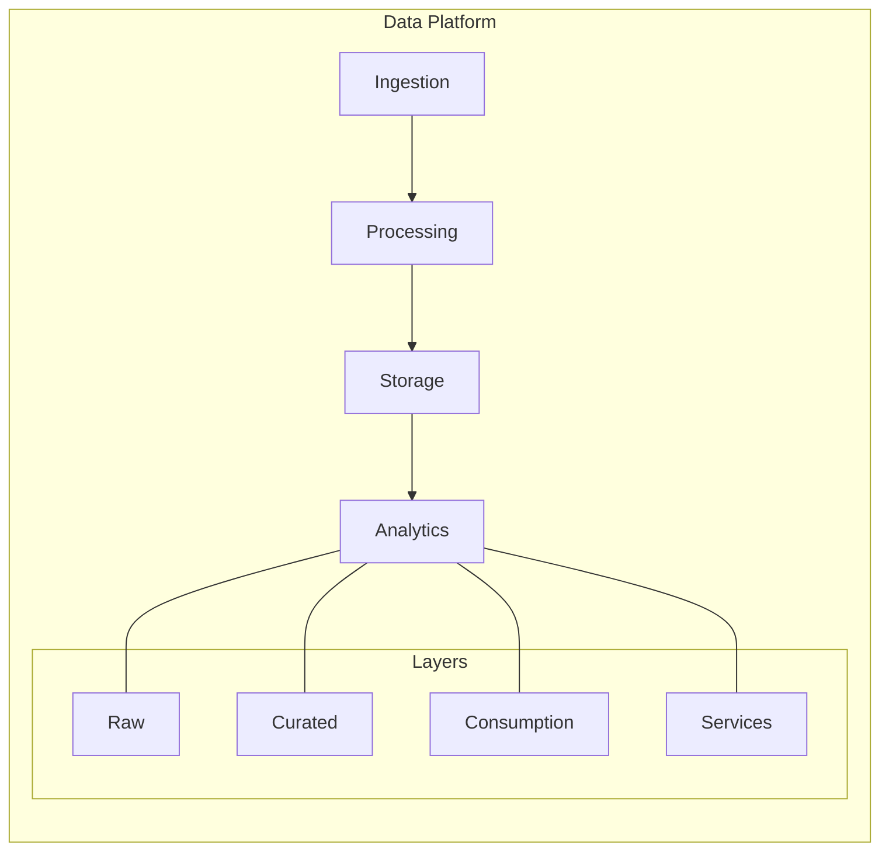
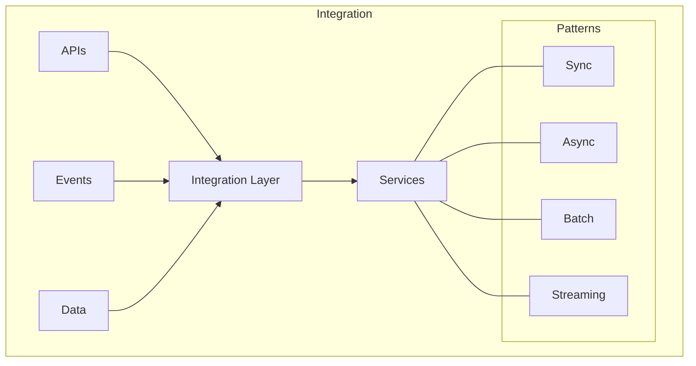
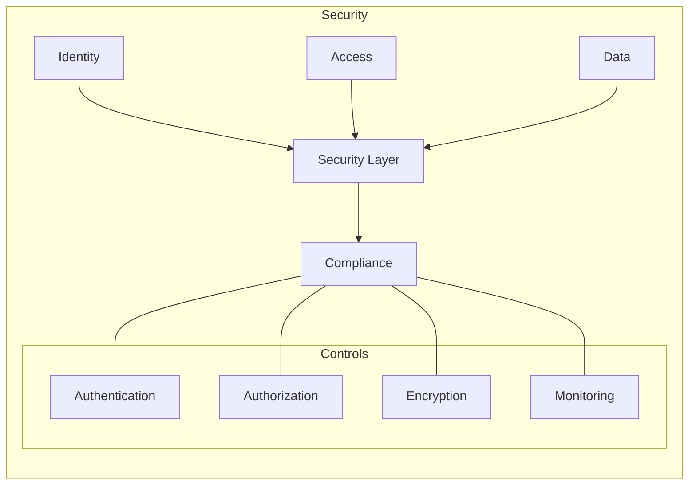
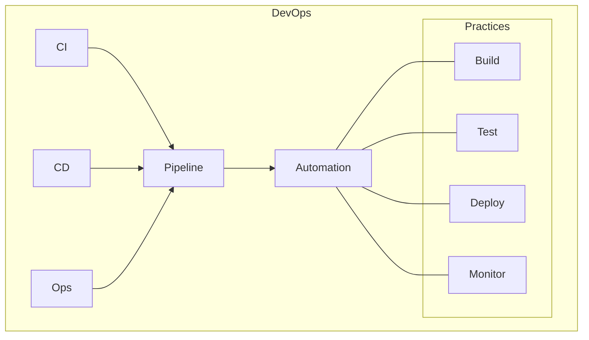
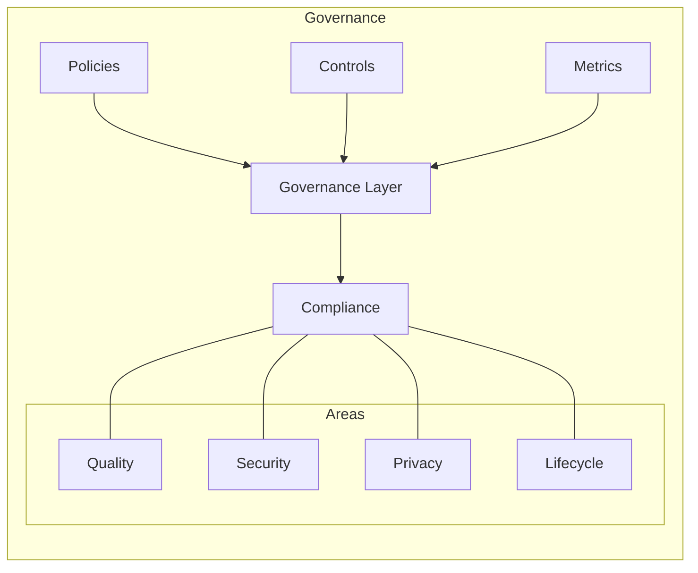
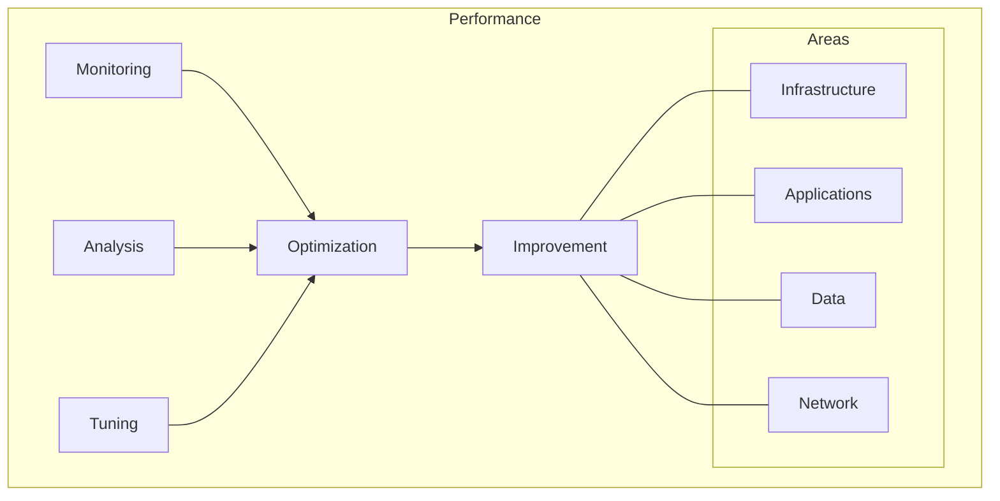

# Chapter 8: Implementation Guidelines

## Architecture Implementation

This chapter provides detailed technical guidelines for implementing a modern multi-cloud data architecture, building on the transformation framework outlined in Chapter 7. By following these guidelines, organizations can ensure a seamless transition to a scalable, secure, and efficient architecture that supports innovation and growth.

## Infrastructure Foundation

### 1. Cloud Platform Setup
- **Multi-Cloud Infrastructure:**
  - Leveraging multiple cloud providers, such as AWS, Azure, and private clouds, ensures resilience and flexibility.
  - Integration layers enable seamless communication between clouds, supporting hybrid and multi-cloud strategies.
  - Orchestration tools, such as Kubernetes, automate the deployment and management of applications across environments.

- **Core Components:**
  - Compute resources, including Kubernetes clusters and serverless functions, provide scalable and cost-effective processing power.
  - Storage solutions, such as object storage and data lakes, support diverse data types and workloads.
  - Networking components, including VPCs and service meshes, ensure secure and efficient data flow.



### 2. Infrastructure Components
```yaml
Core Components:
  Compute:
    - Kubernetes clusters
    - Serverless functions
    - Container services
    - Virtual machines
    
  Storage:
    - Object storage
    - Block storage
    - File systems
    - Data lakes
    
  Network:
    - VPCs/VNets
    - Load balancers
    - API gateways
    - Service mesh
```

## Data Architecture

### 1. Data Platform Design
- **Ingestion:**
  - Streaming pipelines capture real-time data from sources such as IoT devices and APIs, enabling low-latency processing.
  - Batch processes handle large volumes of data, supporting analytics and reporting use cases.
  - Change data capture (CDC) mechanisms ensure that updates in source systems are reflected in downstream systems.

- **Processing:**
  - Stream processing frameworks, such as Apache Kafka and AWS Kinesis, enable real-time analytics and event-driven workflows.
  - Batch processing tools, such as Apache Spark, handle large-scale data transformations and aggregations.

- **Storage:**
  - Data lakes provide a centralized repository for raw and processed data, supporting diverse analytics workloads.
  - Data warehouses enable fast and efficient querying of structured data, supporting business intelligence use cases.



### 2. Implementation Components
```yaml
Data Components:
  Ingestion:
    - Streaming pipelines
    - Batch processes
    - Change data capture
    - API integrations
    
  Processing:
    - Stream processing
    - Batch processing
    - Real-time analytics
    - Machine learning
    
  Storage:
    - Data lake
    - Data warehouse
    - Time series DB
    - Document stores
```

## Integration Framework

### 1. Integration Architecture
- **APIs:**
  - REST APIs and GraphQL provide standardized interfaces for accessing and manipulating data.
  - gRPC and web services enable high-performance communication between systems.

- **Events:**
  - Message queues and event streams decouple producers and consumers, improving scalability and resilience.
  - Pub/sub mechanisms enable real-time event-driven architectures, supporting dynamic workflows.

- **Data:**
  - ETL/ELT processes transform and load data into target systems, ensuring consistency and quality.
  - Data replication and federation enable seamless access to distributed data sources.



### 2. Integration Patterns
```yaml
Integration Patterns:
  Synchronous:
    - REST APIs
    - GraphQL
    - gRPC
    - Web services
    
  Asynchronous:
    - Message queues
    - Event streams
    - Pub/sub
    - Webhooks
    
  Data:
    - ETL/ELT
    - CDC
    - Replication
    - Federation
```

## Security Implementation

### 1. Security Architecture
- **Identity and Access Management:**
  - IAM and SSO solutions provide centralized control over user access, ensuring security and compliance.
  - Role-based and attribute-based access controls enforce fine-grained permissions.

- **Data Protection:**
  - Encryption mechanisms secure data at rest and in transit, protecting sensitive information.
  - Monitoring tools detect and respond to security incidents, ensuring system integrity.



### 2. Security Components
```yaml
Security Components:
  Identity:
    - IAM
    - SSO
    - MFA
    - Directory services
    
  Access:
    - RBAC
    - ABAC
    - Network security
    - API security
    
  Data:
    - Encryption
    - Masking
    - Classification
    - Governance
```

## DevOps Implementation

### 1. DevOps Architecture
- **CI/CD Pipelines:**
  - Automated pipelines streamline the build, test, and deployment processes, reducing time-to-market.
  - Source control systems, such as Git, enable versioning and collaboration.

- **Operations:**
  - Monitoring and logging tools provide visibility into system performance and health.
  - Auto-scaling mechanisms ensure that resources are allocated dynamically based on demand.



### 2. DevOps Components
```yaml
DevOps Components:
  CI/CD:
    - Source control
    - Build automation
    - Test automation
    - Deployment automation
    
  Operations:
    - Monitoring
    - Logging
    - Alerting
    - Auto-scaling
    
  Tools:
    - Git
    - Jenkins
    - Terraform
    - Prometheus
```

## Data Governance Implementation

### 1. Governance Framework
- **Policies:**
  - Data quality policies ensure that data is accurate, complete, and consistent.
  - Data privacy policies protect sensitive information, ensuring compliance with regulations.

- **Controls:**
  - Quality checks and access controls enforce governance policies, ensuring data integrity and security.
  - Audit trails and compliance checks provide transparency and accountability.



### 2. Governance Components
```yaml
Governance Components:
  Policies:
    - Data quality
    - Data privacy
    - Data retention
    - Data access
    
  Controls:
    - Quality checks
    - Access controls
    - Audit trails
    - Compliance checks
    
  Tools:
    - Metadata management
    - Data catalogs
    - Quality monitoring
    - Policy enforcement
```

## Performance Optimization

### 1. Performance Framework
- **Infrastructure:**
  - Resource scaling and load balancing optimize the utilization of compute and storage resources.
  - Caching strategies reduce latency and improve response times.

- **Applications:**
  - Code optimization and query tuning enhance the performance of applications and databases.
  - Async processing and connection pooling improve throughput and scalability.



### 2. Optimization Areas
```yaml
Optimization Areas:
  Infrastructure:
    - Resource scaling
    - Load balancing
    - Caching
    - Distribution
    
  Applications:
    - Code optimization
    - Query tuning
    - Connection pooling
    - Async processing
    
  Data:
    - Indexing
    - Partitioning
    - Compression
    - Archiving
```

## Implementation Checklist

### 1. Technical Requirements
- Infrastructure setup
- Security implementation
- Integration framework
- Data platform
- DevOps pipeline
- Governance controls

### 2. Operational Requirements
- Monitoring setup
- Backup procedures
- Disaster recovery
- SLA management
- Support model
- Documentation

## Best Practices

### 1. Implementation Guidelines
- Follow cloud-native principles
- Implement security by design
- Automate everything possible
- Monitor continuously
- Document thoroughly
- Test extensively

### 2. Technical Standards
- **Architecture:**
  - Cloud-native design
  - Microservices patterns
  - API-first approach
  - Event-driven design

- **Development:**
  - Coding standards
  - Testing practices
  - Security guidelines
  - Documentation requirements

- **Operations:**
  - SLA definitions
  - Monitoring standards
  - Support procedures
  - Incident management

## Next Steps

The next chapter will present real-world case studies demonstrating successful implementations of these patterns and practices.