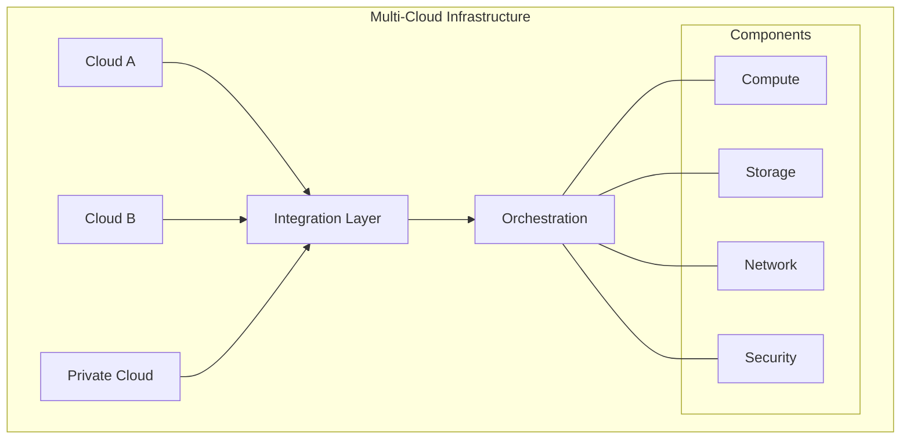
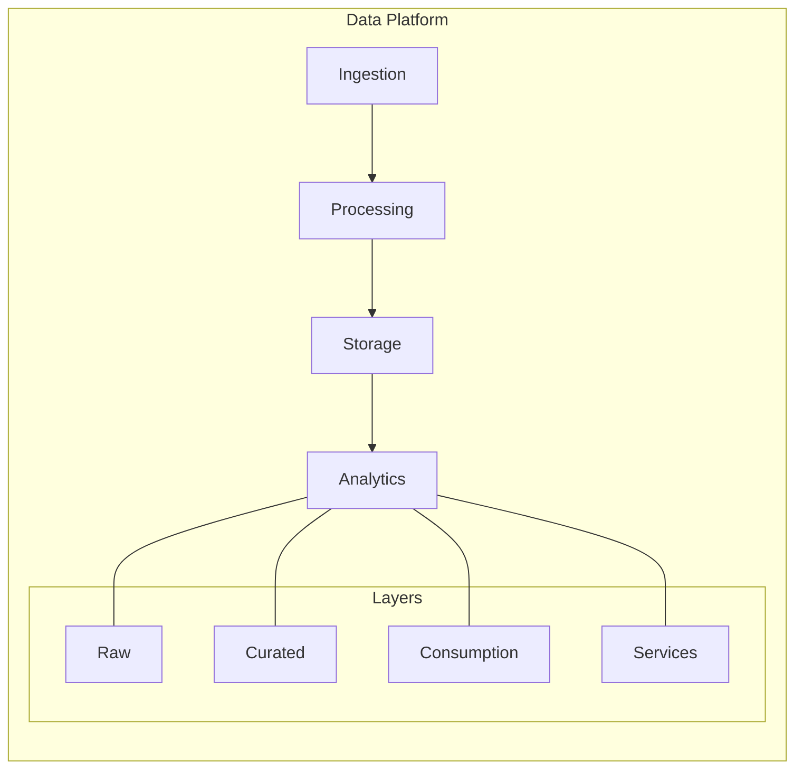
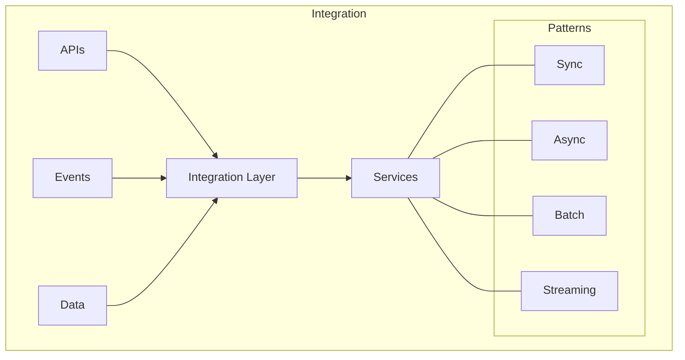
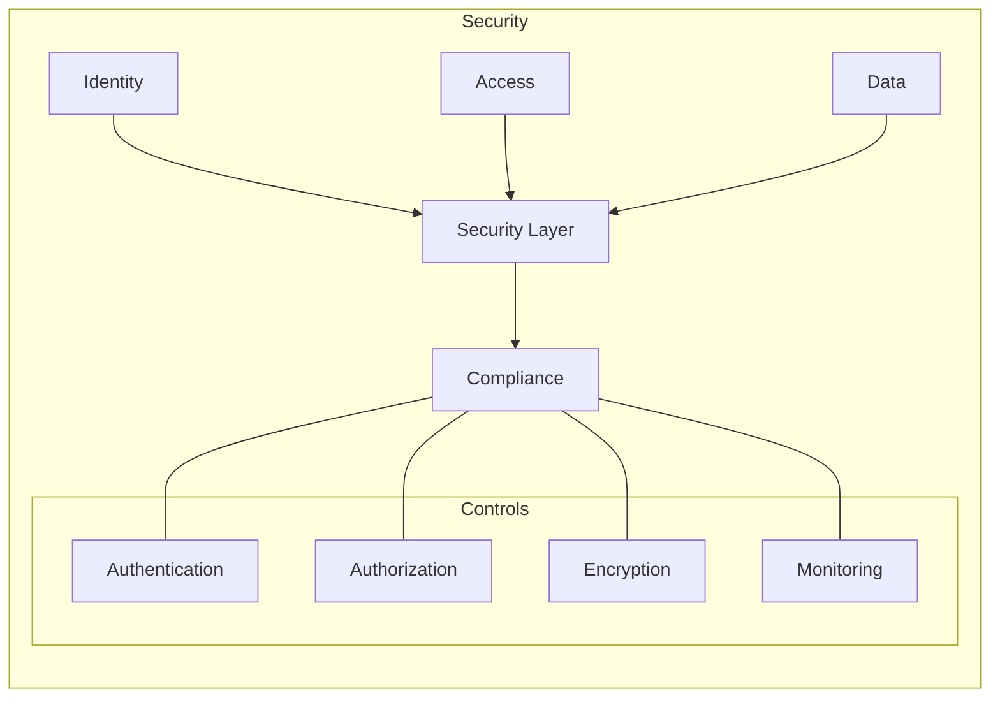
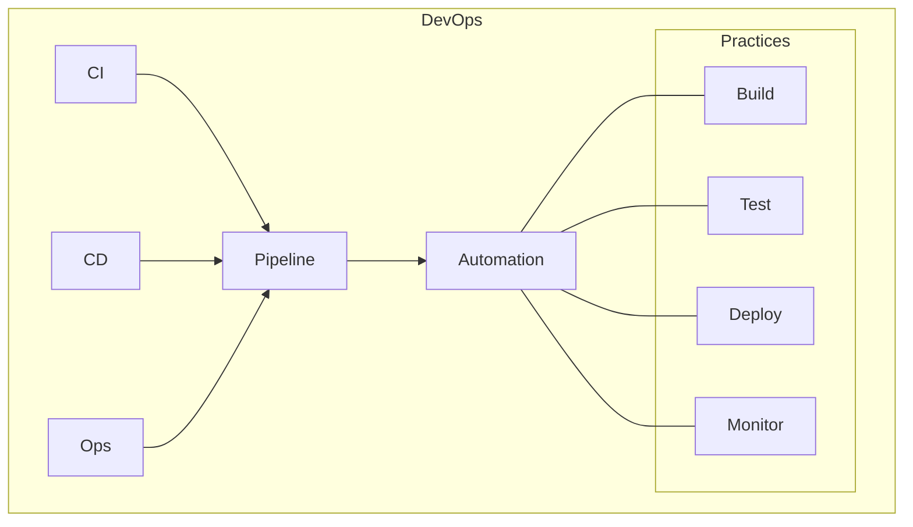
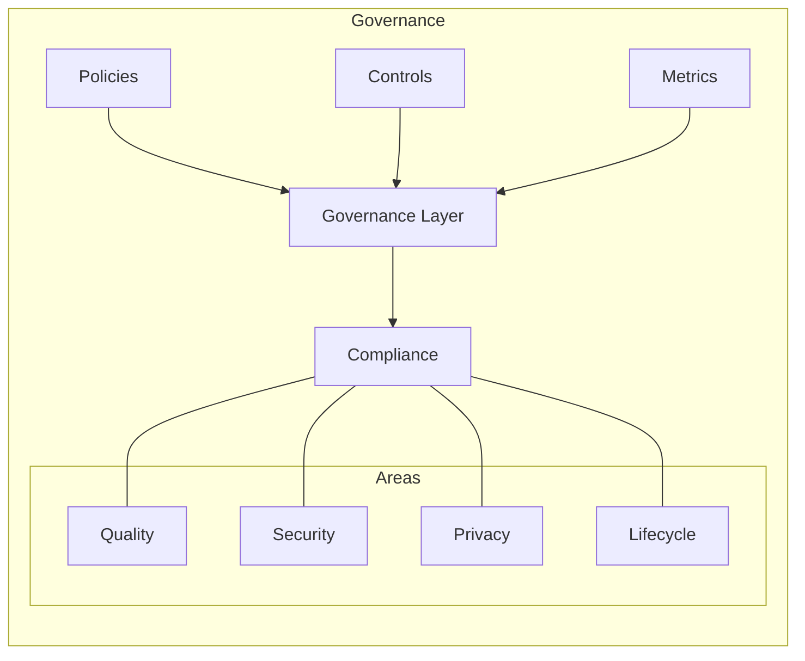
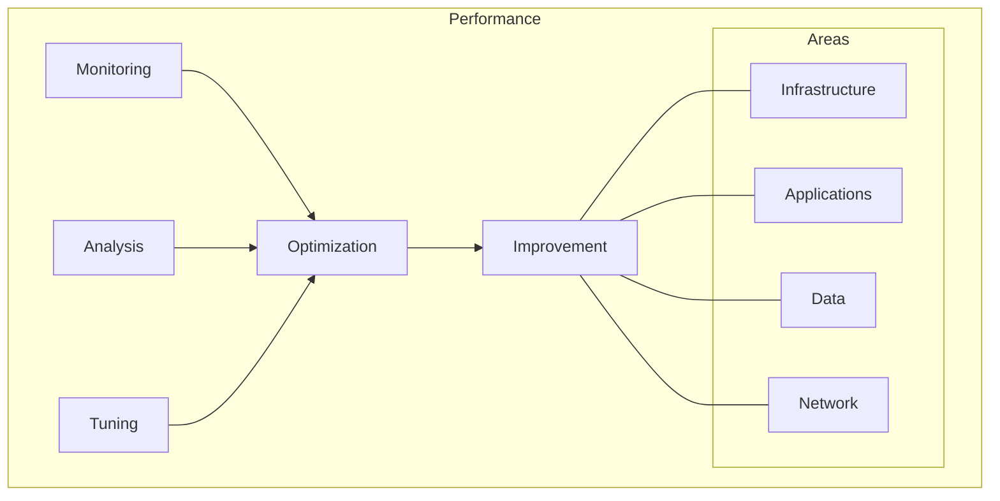

# Chapter 8: Implementation Guidelines

## Architecture Implementation

This chapter provides detailed technical guidelines for implementing a modern multi-cloud data architecture, building on the transformation framework outlined in Chapter 7.

## Infrastructure Foundation

### 1. Cloud Platform Setup


### 2. Infrastructure Components
```yaml
Core Components:
  Compute:
    - Kubernetes clusters
    - Serverless functions
    - Container services
    - Virtual machines
    
  Storage:
    - Object storage
    - Block storage
    - File systems
    - Data lakes
    
  Network:
    - VPCs/VNets
    - Load balancers
    - API gateways
    - Service mesh
```

## Data Architecture

### 1. Data Platform Design


### 2. Implementation Components
```yaml
Data Components:
  Ingestion:
    - Streaming pipelines
    - Batch processes
    - Change data capture
    - API integrations
    
  Processing:
    - Stream processing
    - Batch processing
    - Real-time analytics
    - Machine learning
    
  Storage:
    - Data lake
    - Data warehouse
    - Time series DB
    - Document stores
```

## Integration Framework

### 1. Integration Architecture


### 2. Integration Patterns
```yaml
Integration Patterns:
  Synchronous:
    - REST APIs
    - GraphQL
    - gRPC
    - Web services
    
  Asynchronous:
    - Message queues
    - Event streams
    - Pub/sub
    - Webhooks
    
  Data:
    - ETL/ELT
    - CDC
    - Replication
    - Federation
```

## Security Implementation

### 1. Security Architecture


### 2. Security Components
```yaml
Security Components:
  Identity:
    - IAM
    - SSO
    - MFA
    - Directory services
    
  Access:
    - RBAC
    - ABAC
    - Network security
    - API security
    
  Data:
    - Encryption
    - Masking
    - Classification
    - Governance
```

## DevOps Implementation

### 1. DevOps Architecture


### 2. DevOps Components
```yaml
DevOps Components:
  CI/CD:
    - Source control
    - Build automation
    - Test automation
    - Deployment automation
    
  Operations:
    - Monitoring
    - Logging
    - Alerting
    - Auto-scaling
    
  Tools:
    - Git
    - Jenkins
    - Terraform
    - Prometheus
```

## Data Governance Implementation

### 1. Governance Framework


### 2. Governance Components
```yaml
Governance Components:
  Policies:
    - Data quality
    - Data privacy
    - Data retention
    - Data access
    
  Controls:
    - Quality checks
    - Access controls
    - Audit trails
    - Compliance checks
    
  Tools:
    - Metadata management
    - Data catalogs
    - Quality monitoring
    - Policy enforcement
```

## Performance Optimization

### 1. Performance Framework


### 2. Optimization Areas
```yaml
Optimization Areas:
  Infrastructure:
    - Resource scaling
    - Load balancing
    - Caching
    - Distribution
    
  Applications:
    - Code optimization
    - Query tuning
    - Connection pooling
    - Async processing
    
  Data:
    - Indexing
    - Partitioning
    - Compression
    - Archiving
```

## Implementation Checklist

### 1. Technical Requirements
- Infrastructure setup
- Security implementation
- Integration framework
- Data platform
- DevOps pipeline
- Governance controls

### 2. Operational Requirements
- Monitoring setup
- Backup procedures
- Disaster recovery
- SLA management
- Support model
- Documentation

## Best Practices

### 1. Implementation Guidelines
- Follow cloud-native principles
- Implement security by design
- Automate everything possible
- Monitor continuously
- Document thoroughly
- Test extensively

### 2. Technical Standards
```yaml
Standards:
  Architecture:
    - Cloud-native design
    - Microservices patterns
    - API-first approach
    - Event-driven design
    
  Development:
    - Coding standards
    - Testing practices
    - Security guidelines
    - Documentation requirements
    
  Operations:
    - SLA definitions
    - Monitoring standards
    - Support procedures
    - Incident management
```

## Next Steps

The next chapter will present real-world case studies demonstrating successful implementations of these patterns and practices.