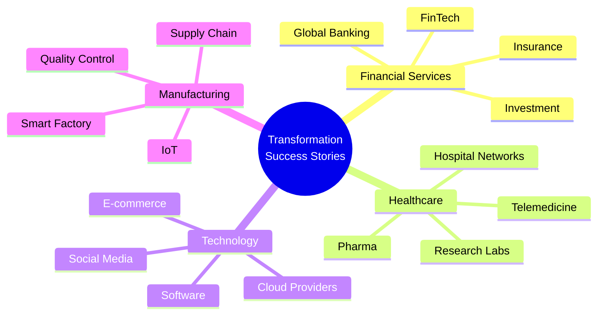
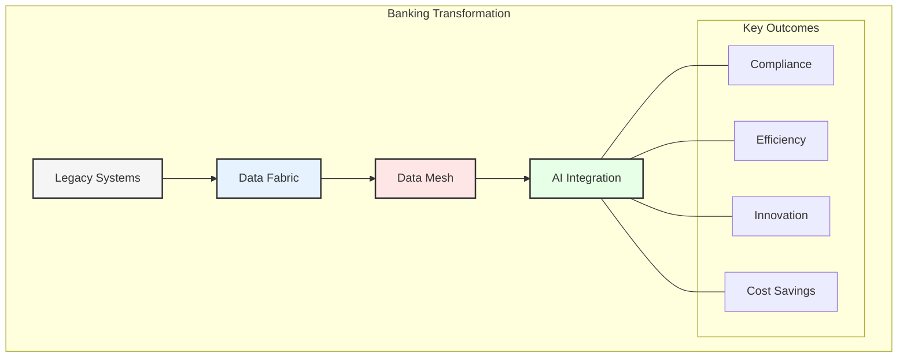
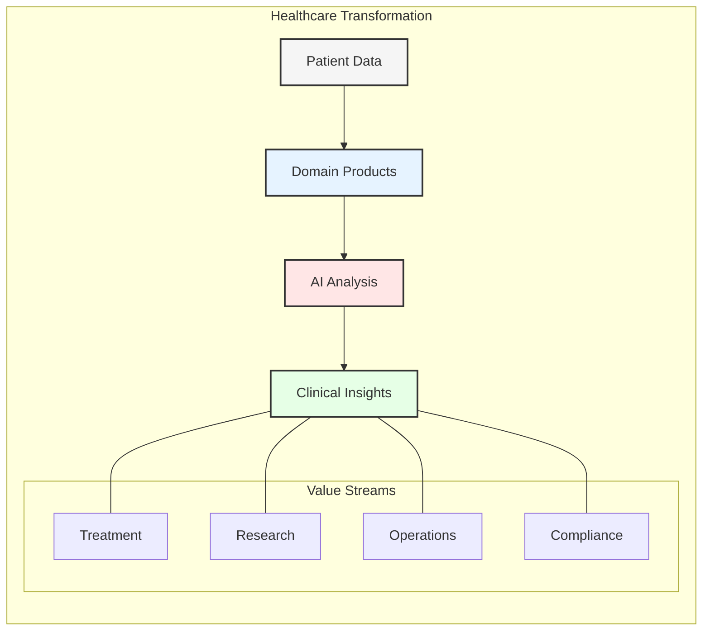
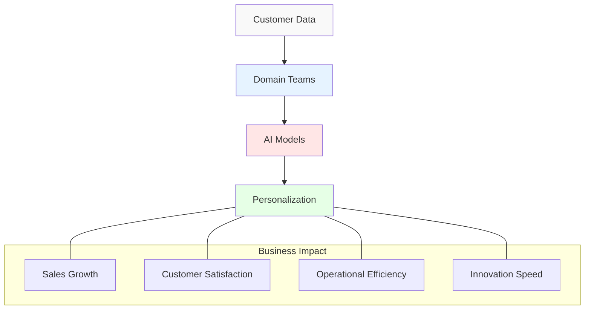
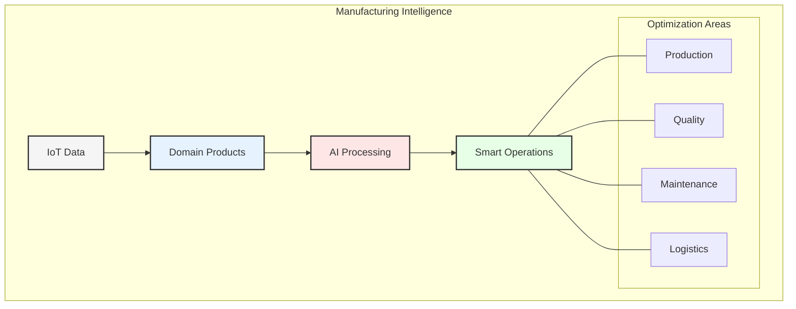
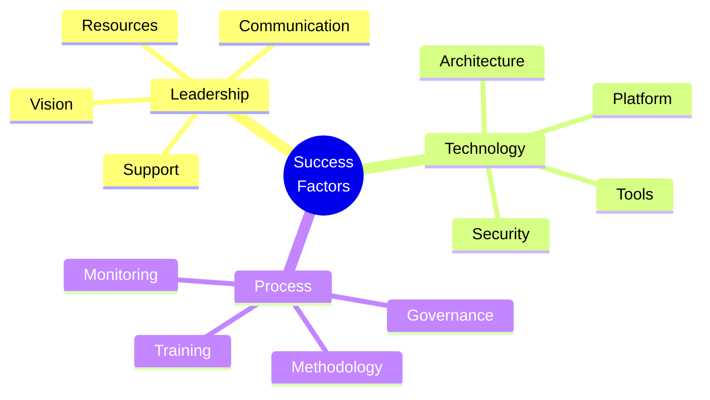

# Chapter 9: Case Studies and Success Stories

## Overview of Success Stories

This chapter presents real-world examples of organizations that have successfully navigated the transformation from traditional data architectures to modern data mesh implementations with agentic AI integration.

## Financial Services Industry

### Case Study 1: Global Banking Transformation

#### Background
- Large multinational bank
- Legacy data infrastructure
- Regulatory constraints
- Global operations

#### Implementation Approach
1. **Phase 1: Assessment**
   - Infrastructure evaluation
   - Regulatory mapping
   - Skill gap analysis
   - Risk assessment

2. **Phase 2: Foundation**
   - Domain identification
   - Platform development
   - Team restructuring
   - Governance setup

3. **Phase 3: Execution**
   - Incremental migration
   - Team enablement
   - Process optimization
   - AI integration

#### Results
- 40% reduction in data access time
- 60% improvement in data quality
- 30% cost reduction
- Enhanced regulatory compliance

## Healthcare Sector

### Case Study 2: Healthcare Network

#### Background
- Multi-state hospital network
- Complex data requirements
- Privacy regulations
- Real-time needs

#### Implementation Strategy
1. **Privacy-First Approach**
   - HIPAA compliance
   - Data encryption
   - Access controls
   - Audit trails

2. **Domain Organization**
   - Clinical domains
   - Research domains
   - Operational domains
   - Administrative domains

3. **AI Integration**
   - Diagnostic support
   - Resource optimization
   - Research acceleration
   - Patient care enhancement

#### Outcomes
- 50% faster research data access
- 35% reduction in operational costs
- Improved patient care quality
- Enhanced research capabilities

## Technology Sector

### Case Study 3: E-commerce Platform

#### Challenge
- Rapid growth
- Scale requirements
- Real-time analytics
- Personalization needs

#### Solution Architecture
1. **Data Product Development**
   - Customer domains
   - Product domains
   - Order domains
   - Analytics domains

2. **AI Implementation**
   - Recommendation engines
   - Fraud detection
   - Inventory optimization
   - Customer service

#### Results
- 45% increase in conversion rates
- 25% reduction in fraud
- Improved customer satisfaction
- Faster feature delivery

## Manufacturing Industry

### Case Study 4: Smart Manufacturing

#### Scenario
- Global manufacturer
- IoT integration
- Quality control
- Supply chain optimization

#### Implementation Details
1. **IoT Integration**
   - Sensor networks
   - Edge computing
   - Real-time analytics
   - Predictive maintenance

2. **Domain Structure**
   - Production domains
   - Quality domains
   - Maintenance domains
   - Supply chain domains

#### Achievements
- 30% reduction in downtime
- 25% quality improvement
- Optimized supply chain
- Reduced maintenance costs

## Success Factors Analysis

### Common Success Elements

### 1. Critical Factors
- Executive sponsorship
- Clear strategy
- Adequate resources
- Strong governance

### 2. Technical Factors
- Robust platform
- Security measures
- Scalable architecture
- Quality controls

### 3. Organizational Factors
- Skills development
- Change management
- Communication
- Culture adaptation

## Lessons Learned

### 1. Key Insights
- Start small, scale fast
- Focus on value
- Maintain flexibility
- Measure progress

### 2. Risk Mitigation
- Pilot programs
- Regular reviews
- Quick adjustments
- Strong support

### 3. Best Practices
- Domain alignment
- Quality focus
- Team enablement
- Continuous improvement

## Implementation Tips

1. **Planning Phase**
   - Thorough assessment
   - Realistic timeline
   - Resource planning
   - Risk evaluation

2. **Execution Phase**
   - Incremental approach
   - Regular feedback
   - Quick wins
   - Clear communication

3. **Sustainability**
   - Continuous learning
   - Performance monitoring
   - Innovation focus
   - Value measurement

## Key Takeaways

1. Successful transformation is possible with proper planning
2. Each industry has unique challenges and solutions
3. Common success patterns exist across sectors
4. Continuous improvement is essential
5. Measurement drives success

## Next Steps

The final chapter will explore future trends and provide conclusions about the evolution of enterprise data architecture.