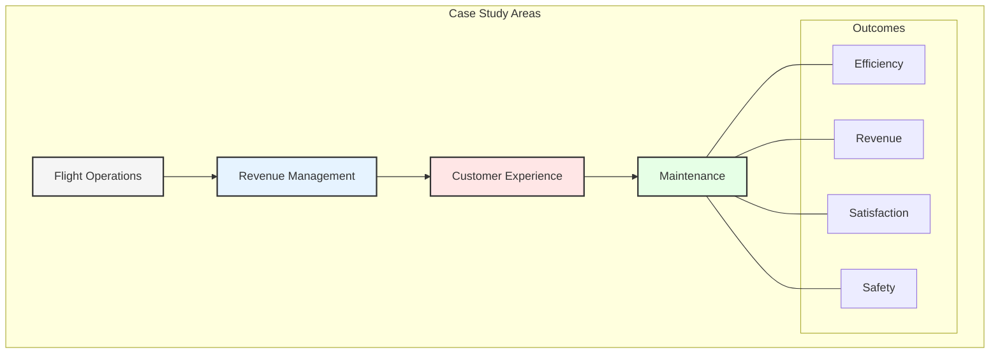
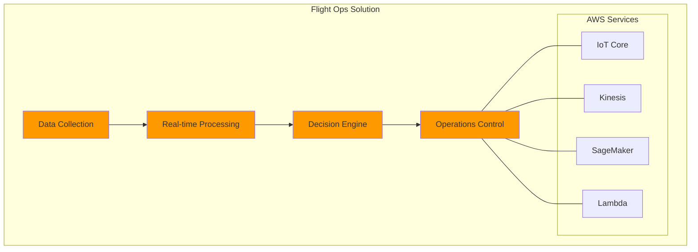
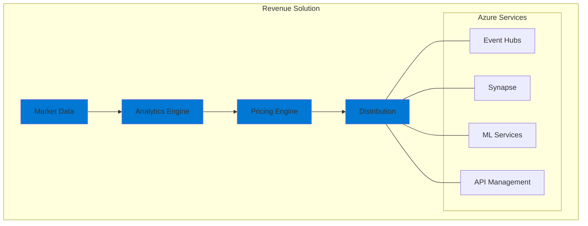
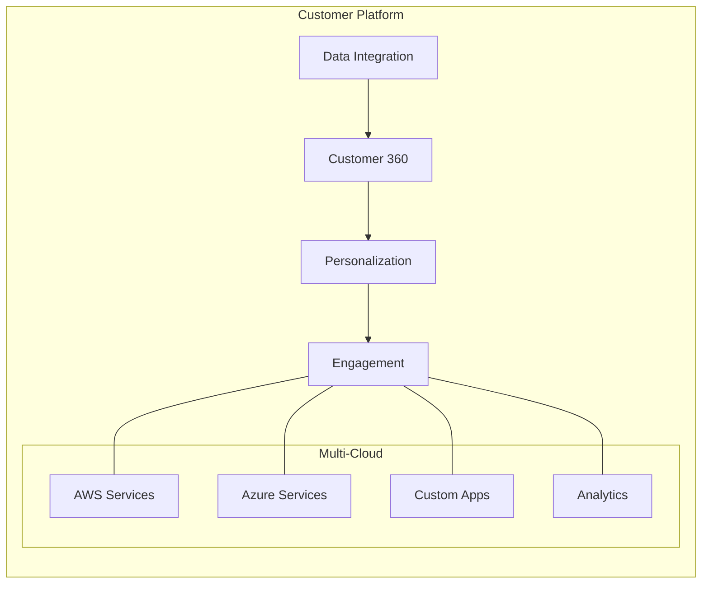
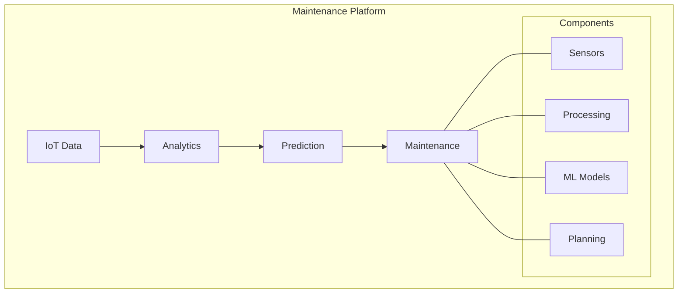
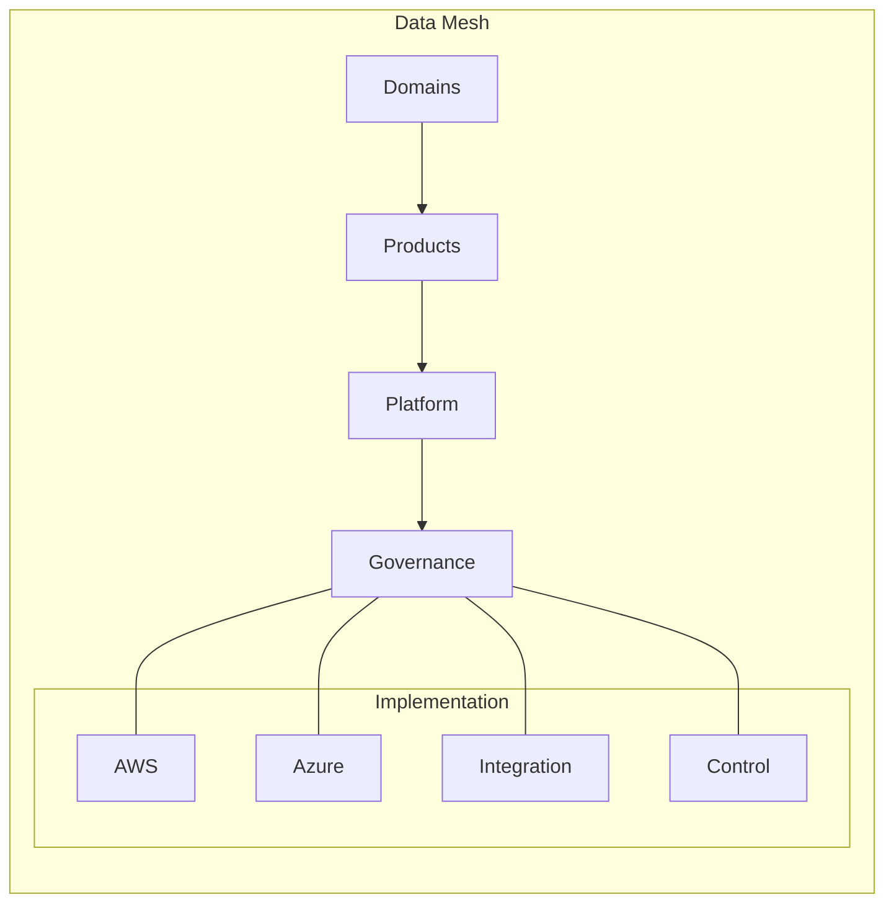
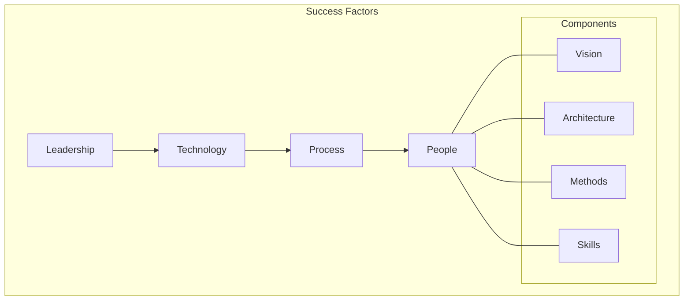

# Chapter 9: Case Studies in Airline Data Architecture

## Introduction to GlobalAir's Experience

This chapter presents detailed case studies from GlobalAir's implementation of a modern data architecture, focusing on specific challenges, solutions, and outcomes across different operational domains.



## Case Study 1: Flight Operations Optimization

### Challenge
GlobalAir needed to optimize flight operations across 200+ aircraft operating in 50+ countries, handling real-time data from multiple sources while ensuring regulatory compliance.

### Solution Architecture


### Implementation Details
```yaml
Data Sources:
  - Aircraft Telemetry:
      Format: ARINC 429
      Frequency: Real-time
      Volume: 500GB/day/aircraft
      
  - Weather Data:
      Format: BUFR/GRIB
      Frequency: 15-minute intervals
      Sources: Multiple weather services
      
  - Flight Plans:
      Format: JSON
      Updates: Dynamic
      Integration: Direct via API

Processing Pipeline:
  Ingestion:
    - AWS IoT Core for telemetry
    - Event Bridge for weather
    - API Gateway for flight plans
    
  Processing:
    - Kinesis for streaming
    - Lambda for transformations
    - SageMaker for predictions
    
  Storage:
    - S3 for raw data
    - DynamoDB for real-time
    - Redshift for analytics
```

### Results
- 15% fuel efficiency improvement
- 23% reduction in delays
- 30% better disruption handling
- $50M annual cost savings

## Case Study 2: Revenue Management Transformation

### Challenge
Modernize the legacy revenue management system to enable dynamic pricing and real-time market response while maintaining system stability during the transition.

### Solution Architecture


### Implementation Details
```yaml
System Components:
  Data Collection:
    - Competitor pricing
    - Historical bookings
    - Market demand
    - Customer behavior
    
  Analytics:
    Engine: Azure Synapse
    Models:
      - Demand forecasting
      - Price elasticity
      - Customer segmentation
      
  Pricing Engine:
    - Real-time pricing
    - Dynamic inventory
    - Route optimization
    - Ancillary services
```

### Results
- 12% revenue increase
- 25% better load factors
- 18% ancillary revenue growth
- 40% faster market response

## Case Study 3: Customer Experience Platform

### Challenge
Create a unified customer experience platform integrating booking, loyalty, and service data across multiple channels while enabling personalization.

### Solution Architecture


### Implementation Details
```yaml
Platform Components:
  Customer Data Platform:
    Source Systems:
      - Booking system
      - Loyalty program
      - Service records
      - Social media
      
    Integration:
      - Real-time events
      - Batch processing
      - API integration
      - Data quality
      
    Analytics:
      - Customer segmentation
      - Journey analytics
      - Preference modeling
      - Churn prediction
```

### Results
- 35% increase in satisfaction
- 28% higher loyalty engagement
- 45% faster issue resolution
- 20% reduction in churn

## Case Study 4: Predictive Maintenance

### Challenge
Implement a predictive maintenance system for the aircraft fleet, integrating IoT data with maintenance records to prevent disruptions.

### Solution Architecture


### Implementation Details
```yaml
System Architecture:
  Data Collection:
    - Engine sensors
    - Flight data
    - Maintenance logs
    - Part inventory
    
  Processing:
    - Stream processing
    - Feature engineering
    - Model training
    - Alert generation
    
  Integration:
    - MRO systems
    - Supply chain
    - Crew scheduling
    - Documentation
```

### Results
- 45% reduction in disruptions
- 30% maintenance cost savings
- 25% better parts management
- 60% faster issue detection

## Case Study 5: Multi-Cloud Data Mesh

### Challenge
Implement a data mesh architecture across AWS and Azure to enable domain-oriented data products while maintaining governance.

### Solution Architecture


### Implementation Details
```yaml
Domain Structure:
  Flight Operations:
    Platform: AWS
    Products:
      - Flight tracking
      - Crew management
      - Weather integration
      
  Customer Experience:
    Platform: Azure
    Products:
      - Customer 360
      - Loyalty analytics
      - Service insights
```

### Results
- 40% faster data access
- 50% reduced development time
- 35% cost optimization
- 60% better data quality

## Key Learnings

### 1. Technical Insights
- Start with strong foundation
- Implement incrementally
- Maintain flexibility
- Focus on integration
- Ensure scalability

### 2. Organizational Learnings
- Change management crucial
- Skills development essential
- Clear communication needed
- Stakeholder alignment vital
- Cultural adaptation required

## Success Factors

### 1. Critical Elements


### 2. Best Practices
- Strong governance
- Clear ownership
- Regular feedback
- Continuous improvement
- Measured outcomes

## Next Steps

The final chapter will explore future trends and emerging technologies that will shape the next evolution of airline data architecture.