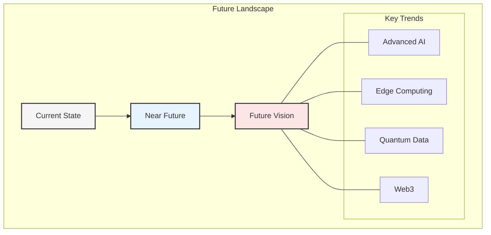
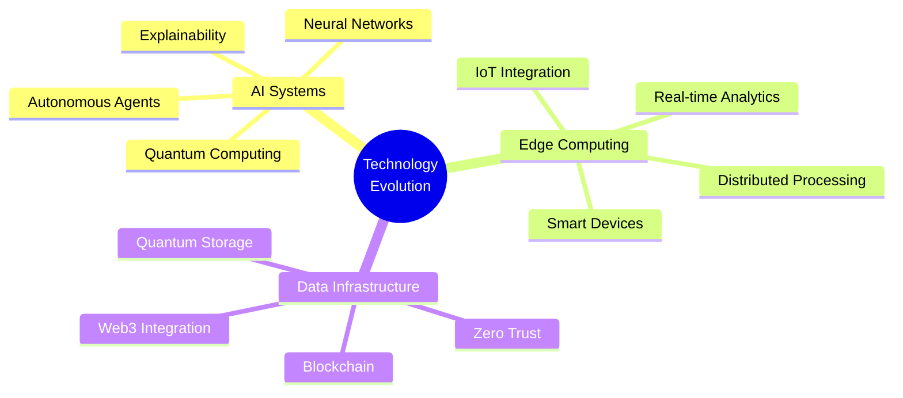
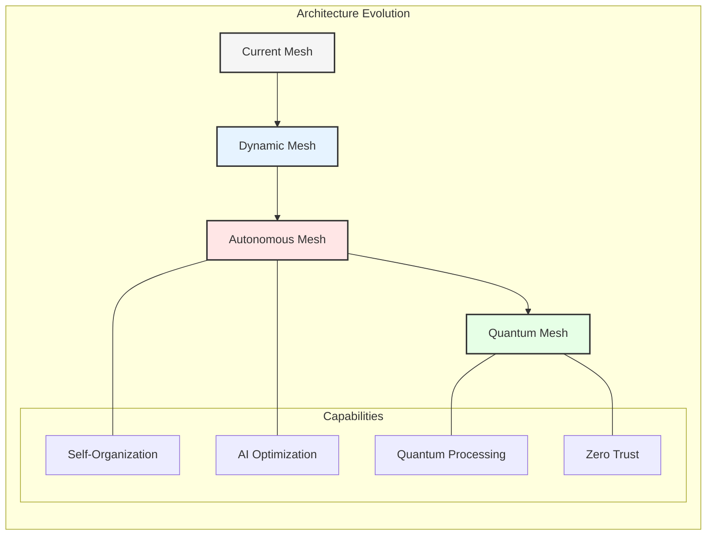
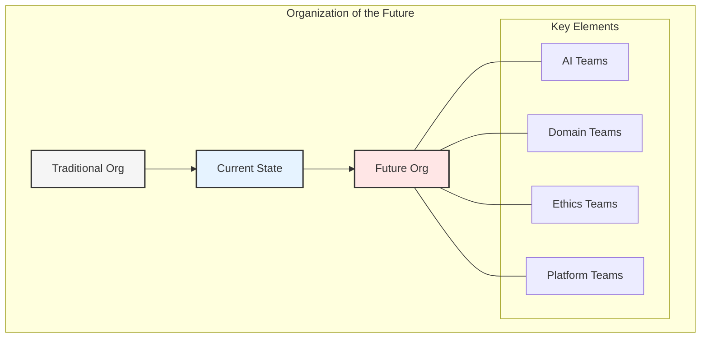
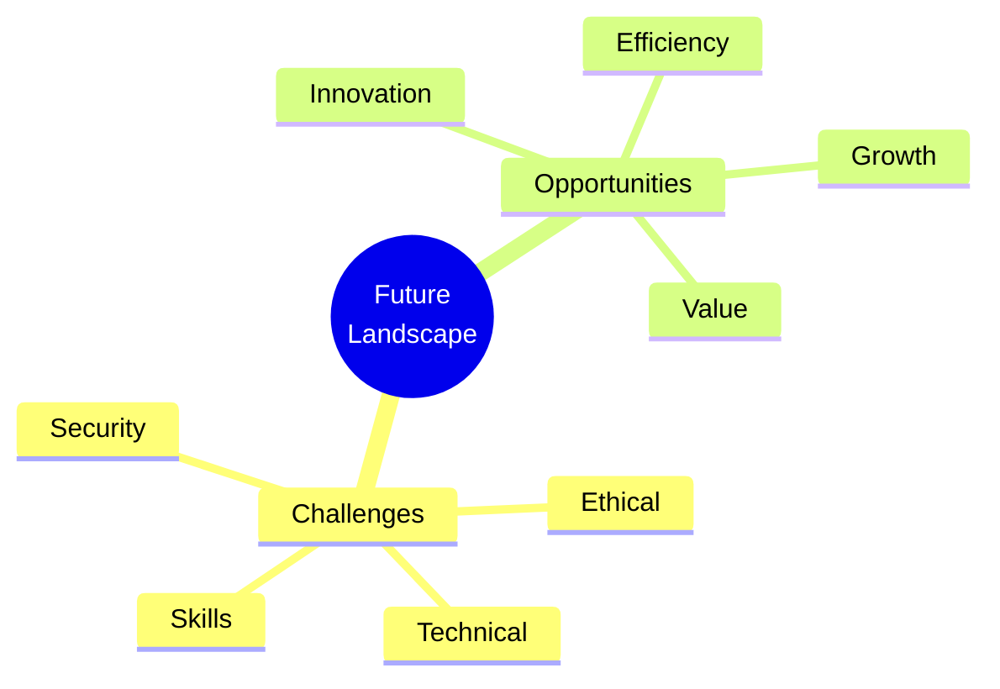
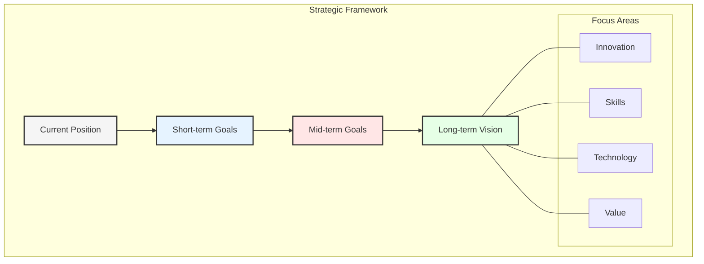

# Chapter 10: Future Trends and Conclusions

## The Evolution Continues

As we conclude our exploration of enterprise data architecture transformation, we look ahead to emerging trends and future developments that will shape the landscape of data management and AI integration.

## Emerging Technologies

### 1. Advanced AI Capabilities
- Autonomous agents
- Neural architectures
- Quantum AI
- Explainable AI

### 2. Edge Computing Evolution
- Distributed processing
- Smart endpoints
- Real-time analytics
- IoT integration

## Data Architecture Trends

### 1. Next-Generation Data Mesh
- Dynamic domains
- Automated governance
- Self-organizing systems
- AI-driven optimization

### 2. Advanced Integration Patterns
- Event-driven architecture
- Quantum-ready systems
- Web3 integration
- Zero-trust security

## Future of Agentic AI

### 1. Enhanced Capabilities
- Advanced reasoning
- Contextual understanding
- Ethical decision-making
- Continuous learning

### 2. Business Integration
- Autonomous operations
- Strategic planning
- Risk management
- Innovation acceleration

### 3. Human Collaboration
- Augmented intelligence
- Natural interaction
- Knowledge partnership
- Skill enhancement

## Organizational Evolution

### 1. Future Structures
- AI-enabled teams
- Virtual organizations
- Dynamic hierarchies
- Global collaboration

### 2. Skills and Roles
- AI specialists
- Domain experts
- Ethics officers
- Integration architects

## Technology Impact

### 1. Quantum Computing
- Data processing
- Algorithm optimization
- Security implications
- Storage solutions

### 2. Web3 and Blockchain
- Decentralized data
- Smart contracts
- Token economics
- Trust frameworks

### 3. Edge Computing
- Local processing
- Reduced latency
- Enhanced privacy
- Resource optimization

## Challenges and Opportunities

### 1. Future Challenges
- Quantum readiness
- Ethics and compliance
- Skills evolution
- Security threats

### 2. Emerging Opportunities
- New business models
- Enhanced capabilities
- Innovation potential
- Competitive advantage

## Implementation Considerations

### 1. Preparation Steps
- Technology assessment
- Skills development
- Infrastructure planning
- Risk evaluation

### 2. Action Items
- Research initiatives
- Pilot programs
- Partnership development
- Investment planning

## Strategic Recommendations

### 1. Short-term Actions
- Capability assessment
- Skills development
- Technology evaluation
- Partnership building

### 2. Long-term Strategy
- Innovation focus
- Continuous learning
- Adaptable architecture
- Sustainable growth

## Final Thoughts

### 1. Key Messages
- Continuous evolution
- Adaptable architecture
- Human-AI collaboration
- Value-driven approach

### 2. Success Factors
- Vision and leadership
- Technical excellence
- Cultural adaptation
- Continuous learning

## Book Summary

### 1. Journey Overview
- Traditional architecture
- Data fabric evolution
- Data mesh transformation
- AI integration

### 2. Core Principles
- Domain orientation
- Product thinking
- Self-service platform
- Federated governance

### 3. Future Direction
- Enhanced AI capabilities
- Quantum readiness
- Edge computing
- Sustainable growth

## Call to Action

1. **Assess Your Position**
   - Current state
   - Future needs
   - Gap analysis
   - Action planning

2. **Prepare for Change**
   - Skill development
   - Technology evaluation
   - Culture adaptation
   - Resource planning

3. **Start the Journey**
   - Vision creation
   - Team alignment
   - Initial steps
   - Progress monitoring

## Key Takeaways

1. The future is AI-driven and domain-oriented
2. Preparation for quantum computing is essential
3. Human-AI collaboration will be crucial
4. Continuous learning is fundamental
5. Value creation remains the primary goal

## Conclusion

The transformation of enterprise data architecture is an ongoing journey. Success requires vision, commitment, and adaptability. The future holds both challenges and opportunities, but organizations that prepare today will be better positioned to succeed tomorrow.