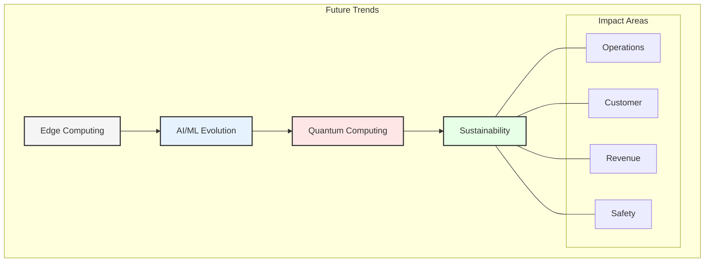
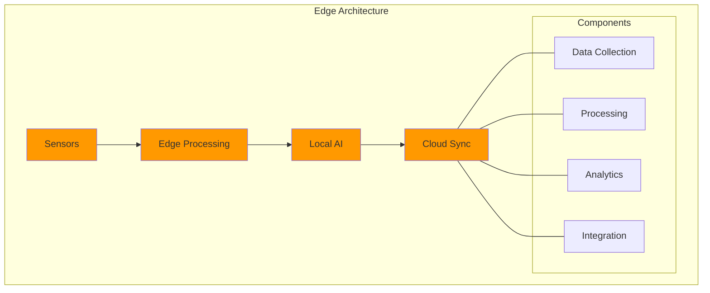
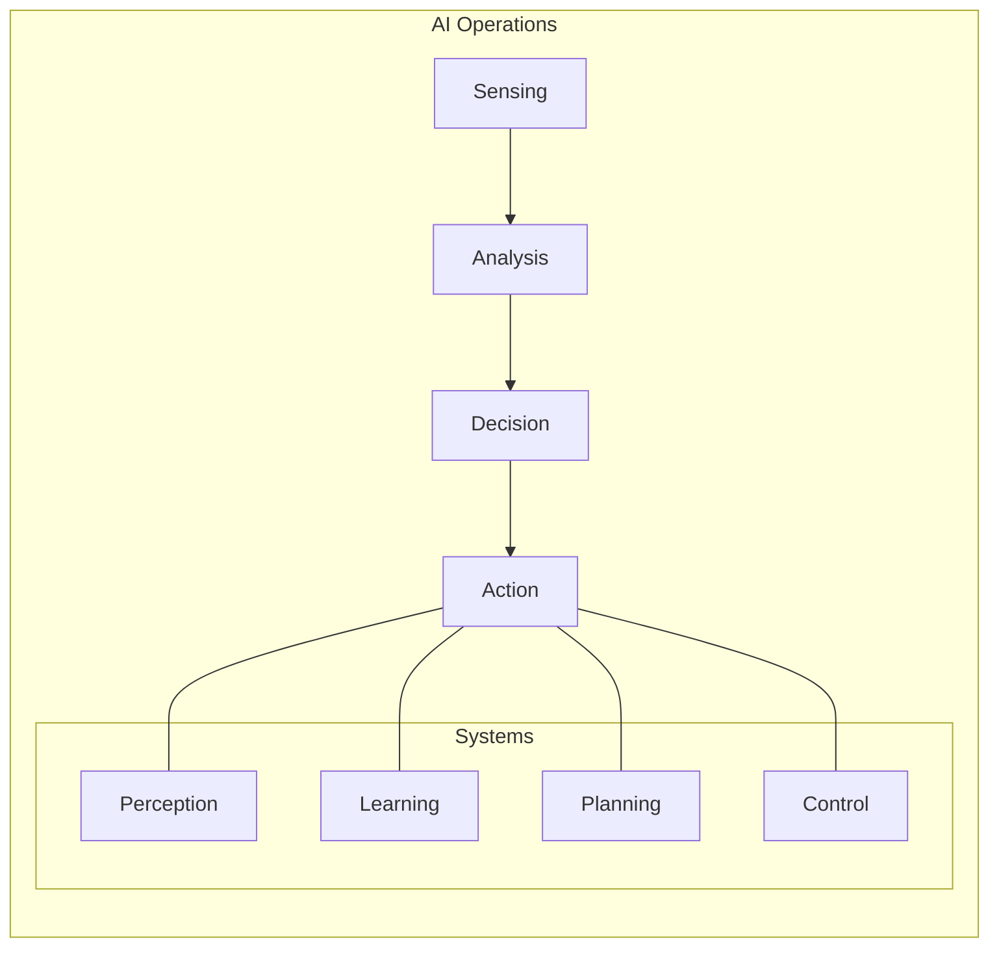
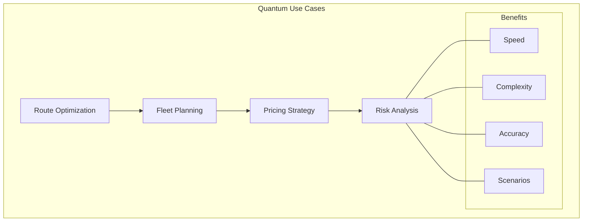
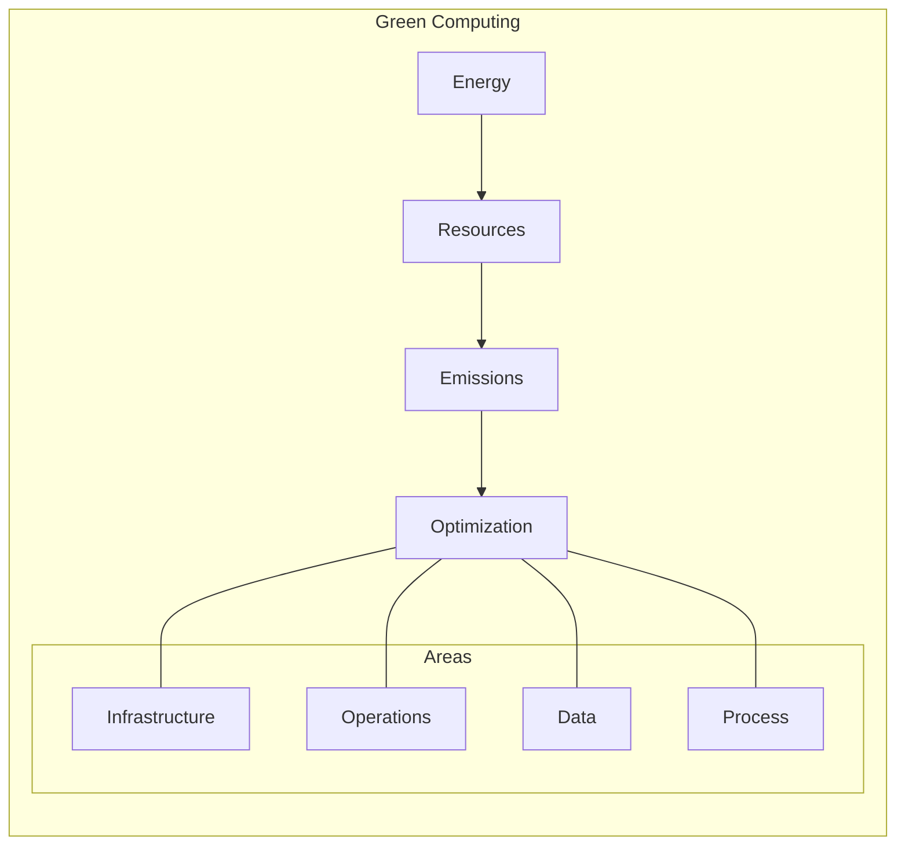
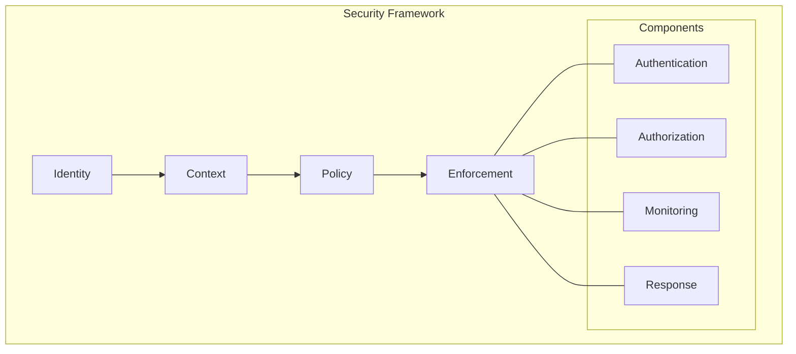
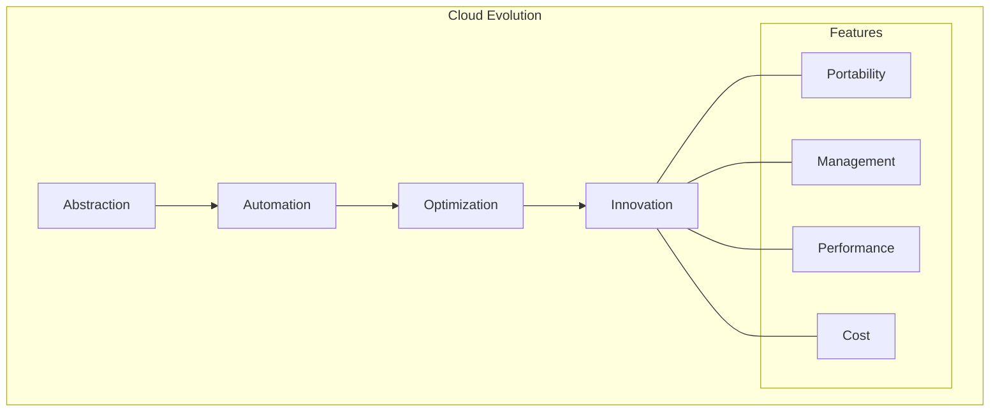
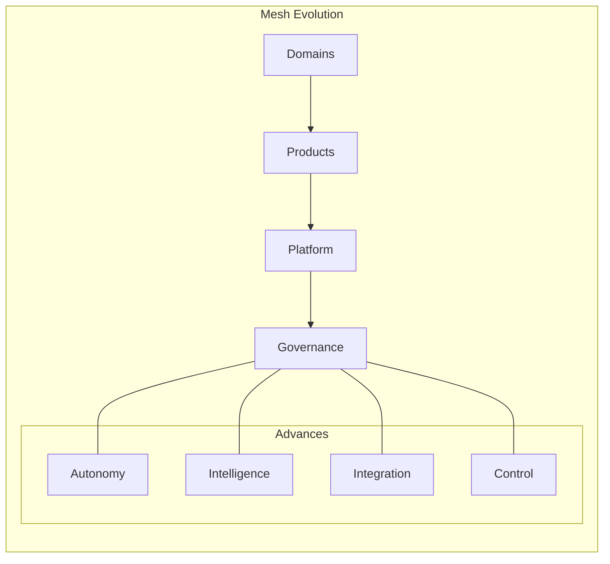
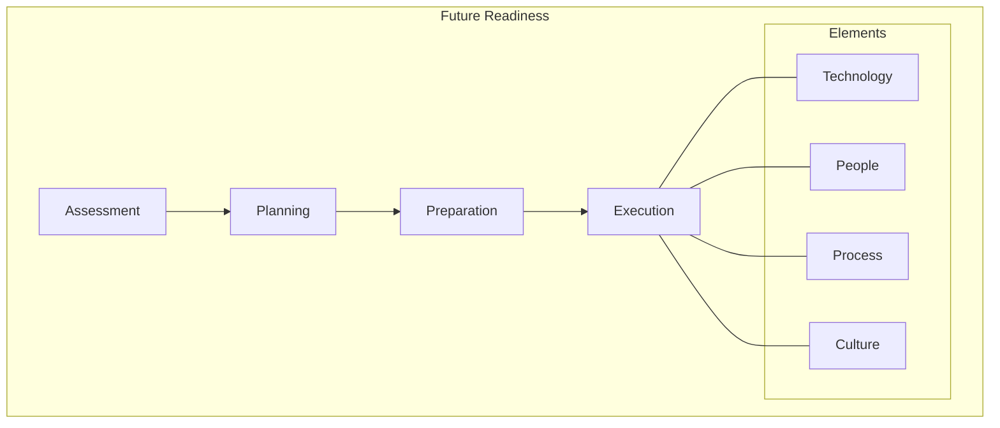

# Chapter 10: Future Trends in Airline Data Architecture

## Evolution of Data Architecture

Drawing from GlobalAir's transformation journey and industry trends, this chapter explores emerging technologies and approaches that will shape the future of airline data architecture.



## Edge Computing and IoT

### 1. Aircraft Edge Computing


### 2. Implementation Roadmap
```yaml
Edge Capabilities:
  Real-time Processing:
    - Engine performance
    - Flight parameters
    - Weather conditions
    - System health
    
  Local Intelligence:
    - Predictive maintenance
    - Flight optimization
    - Safety monitoring
    - Resource management
    
  Cloud Integration:
    - Delta syncs
    - Model updates
    - Configuration changes
    - Analytics feedback
```

## Advanced AI/ML Applications

### 1. Autonomous Operations


### 2. Customer Experience
```yaml
AI Applications:
  Personalization:
    - Dynamic pricing
    - Service customization
    - Journey optimization
    - Communication
    
  Predictive Analytics:
    - Demand forecasting
    - Behavior modeling
    - Risk assessment
    - Resource planning
    
  Automation:
    - Customer service
    - Booking process
    - Disruption management
    - Loyalty programs
```

## Quantum Computing Applications

### 1. Optimization Problems


### 2. Implementation Strategy
```yaml
Quantum Roadmap:
  Phase 1 - Research:
    - Use case identification
    - Partner selection
    - Technology assessment
    - Pilot planning
    
  Phase 2 - Experimentation:
    - Algorithm development
    - Small-scale testing
    - Performance evaluation
    - Integration planning
    
  Phase 3 - Implementation:
    - Infrastructure setup
    - System integration
    - Process adaptation
    - Skills development
```

## Sustainability and Green Computing

### 1. Environmental Impact


### 2. Implementation Framework
```yaml
Green Initiatives:
  Infrastructure:
    - Energy-efficient hardware
    - Renewable power sources
    - Cooling optimization
    - Resource sharing
    
  Operations:
    - Workload optimization
    - Automated scaling
    - Efficient algorithms
    - Data lifecycle management
    
  Monitoring:
    - Energy consumption
    - Carbon footprint
    - Resource utilization
    - Environmental impact
```

## Data Security Evolution

### 1. Zero Trust Architecture


### 2. Implementation Plan
```yaml
Security Evolution:
  Zero Trust:
    - Identity verification
    - Context awareness
    - Policy enforcement
    - Continuous monitoring
    
  Data Protection:
    - Encryption advances
    - Privacy enhancement
    - Access control
    - Audit capabilities
    
  Threat Management:
    - AI-driven detection
    - Automated response
    - Risk prediction
    - Incident handling
```

## Multi-Cloud Evolution

### 1. Advanced Integration


### 2. Future Architecture
```yaml
Cloud Strategy:
  Infrastructure:
    - Cloud-agnostic design
    - Automated deployment
    - Dynamic optimization
    - Cost management
    
  Services:
    - Unified management
    - Cross-cloud services
    - Hybrid operations
    - Edge integration
    
  Innovation:
    - New service models
    - Advanced analytics
    - AI integration
    - Edge computing
```

## Data Mesh Evolution

### 1. Advanced Capabilities


### 2. Implementation Vision
```yaml
Future Mesh:
  Domain Evolution:
    - Greater autonomy
    - Enhanced capabilities
    - Advanced analytics
    - AI integration
    
  Platform Features:
    - Self-service expansion
    - Automated governance
    - Intelligent optimization
    - Advanced security
    
  Integration:
    - Seamless connectivity
    - Real-time sync
    - Automated discovery
    - Enhanced monitoring
```

## Preparing for the Future

### 1. Strategic Planning
- Technology assessment
- Capability development
- Infrastructure readiness
- Skills preparation
- Cultural adaptation

### 2. Implementation Approach


## Key Takeaways

1. Edge computing will transform operations
2. AI/ML will drive automation
3. Quantum computing will enable new capabilities
4. Sustainability will become critical
5. Security will evolve continuously

## Conclusion

The future of airline data architecture will be characterized by:
- Increased intelligence at the edge
- Advanced automation and AI
- Quantum-enabled optimization
- Sustainable operations
- Enhanced security and privacy
- Seamless multi-cloud integration
- Evolution of data mesh principles